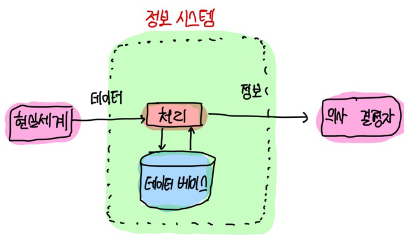

# 데이터베이스 개론

## Chapter 01. 데이터베이스 기본 개념
### 1.1 데이터베이스의 필요성
1) 데이터와 정보
2) 정보 시스템과 데이터베이스

---

# 1.1 데이터베이스의 필요성

## 1) 데이터와 정보

1. 데이터(data) : 현실 세계에서 단순히 관찰하거나 측정하여 수집한 사실(fact)이나 값(value).
2. 정보(information) : 데이터를 의사 결정에 유용하게 활용할 수 있도록 처리하여 체계적으로 조직한 결과물.

   #### <<데이터, 정보를 비유하자면...>>
   - 데이터 : 목장에서 바로 짠 원유
   - 정보 : 고객을 위해 공장에서 가공하여 팩에 담은 우유
   

3. 정보처리(information processing)
   - 데이터에서 정보를 추출하는 과정 또는 방법
   - 데이터를 상황에 맞게 분석하거나 해석하여 데이터 간의 관계를 파악하는 것

4. 가치있는 정보를 얻기 위해 필요한 것 
   - 유의미한 데이터 수집
   - 데이터의 효율적 저장, 관리 -> 데이터베이스

---

## 2) 정보 시스템과 데이터베이스

1. 정보 시스템(Information System)
   - 데이터를 수집하여 저장해두었다가, 의사 결정이 필요할 때 처리하여 유용한 정보를 만들어주는 수단
   - 사회 전반에서 다양한 정보 시스템이 활용되고 있음.
     - 예) 의사 결정 지원 시스템 : 복합적이고 광범위한 의사 결정을 위해 사용되는 정보 시스템 (기업의 경영관리 - 경영 정보)
     

2. 데이터베이스(DataBase)
   - 데이터를 저장하고 있다가, 필요할 때 제공하는 핵심적인 역할을 수행
   
---