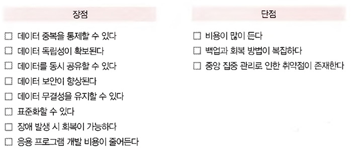

# <a href = "../README.md" target="_blank">데이터베이스 개론</a>
## Chapter 02. 데이터베이스 관리 시스템
### 2.3 데이터베이스 관리 시스템의 장단점
1) 데이터베이스 관리 시스템의 장점
2) 데이터베이스 관리 시스템의 단점
3) 데이터베이스 관리 시스템을 사용할 것인가, 사용하지 않을 것인가

---

# 2.3 데이터베이스 관리 시스템의 장단점

## 1) 데이터베이스 관리 시스템의 장점

1. 데이터 중복 통제
   - 파일시스템의 단점 : 중복성 -> 저장공간 낭비, 데이터 일관성, 무결성 유지 곤란
   - 데이터를 통합하여 관리하므로 데이터 중복문제를 해결.
   - 효율성 때문에 중복을 허용하는 경우에도 통제 가능하도록 중복을 최소화하여, 데이터 일관성 유지를 지원
   
    
2. 데이터 독립성 확보
   - 파일시스템의 단점 : 파일 구조 변경시, 이를 의존한 응용프로그램 구조도 수정해야함. -> 유지보수가 힘들다. 
   - 데이터에 접근, 관리하는 역할 및 책임을 대신 지기 때문에, 데이터베이스 구조가 변경되어도 사용자 또는 응용 프로그램단에서 영향을 받지 않음

3. 데이터 동시 공유 가능
   - 데이터베이스에 통합된 데이터를 응용 프로그램이 공유하여 같은 데이터에 동시 접근할 수 있도록 지원
   - 동일한 데이터를 각 응용 프로그램의 요구에 따라 다양한 구조로 제공
   - 동시공유를 지원하기 때문에 같은 데이터베이스를 복제할 필요가 없고, 불필요한 데이터 중복을 제한할 수 있음.

4. 데이터 보안 향상
   - 기존 파일시스템의 단점
     - 중복된 모든 파일의 보안을 같은 수준으로 유지하기 힘듬.
     - 권한을 파일 단위로 제한할 뿐 구체적이고 다양한 접근 제어 기능이 제공되지 않는다.
   - 데이터를 중앙집중식으로 관리하므로 데이터의 보안 수준에 대한 효율적인 접근제어가 가능함.
   - 권한이 없는 사용자의 접근, 허용되지 않은 데이터와 연산에 대한 요청을 사전에 차단함
   - 사용자별 접근 가능 데이터베이스 영역을 제한하거나 접근 수준을 차별화 가능

5. 데이터 무결성 유지
   - 데이터 무결성 : 데이터 값의 정확성, 유효성
   - 데이터 연산이 수행될 때마다 유효성을 검 사하여 데이터 무결성을 유지할 수 있도록 도와줌.

6. 표준화 가능
   - 데이터에 대한 모든 접근을 데이터베이스 관리 시스템을 거치기 때문에(의존), 데이터 접근 방법, 형식과 구조 등을 표준화하기 쉬움.
   - 각각의 응용 프로그램 별로, 데이터베이스 관리 시스템이 정한 표준화 방식을 통해 데이터베이스에 접근할 수 있음.

7. 장애 발생시 회복 가능
   - 장애가 발생해도 데이터 일관성, 무결성을 유지하면서 장애가 발생하기 이전 상태로 복구하는 회복 기능 지원

8. 응용프로그램 개발비용이 줄어듬
   - 데이터 관리를 응용 프로그램 대신 DBMS가 담당하도록 하기 때문에 응용 프로그램 개발 비용이 적게 소요됨.
   - 데이터베이스 구조가 변경되어도 응용 프로그램 단에서는 변경할 필요가 없으므로, 유지 보수 비용이 줄어든다.

---

## 2) 데이터베이스 관리 시스템의 단점
1. 비용이 많이 든다.
   - 신뢰할 수 있는 DBMS을 구입, 유지하는 비용이 많이 듬(라이센스 비용, 기술지원 비용, ...)
   - 동시 사용이 허용되는 사용자 수에 따라 제품 가격도 증가
   - 복잡하고 다양한 기능을 제공하기 위해, 컴퓨터 자원을 많이 사용한다.

2. 백업 및 회복 방법이 복잡합
   - 데이터 베이스는 데이터 양이 많아서 구조가 복잡하다. 또, 여러 사용자의 동시 공유를 지원하다보니 장애가 발생했을 때 원인 파악하기 어려움.
   - 장애 발생 전에 데이터를 미리 백업해놓고 원래의 일관된 상태로 회복하는 방법이 복잡함

3. 중앙 집중 관리로 인한 취약점이 존재
   - 모든 데이터가 데이터베이스에 중앙집중식으로 통합되어 있고, 이에 대한 관리 책임이 DBMS에 집중됨
   - DBMS 자체에 장애가 발생하면 전체 업무 처리가 중단됨.
   - 데이터베이스에 대한 의존도가 높은 시스템일 수록 가용성, 신뢰성에 치명적 영향을 받을 수 있음. 

---

## 3) 데이터베이스 관리 시스템을 사용할 것인가, 사용하지 않을 것인가

1. DBMS를 사용하면 좋은 경우
   - DBMS를 사용했을 때의 단점보다 이점이 더 많아서, 주로 대량의 데이터를 관리할 때는 DBMS을 통해 처리함.

2. 다음 상황에서는 DBMS을 사용하지 않는게 더 나을 수 있다.
   - 비용을 많이 투자할 수 없거나, 소수의 사용자를 대상으로 한 시스템을 개발할 경우
   - 데이터 구조나 내용이 자주 변경되지 않을 경우

3. 결론
   - 업무의 특성, 경제적 상황 등 다양한 요소를 고려하여 DBMS의 사용여부를 결정해야함.

---