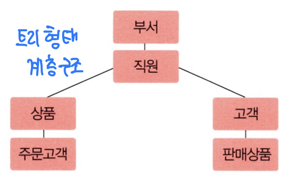
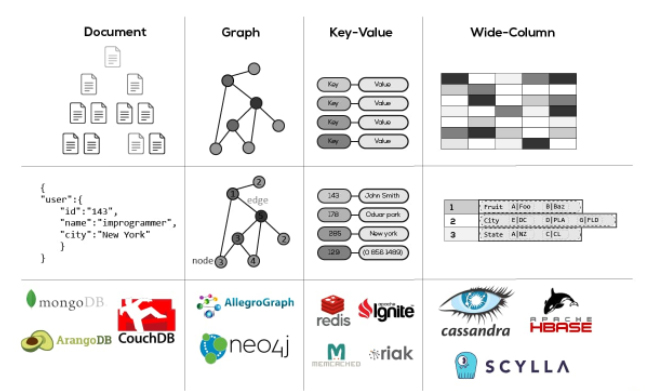

# 데이터베이스 개론
## Chapter 02. 데이터베이스 관리 시스템
### 2.4 데이터베이스 관리 시스템의 발전 과정
1) 데이터 모델(data model)
2) 1세대 데이터베이스 관리 시스템 - 네트워크, 계층 DBMS
3) 2세대 데이터베이스 관리 시스템 - 관계형 DBMS
4) 3세대 데이터베이스 관리 시스템 - 객체지향, 객체관계 DBMS
5) 4세대 이후 데이터베이스 관리 시스템 - NoSQL, NewSQL DBMS
6) 그래서 뭐 써요?

---

# 2.4 데이터베이스 관리 시스템의 발전 과정

## 1) 데이터 모델(data model)
데이터를 데이터에 저장하는 구조
- 시대를 거듭하면서, 데이터 모델은 많은 변천과정을 거쳐왔다.
- 현역 DBMS들은 보통 다음의 데이터 모델들로 구분할 수 있다.
  - 1세대 : 네트워크, 계층 DBMS
  - 2세대 : 관계형 DBMS
  - 3세대 : 객체지향, 객체관계 DBMS
  - 4세대 : NoSQL, NewSQL DBMS

---

## 2) 1세대 데이터베이스 관리 시스템 - 네트워크, 계층 DBMS

1. 네트워크 DBMS(Network DBMS)
   - 데이터베이스를 노드, 간선을 이용한 그래프 형태로 구성
   - 간선을 이용해 데이터 간의 관계를 표현.
   - 데이터베이스의 구조가 복잡하고 변경하기 어렵다.

2. 계층형 DBMS(Hierarchical DBMS)
   - 데이터베이스를 트리 형태로 구성
   - 복잡한 현실세계에서 얻어낸 데이터들을 부모-자식 관계가 명확한 트리 형태로 표현하기 힘듬.
   - 구조 변경이 어렵다.

---

## 3) 2세대 데이터베이스 관리 시스템 - 관계형 DBMS
1. 관계형 DBMS(Relational DBMS) : 테이블(2차원 표) 형태로 데이터베이스를 관리

2. 특징
   - 단순하고, 이해하기 쉬운 구조.
   - 현 시점에서도 주류로 사용되는 데이터베이스.
   - 오랜 기간 사용되면서 많이 연구되어 기술이 확장되고, 성능향상도 많이 되었다.

3. 대표적인 관계형 DBMS
   - 오라클(Oracle), MySQL, MS SQL 서버(MS SQL Server), 액세스(Access), 인포믹스(Informix)

---

## 4) 3세대 데이터베이스 관리 시스템 - 객체지향, 객체관계 DBMS
1. 객체지향 DBMS(Object DBMS, ODBMS)
   - OOP에서 도입된 객체(Object) 개념을 이용해 데이터베이스 구성
   - 더 복잡한 응용 분야의 데이터를 관리하기 위함
   - 새로운 유형의 데이터를 저장, 데이터에 대한 복잡한 분석 및 쿼리를 지원
   - 단순하고 관리가 쉬운 RDBMS가 주류로 사용되고, ODBMS는 거의 안 쓰임 
   - 오투(O2), 온투스(ONTOS), 젬스톤(GemStone) 등...

2. 객체관계 DBMS(Object-Relational DBMS, ORDBMS)
   - 객체지향 DBMS에, 관계DBMS의 개념을 통합
   - 사용처가 늘고 있음. 특히 오픈소스의 PostgreSQ가 요즘 많이 뜨고 있다...!
   - PostgreSQL, Oracle DataBase(Oracle), Illustra, Informix Dynamic Server, IBM DB2, 티베로 등...

---

## 5) 4세대 이후 데이터베이스 관리 시스템 - NoSQL, NewSQL DBMS

1. 폭발적으로 증가하는 비정형 데이터
   - SNS, 클라우드 컴퓨팅, 빅데이터 등의 도입으로 초대량의 비정형 데이터(사진, 동영상, 검색 로그 등...)를 다루게 됨.
   - 기본의 RDBMS만으로는 대량의 비정형 데이터를 처리하는데 비효율적이다. RDBMS를 유지하면서 CPU, 메모리 등의 하드웨어 장치 성능을 향상시키는 것만으로는 부족.

2. NoSQL의 도입
   - 기존 RDBMS가 가진, 안정성 및 일관성 유지 등을 위한 복잡한 기능을 포기
   - 데이터 구조를 미리 정해두지 않음(다양한 데이터 구조) -> 비정형 데이터 저장 및 처리에 유리
   - 확장성이 뛰어남 -> 여러 대의 서버 컴퓨터에 데이터를 분산, 저장, 처리하는 환경에서 주로 사용
   - MongoDB, Cassandra, HBase, 네오포제이(Neo4j), 오리엔트DB(OrientDB), ...

3. NewSQL의 도입
   - DBMS의 안전성과 일관성, NoSQL의 비정형데이터의 처리, 양쪽을 쓰게 되면 비용 부담이 증가함.
   - NewSQL은 안정성과 일관성을 유지하면서도, SQL을 통해 다양하고 복잡한 데이터 처리를 편리하게 요청 가능.
   - RDBMS, NoSQL의 확장성 및 유연성 모두를 지원
   - 구글 스패너(Spanner), 볼트DB(VoltDB), 누오DB(NuoDB), ...
   
   
---

## 6) 그래서 뭐 써요?
저장할 데이터의 형태, 업무 처리 성격 등을 고려해야함.
- 데이터의 안정성, 일관성 중시 : RDBMS
- 대량의 비정형 데이터 처리 : NoSQL DBMS

---