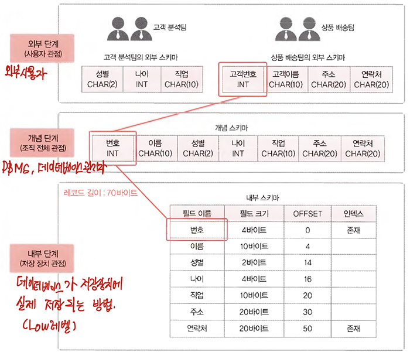

# <a href = "../README.md" target="_blank">데이터베이스 개론</a>
## Chapter 03. 데이터베이스 시스템의 정의
### 3.2 데이터베이스의 구조
1) 스키마
2) 3단계 데이터베이스 구조
3) 데이터 독립성 (정리 아직 안 됨)
4) 데이터 사전 (정리 아직 안 됨)

---

# 3.2 데이터베이스의 구조

## 1) 스키마
1. 스키마 : 데이터베이스에 저장되는 데이터 구조와 제약조건을 정의한 것.
   - 3층 구조 : 외부 스키마, 개념 스키마, 내부 스키마
   - 데이터베이스의 틀, 골격에 해당하는 부분이므로 보통은 자주 변경되지 않는다.
   

2. 인스턴스 : 데이터베이스에 실제로 저장된 값
   - 계속 변하는 특성이 있음.

---

## 2) 3단계 데이터베이스 구조

1. 3단계 데이터 구조(3-level database architecture)
   - 미국의 표준화 기관 ANSI/SPARC 에서 제안한 데이터베이스의 3단계 구조
       - 외부 스키마, 개념 스키마, 내부 스키마
   - 데이터의 저장, 유지 등 복잡한 내부 내용을 숨기고, 필요한 데이터만 단순화한 외부 단계 관점을 일반 사용자들에게 제공할 수 있다.
   - 각 단계별로 추상화 레벨을 다르게 부여(외부에 가까이 갈 수록, 더 추상화 레벨이 높아짐) 

2. 외부 스키마 : 개별 사용자 관점에서 바라보는 외부 단계
   - 개별 사용자 관점으로 데이터베이스를 이해하고 표현
   - 외부 단계의 사용자에게 필요한 데이터베이스를 정의한 것.
   - 데이터베이스 하나에는 여러개의 외부 스키마가 존재할 수 있고, 외부 스키마 하나를 같은 사용자들이 공유할 수 있음.
   - 전체 데이터 베이스 중, 사용자가 관심을 가지는 일부분이라는 관점에서 서브 스키마(Sub Schema)라고도 함.

3. 개념 스키마 : 조직 전체의 관점에서 바라보는 개념 단계
   - 데이터베이스를 이용하는 사용자들의 관점을 통합하여, 데이터베이스를 조직 전체의 관점에서 이해하고 표현
   - DBMS, 데이터베이스 관리자의 관점에서 모든 사용자에게 필요한 데이터를 통합하여, 전체 데이터베이스의 논리적 구조를 정의
   - 모든 개별 사용자가 생각하는 데이터베이스의 모습을 하나로 합친 형태
   - 전체 데이터베이스에 어떤 데이터가 저장되는지, 데이터들 간에 어떤 관계가 존재하고 어떤 제약조건이 있는지, 데이터에 대한 보한 정책이나 접근 권한은 어떻게 부여되어있는 지
   - 보통 '스키마'라고 하면, 개념스키마를 지칭함

4. 내부 스키마 : 물리적 저장장치 관점에서 바라보는 내부 단계
   - 데이터베이스가 저장 장치에 실제로 저장되는 방법을 정의
   - 데이터베이스 파일에 데이터를 저장하는 레코드의 구조, 레코드를 구성하는 필드의 크기, 인덱스를 이용한 레코드 접근 경로 등을 정의
   - 어떤 데이터베이스의 개념 스키마에 대한 물리적인 저장구조를 표현하므로, 하나의 데이터베이스에 하나만 존재

---
