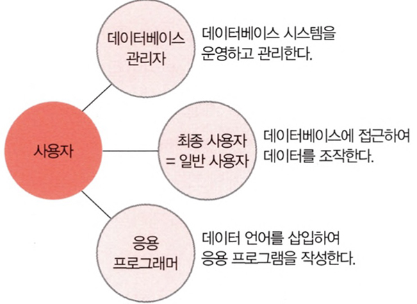

# <a href = "../README.md" target="_blank">데이터베이스 개론</a>
## Chapter 03. 데이터베이스 시스템의 정의
### 3.3 데이터베이스 사용자
1) 데이터베이스 관리자
2) 최종 사용자
3) 응용 프로그래머(정리 아직 안 됨)

---

# 3.3 데이터베이스 사용자

데이터베이스 사용자(DataBase User) : 데이터베이스를 이용하기 위해 접근하는 모든 사람.

---

## 1) 데이터베이스 관리자
1. 데이터베이스 관리자 (DBA, DataBase Administrator)
   - 데이터베이스 시스템을 운영, 관리
   - 조직 내의 사용자를 위해 데이터베이스를 설계(design) 및 구축
   - 데이터베이스 시스템을 제대로 서비스할 수 있도록 데이터베이스를 제어
   - 데이터베이스 정의어(DDL), 데이터베이스 제어어(DCL)을 통해 데이터베이스에 접근
   

2. 데이터베이스 관리자의 필요 역량
    - 실제 데이터베이스 운영, 관리 전반을 책임지므로 컴퓨터 시스템 및 데이터베이스와 관련된 지식과 경험을 많이 갖춰야함
    - 대규모 조직에서는, 설계업무만 담당하는 데이터베이스 설계자(DataBase Designer)를 따로 두기도 함.
    

3. 데이터베이스 관리자의 주요 업무
   1. 데이터베이스 구성 요소 선정 : 사용자의 요구 사항을 분석하여 데이터베이스를 구성할 데이터 결정
   2. 데이터베이스 스키마 정의
      - 설계 : 선정된 구성요소를 토대로 데이터베이스 스키마 설계
      - DDL을 통하여, 설계한 스키마를 DBMS에 설명
   3. 물리적 저장구조와 접근 방법 결정
      - 물리적으로 저장하기 위한 레코드 구조를 설계(내부 스키마)
      - 레코드 간 저장 순서
      - 인덱스를 만들 기준 필드 등도 결정 (레코드에 빠르게 접근하기 위함)
   4. 무결성 유지를 위한 제약조건 정의
      - 제약 조건 정의 : 실세계의 데이터와 일치하는 결함이 없는 데이터만 저장할 수 있도록 필요 규칙 정의
      - 제어 : 실제, 데이터베이스를, 사전에 정의한 제약 조건에 따라 제어하여 데이터의 정확성 및 유효성 유지 
   5. 보안 및 접근 권한 정책 결정
      - 허가되지 않는 사용자가 데이터베이스에 불법적으로 접근하는 것을 방지
      - 허가된 사용자에게 적절한 권한을 부여하는 보안 관련 정책 결정
   6. 백업 및 회복 기법 정의
      - 백업 : 시스템 장애에 대비하여 데이터베이스 백업하는 방법
      - 회복 : 손상된 데이터베이스를 일관된 상태로 복구하는 방법
   7. 시스템 데이터베이스 관리
      - 데이터 사전 등의 시스템 데이터베이스 관리
   8. 시스템 성능 감시 및 성능 분석
      - 시스템 성능을 저해하는 병목현상 등이 발생하지 않는지 확인
      - 시스템 자원의 활용도 분석 등을 통해 시스템 성능 감시
   9. 데이터베이스 재구성 (리팩토링)
      - 사용자의 요구사항, 사용형태가 달라지면 변화된 내용에 맞게 데이터를 재구성하여, 사용자의 만족도를 높여야함
      - 시스템의 전체 성능을 향상시켜야하거나 시스템 장비가 교체된 경우에도 데이터베이스를 재구성
   

---

## 2) 최종 사용자

1. 최종 사용자(End User)
   - 데이터를 검색, 조작하기 위해 데이터베이스에 접근하는 일반 사용자
   - 컴퓨터 시스템 또는 데이터베이스에 대한 깊은 지식을 갖출 필요는 없음
   - 캐쥬얼 사용자, 초보 사용자로 구분

2. 캐쥬얼 사용자 (Casual End User)
   - 데이터베이스에 대한 이론적 지식을 어느 정도 가지고 있는 최종 사용자
   - 주로 데이터 조작어(DCL)을 통해 원하는 데이터, 데이터에 대한 처리를 DBMS에 직접 설명

3. 초보 사용자 (Naive End User)
   - 데이터베이스를 초보 수준으로 다루는 최종 사용자
   - 주로 DCL을 이용하기보다, GUI 형태의 응용 프로그램을 통해 데이터베이스를 사용
   - 예) 물류 관리자, 사서, 관리자 페이지 사용자, 웹사이트 고객...

---

