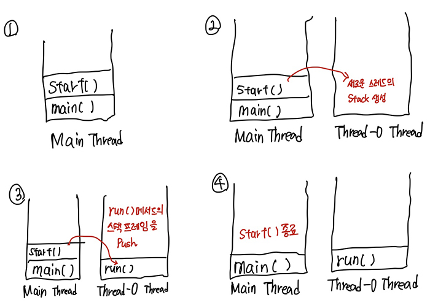
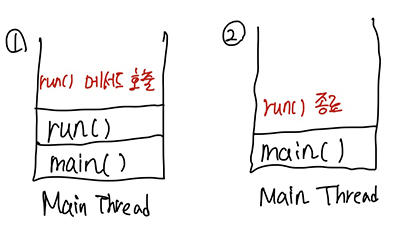

# <a href = "../README.md" target="_blank">Chapter 13. 스레드</a>
## 2. 스레드의 구현과 실행
### 2.2 스레드의 실행
1) 스레드의 실행 - start()
2) start()와 run()
3) main 스레드
4) Stack의 소멸, 프로그램의 종료

---

# 2.2 스레드의 실행

## 1) 스레드의 실행 - start()
```
    Thread th = new Thread(new MyThread()); // (여기서 MyThread는 Runnable의 구현체)
    th.start();
```
- `start()` 메서드를 호출하면, Thread를 실행 대기상태로 전환시킴
- OS의 스케쥴러에 스케쥴에 따라, 스레드의 순서가 되었을 때 실행된다. (바로 실행되는 것이 아님...!)
- 여러 Thread가 실행되었을 때 start 호출 순서에 따라 실행되지 않고, OS 스케쥴러의 스케쥴에 따라 번갈아가면서 실행됨. 순서가 일정하지 않다.
- 한번 실행완료되어 소멸된 스레드는 다시 start를 통해 실행되지 않는다.(스레드 소모)
  - 다시 start 메서드를 호출시, `IllegalThreadStateException`이 throw됨

---

## 2) start()와 run()


1. start()
   - 스레드의 Stack을 생성하고, `run()`메서드의 스택프레임을 생성된 Stack에 push한다.
   - 이때부터 각 stack의 메서드들은 OS의 스케쥴러의 스케쥴에 따라 번갈아가며 실행된다.



2. run()
   - 호출된 스택프레임의 바로 위에, `run()`메서드의 스택프레임을 push한다.
   - run() 메서드가 종료되어 스택프레임이 소멸되어야, 다시 원래 메서드의 다음 작업이 진행된다.

---

## 3) main 스레드

- 최초 실행된 main 메서드가 호출된 스레드

---

## 4) Stack의 소멸, 프로그램의 종료

- 스레드의 Stack의 모든 메서드가 종료되었을 때 Stack은 사라진다.
- 실행 중인 스레드가 하나도 없을 때 프로그램이 종료된다.
- main 스레드가 작업을 마치더라도, 다른 스레드의 작업이 종료되지 않았을 경우 프로그램은 종료되지 않는다.

---