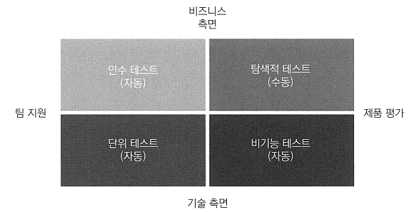

# <a href = "../README.md" target="_blank">배포 자동화와 지속적 인도</a>
## Chapter 01. 지속적 인도 소개
### 1.2 자동 배포 파이프라인
1) 자동 배포 파이프 라인
2) 지속적 통합(CI)
3) 자동 인수 테스트
4) 구성 관리

---

# 1.2 자동 배포 파이프라인

---

## 1) 자동 배포 파이프 라인

### 1.1 자동 배포 파이프라인
- 코드 리포지터리에 변경이 발생할 때마다 실행되는 스크립트
- 프로세스가 성공되면 프로덕션 환경으로 배포가 된다.

### 1.2 단계
- 코드 변경
- 지속적 통합(CI) : 각기 다른 개발자가 작성한 코드가 통합됐는지 확인
- 자동 인수 테스트(Automated Acceptance Testing) : 개발자가 구현한 기능이 고객의 요구사항과 맞는지 확인.
수동 품질 보증 단계를 대체함.
- 구성 관리(Configuration Management) : 수동 운영 단계를 대체. 환경을 구성하고 소프트웨어를 배포함

---

## 2) 지속적 통합(CI)
- 체크아웃 -> 컴파일, 단위 테스트 실행, 코드 품질 검증
- 도중에 실패 시, 파이프라인이 중단되는데 이를 통과시키려면 CI 빌드를 다시 수정해야함
- 적절한 시간에 반드시 실행되어야한다.

---

## 3) 자동 인수 테스트

### 3.1 자동 인수 테스트(Automated Accepted Testing)
- 수동 UAT 절차를 대체
- 제품이 릴리스할 준비가 됐는지를 결정하는 품질 게이트
- 테스트 항목 중 하나라도 실패하면 파이프라인은 중단되며, 이후 단계도 실행되지 않는다.

### 3.2 품질 점검을 개발 도중 제품에 내재하는 것
- 인수 테스트 단계를 자동화하는 것은 품질 점검을 나중에 하는 것이 아니라 개발 중에 제품에 내재시키는 것
- 개발자가 구현을 마치는 즉시 고객이 원하는 제품인지 검증하는 인수 테스트를 거친 후 소프트웨어를 인도
- CD에서 제일 어려운 부분
- 프로세스의 끝에 위치하지 않고, 시작 단계부터 테스트 케이스를 만들고 고객과 긴밀하게 협력해야함.

### 3.3 애자일 테스트 매트릭스

- 인수 테스트(자동) : 비즈니스 관점에서 본 기능적 요구사항 검증
- 단위 테스트(자동) : 버그를 최소화하고 소프트웨어의 품질을 향상하도록 개발자 지원
- 탐색적 테스트(수동) : 수동으로 하는 블랙박스 테스트. 경험을 바탕으로 시스템의 문제를 찾거나 개선하는 테스트 수행
- 비기능 테스트(자동) : 성능, 확장성, 보안 등과 관련된 시스템 속성을 검증

#### 수동 QA vs 자동 QA
- 수동 QA : 탐색적 테스트를 수행.
  - 자동 CD 프로세스 내에서는 반복 작업을 해야하는 수동 QA 과정이 없다.
- 자동 QA : 비 기능 테스트 및 인수 테스트 수행을 지원

#### (cf) 통합 테스트는?
- 단위 테스트와 인수 테스트의 중간
- 단위 테스트와 유사한 통합 테스트 : 코드 관점에서 테스트
- 인수 테스트와 유사한 통합 테스트 : 사용자 관점에서 테스트

### 3.4 테스트 피라미드

- 피라미드의 위로 갈 수록 테스트 속도가 느려지고 비용이 높아진다.
- 인수 테스트 : 속도가 느리고 비용이 높아짐. 따라서 100% 자동화를 목표로 하면 안 되고, 오로지 기 능 위주로
선정된 테스트 시나리오만 검증해야함. 그렇지 않을 경우 테스트 케이스 개발, 유지 등에 비용이 많이 소요되고 CD
파이프라인의 실행도 매우 오래 걸린다.
- 피라미드 하단에 해당하는 단위 테스트는 빠르고 저렴하므로 가능한 100%의 코드가 테스트되도록 해야함

---

## 4) 구성 관리
- 소프트웨어와 환경 변화를 추적하고 제어
- 필수 도구 준비와 설치, 애플리케이션 배포와 관련된 다양한 서비스 인스턴스와 배포 버전, 인프라 인벤토리 및
기타 작업의 확장 관리 등
- 프로덕션 환경의 애플리케이션을 수동으로 구성하고 배포하면서 생기는 문제에 대한 해결책
  - 일반배포 환경에서는 각 서비스가 어떤 속성을 갖고 어디서 실행되고 있는 지를 더 이상 알 수 없는 문제가 있음
  - 앤서블, 셰프, 퍼핏 같은 구성 관리 도구를 이용하여 구성 관리를 버전 관리 시스템에 저장할 수 있고, 프로덕션
  환경에서 발생한 변경 사항을 모두 추적할 수 있음
- 애플리케이션 모니터링

---

