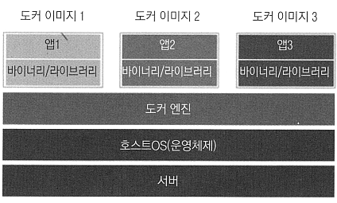

# <a href = "../README.md" target="_blank">배포 자동화와 지속적 인도</a>
## Chapter 02. 도커 소개
### 2.1 도커 소개
1) 하드웨어 가상화 vs 컨테이너화
2) 도커의 필요성
3) 고양이와 가축
4) 다른 컨테이너화 기술

---

# 2.1 도커 소개

---

## 1) 하드웨어 가상화 vs 컨테이너화

### 1.1 하드웨어 가상화

- 각 애플리케이션을 분리된 이미지에서 실행.
- 각 이미지에는 모든 필요한 의존성 요소와 게스트 OS(운영체제)가 들어있다.
- 이미지의 실행은 가상화 계층인 하이퍼바이저에서 담당
- 제품 : 버추얼 박스, VM 웨어, 패러렐즈, ...

### 1.2 가상화의 단점
- 낮은 성능 : 컴퓨터의 전체 아키텍처를 모방해 게스트 OS를 실행하는데, 이 방식은 작업을
실행하는데 상당한 자원을 사용하므로 성능이 떨어진다.
- 높은 자원 소비 : 많은 자원이 필요하고, 애플리케이션마다 할당해줘야한다. 데스크톱에서 동시에
실행할 수 있는 애플리케이션의 개수도 제한됨.
- 큰 파일 크기 : 각 애플리케이션마다 OS가 한개씩 포함되므로, 서버에 배포할 때마다 상당한 크기의 데이터를
보내고 저장해야함.

### 1.3 컨테이너화

- 각 애플리케이션에 운영체제가 아닌 의존성 요소만 포함
- 인터페이스는 호스트 OS와 직접 연결되며, 게스트 OS와 같은 추가적인 레이어가 없다.
- 성능이 향상되고, 리소스 낭비가 적다. 도커 이미지는 파일 크기도 매우 작다.
- 호스트 OS 프로세스 수준에서 격리(Isolation)되고 컨테이너들의 의존성 요소를 공유하지 않는다.
  - 한 컨테이너의 라이브러리가 하나 업데이트 되더라도, 다른 라이브러리에 영향을 끼치지 않는다.

---

## 2) 도커의 필요성

### 2.1 실행 환경
- 소프트웨어 설치, 실행 환경은 간단하지 않음
- 운영체제, 리소스, 라이브러리, 서비스, 사용 권한, 관련 소프트웨어 등 애플리케이션이 사용하는 모든 사항을
결정해야함
- 설치 과정에서, 여러 애플리케이션을 설치/실행하는 과정에서 의존성 충돌이 발생할 수 있다.
- 애플리케이션 별로 분류해서, 각 애플리케이션 마다 전용 서버를 할당하는 식으로 해결하는 방식도 있으나
이 방식은 다양한 프로덕션/테스트 서버 관리하는데 많은 운영 팀 인력을 필요로 하고, 인력 운영 측면에서 좋지 않음
- 실행 환경이 복잡해지므로 애플리케이션을 실행하는 데 별도의 전문성을 가진 담당자가 필요해짐. 담당자의 기술력이 부족할 경우
관리 난이도가 더 높아짐

### 2.2 격리
- 실행 환경은 깔끔하게 격리되어 유지되어야한다.
- 실행 환경이 격리되지 않았을 경우 한 애플리케이션이 다른 애플리케이션의 실행에 영향을 주게 된다.
- 애플리케이션 하나가, 잘못된 소프트웨어를 실행하면 다른 애플리케이션도 손상시킬 수 있는 등 보안 측면의 문제도 있다. 
- 애플리케이션의 손상을 예방할 수 있도록 분리된 샌드박스에서 실행하는 것이 더 안전하다.

### 2.3 애플리케이션 구성
- 한 서버에서 여러 애플리케이션을 실행하면 왜 실행되는지 모르는 애플리케이션이 많아짐
- 각각의 애플리케이션이 무엇인지, 이들 간의 의존성은 어떤 것인지 알기 힘들어짐.
- 도커에서는 각 애플리케이션을 개별 컨테이너로 구성하므로 실행 목록을 보고 검색하고 모니터링하는 작업을
깔끔하게 수행할 수 있다.

### 2.4 이식성
- 도커 버전만 호환되면 그 안에 포함된 모든 소프트웨어들은 프로그래밍 언어, OS, 환경 구성이든 관계 없이 호환된다.
- 도커를 통해 코드 뿐 아니라, 실행 환경을 통째로 제공

---

## 3) 고양이와 가축 
- 각각의 서버들을 집단적으로 다룸
- 각 서버는 고유의 이름도 없고, 개별적으로 취급하지도 않음
- 각각의 서버는 개별적인 개체이긴 집단적으로 다루는 것이므로 중요하지 않다.

---

## 4) 다른 컨테이너화 기술
- 리눅스 컨테이너, 윈도우 서버 컨테이너, OpenVZ, 리눅스 서버 등, ...
- **하지만 도커는 간결성과 효율적인 마케팅, 스타트업의 성공 방식을 활용해 다른 모든 솔루션들을 넘어섬.**
- 도커는 그냥 컨테이너화 기술의 표준이며 국룰 그 자체

---
