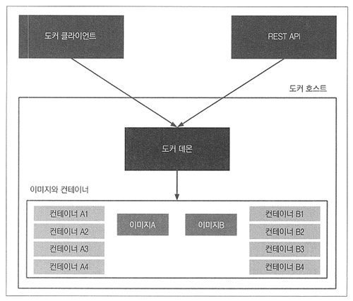
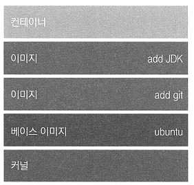

# <a href = "../README.md" target="_blank">배포 자동화와 지속적 인도</a>
## Chapter 02. 도커 소개
### 2.3 도커에서 hello-world 실행하기
1) hello-world
2) 도커 엔진의 컴포넌트

---

# 2.3 도커에서 hello-world 실행하기

---

## 1) hello-world

### 1.1 터미널에서 실행
```shell
docker run hello-world
```
```txt
Unable to find image 'hello-world:latest' locally
latest: Pulling from library/hello-world
2db29710123e: Pulling fs layer
2db29710123e: Download complete
2db29710123e: Pull complete
Digest: sha256:faa03e786c97f07ef34423fccceeec2398ec8a5759259f94d99078f264e9d7af
Status: Downloaded newer image for hello-world:latest

Hello from Docker!
This message shows that your installation appears to be working correctly.
...
```
- docker run 명령어로 hello-world를 통해 실행하면 위와 같은 로그를 확인할 수 있다.

### 1.2 흐름


1. 사용자가 run 명령어로 도커 클라이언트를 실행
2. 도커 클라이언트가 도커 데몬에 접속해 hello-world 이름의 이미지에서 컨테이너를 생성할 것을 요청
3. 도커 데몬이 hello-world 이미지를 로컬에서 찾았으나 없다는 것을 확인하고, 도커 허브 레지스트리에
hello-world 이미지를 요청
4. 도커 허브 레지스트리는 hello-world 이미지를 갖고 있으므로 도커 데몬이 이미지를 다운로드(pull) 함
5. 도커 데몬이 hello-world 이미지로부터 신규 컨테이너를 생성하고, 컨테이너가 실행되면 메시지를 출력
6. 도커 데몬은 이 출력문을 도커 클라이언트로 전달
7. 도커 클라이언트는 이 출력문을 터미널로 전송

---

## 2) 도커 엔진의 컴포넌트

### 2.1 도커 클라이언트 - 도커 데몬(서버)


도커 엔진은 크게 3개의 컴포넌트로 구성되어 있다.
- 클라이언트(명령툴)
- REST API
- 도커 데몬(서버)

예제에서는 도커 클라이언트를 통해, 도커 데몬에 연결을 했다.

### 2.2 도커 이미지와 도커 컨테이너



- 도커 컨테이너 : 1개 이상의 이미지가 실행된 인스턴스가 도커 컨테이너다.
  - stateful : 컨테이너를 사용하면서 컨테이너의 상태를 변경할 수 있다.
- 도커 이미지 : 스테이트리스(stateless, 무상태), 계층화 가능
  - 하나의 이미지로부터 여러 컨테이너를 실행시킬 수 있다.
  - 베이스 이미지 : 대부분의 경우 운영체제(Ubuntu, CentOS, ...)
  - stateless : 상태를 저장하지 않음. 애플리케이션을 실행하는 모든 파일들과 그것을 실행하는 방법을 묶어놓은 것.
  - 레이어링 : 이미지를 추가시 새로 설치되는 부분만 추가되므로 저장 공간 절약, 네트워크 전송 시 대역폭 절약

---
