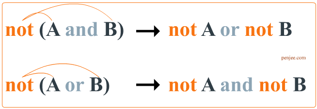

# <a href = "../README.md" target="_blank">한 권으로 읽는 컴퓨터 구조와 프로그래밍</a>
## Chpater 01. 컴퓨터 내부의 언어 체계
### 1.4 논리 연산
1) 논리 연산
2) 불리언 대수(Boolean Algebra)
3) 진리표
4) 드모르간의 법칙

---

# 1.4 논리 연산

True/False만으로는 모든 상황을 표현할 수 없다.  
어떻게 복잡한 상황을 이진 표현으로 나타낼 수 있을까?

## 1) 논리 연산
여러 비트들이 표현하는 내용으로부터 새로운 비트를 만들어내는 연산

### 예시
- 비가 오거나 춥다면 코트를 입어라 (비 온다 OR 춥다 -> 코트를 입어도 되는가? -> TRUE)
- 눈이 오고 학교 가는 날이면 스키를 타러 가라. (눈 온다 AND 학교 가는 날 -> 스키를 타러 가도 되는가? -> TRUE)

---

## 2) 불리언 대수(Boolean Algebra)
1800년대 수학자 조지 불이 만들어낸, 비트에 대해 사용할 수 있는 연산 규칙 집합

- `NOT` : 반대
- `AND` : 비트가 모두 참일 때 참
- `OR` : 비트 중 어느 하나라도 참이면 참
- (추가적 설명) XOR : 두 비트가 서로 다른 값일 때 참

---

## 3) 진리표
불리언 연산을 시각적으로 요약해 보여주는 표

---

## 4) 드모르간의 법칙

> a AND b == NOT (Not a And Not b)

NOT을 적절히 활용하면
AND연산을 OR 연산으로 대신하거나, OR 연산을 AND 연산으로 대신할 수 있다.

---