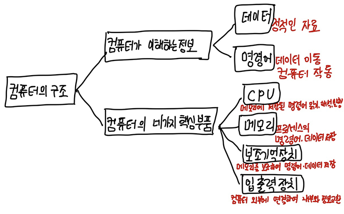

# <a href = "../README.md" target="_blank">혼자 공부하는 컴퓨터 구조 + 운영체제</a>
## Chapter 01. 컴퓨터 구조 시작하기
### 1.2 컴퓨터 구조의 큰 그림
1) 컴퓨터가 이해하는 정보 : 데이터, 명령어
2) 컴퓨터의 핵심 부품 : CPU, 메모리, 보조기억장치, 입출력장치 (+ 메인보드)

---

# 1.2 컴퓨터 구조의 큰 그림

- 컴퓨터가 이해하는 정보 : 데이터, 명령어
- 컴퓨터의 네가지 핵심 부품 : CPU, 메모리, 보조기억장치, 입출력장치

---

## 1) 컴퓨터가 이해하는 정보 : 데이터, 명령어

### 1.1 데이터
- 컴퓨터가 이해하는 숫자, 문자, 이미지, 동영상과 같은 정적인 정보
- 실제로는 0과 1들로 구성되어 있다.
- 예) '1', '2','cat.jpg'

### 1.2 명령어
- 데이터를 움직이고 컴퓨터를 작동시키는 정보
- 실제로는 0과 1들로 구성되어 있다.
- 예) '1과 2를 더하라', 'cat.jpg를 USB에 저장하라.'

---

## 2) 컴퓨터의 핵심 부품 : CPU, 메모리, 보조기억장치, 입출력장치 (+ 메인보드)

### 2.1 중앙 처리 장치(CPU)
- 메모리에 저장된 값을 읽어 들이고, 해석하고, 실행하는 장치이다.
- CPU 내부에는 ALU, 레지스터, 제어장치가 있다.
  - ALU : 계산하는 장치
  - 레지스터 : 임시 저장 장치
  - 제어장치 : 제어 신호(메모리 읽기, 쓰기)를 발생시키고, 명령어를 해석하는 장치

### 2.2 메모리(Main Memory, 주기억장치)
- 프로그램이 실행되기 위해서는 반드시 메모리에 저장되어 있어야 한다.
- 메모리는 현재 실행되는 프로그램(프로세스)의 명령어와 데이터를 저장하는 부품이다.
- 메모리에 저장된 값의 위치는 주소로 알 수 있다.

### 2.3 보조기억장치(Secondary Storage)
- 컴퓨터 전원이 꺼지면 메모리에 남아있던 프로그램의 데이터, 명령어가 사라진다.
- 전원이 꺼져도 저장된 내용이 사라지지 않으려면, 메모리를 보조할 저장 장치가 필요하다.
- HDD, SSD, USB 메모리, DVD, CD-ROM과 같은 저장 장치가 이러한 보조기억장치의 일종이다.

### 2.4 입출력장치(input/output device)
- 마우스, 스피커, 프린터, 마우스, 키보드와 같이 컴퓨터 외부에 연결되어 컴퓨터 내부와 정보를 교환하는 장치
- 엄밀히 따지면 보조기억장치도 입출력장치의 일종이지만, 보조기억장치는 메모리를 보조하는 특별한 기능을 수행하는 의미가
강하기 때문에 별도로 분류한다.

### 2.5 메인보드(Main Board, Mother Board)
- 컴퓨터의 부품을 연결한 판
- 버스(Bus)를 통해 부품들 간에 정보를 교환할 수 있다.
- 여러가지 기능을 수행하는 버스들이 존재하는데, 핵심 부품들을 연결하는 가장 중요한 버스는 시스템 버스다.
- 시스템 버스 : 주소 버스 + 데이터 버스 + 제어버스
  - 주소 버스 : 주소를 주고 받는 통로
  - 데이터 버스 : 명령어와 데이터를 주고 받는 통로
  - 제어 버스 : 제어 신호를 주고 받는 통로

---
