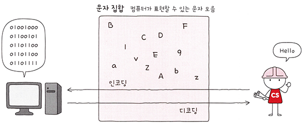
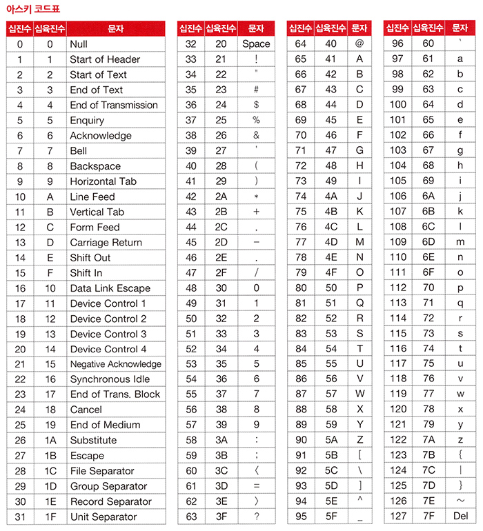
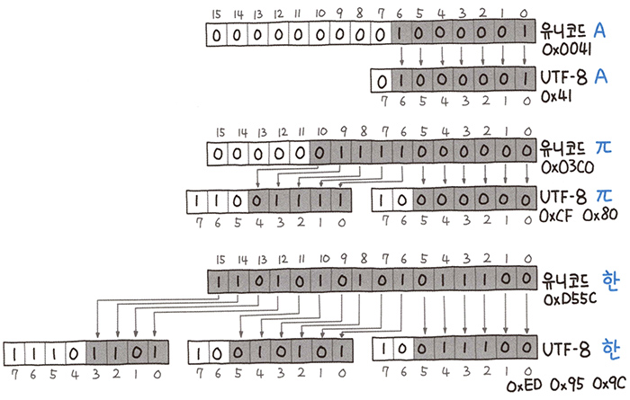

# <a href = "../README.md" target="_blank">혼자 공부하는 컴퓨터 구조 + 운영체제</a>
## Chapter 02. 데이터
### 2.2 0과 1로 문자를 표현하는 방법
1) 문자 집합, 문자 인코딩, 문자 디코딩
2) 아스키 코드(ASCII)
3) EUC-KR, CP949
4) 유니코드와 UTF-8

---

# 2.2 0과 1로 문자를 표현하는 방법

---

## 1) 문자 집합, 문자 인코딩, 문자 디코딩

### 1.1 문자 집합(Character Set)
- 컴퓨터가 인식하고 이해할 수 있는 문자들의 모음
- 예) ASCII 문자집합, EUC-KR 문자 집합, CP949 문자 집합, ...

### 1.2 문자 인코딩(Character Encoding)
- 문자집합에 속한 문자를 컴퓨터가 이해할 수 있는 0과 1로 변환하는 과정
- 문자 코드(code point) : 인코딩 결과 0과 1로 이루어진 결과값
  - 원래 코드 포인트가 맞는 말인데, 이 책에서는 쉬운 설명을 위해 문자 코드라고 하였음
- 예) ASCII 인코딩 : '0' -> 0b00110000

### 1.3 문자 디코딩(Character Decoding)
- 0과 1로 표현된 문자 코드를 사람이 이해할 수 있는 문자로 변환하는 과정.
- 예) ASCII 디코딩 : 0b00110101 -> 'S'

---

## 2) 아스키 코드(ASCII)

### 2.1 ASCII
- American Standard Code for Information Interchange
- 초창기의 문자 집합 중 하나
- 7비트로 표현할 수 있고, 아스키로 2**7 == 128개의 문자를 표현할 수 있다.
- 실제로 하나의 아스키 문자를 표현할 때는 8바이트를 사용하는데,
그 이유는 오류 검출용으로 패트리 비트(patry bit)라고 불리는 1개의 비트를 사용하기 때문이다.
- 기억할 아스키 문자코드 : 48 == '0', 65 == 'A', 97 == 'a'

### 2.2 한계
- 실질적으로 7비트로만 문자를 표현하기에 128개보다 많은 문자를 표현할 수 없다. 한글도 이에 해당한다.
- 더 다양한 문자 표현을 지원하기 위해, 이후 8비트의 확장 아스키도 추가됐지만 이 또한 모든 문자를 표현하기엔
턱 없이 부족하다.
- 한국 등 다양한 국가에서는 자국의 언어를 0과 1로 표현할 수 있도록 고유 문자집합, 인코딩 방식을 사용했다.

---

## 3) EUC-KR, CP949

### 3.1 한글 인코딩 방식
- 완성형 인코딩 : 완전한 하나의 글자에 고유한 코드를 부여하는 인코딩 방식
  - 예) '강' == 11101010 10110000 10010101
- 조합형 인코딩 : 초성, 중성, 종성 각각을 위한 비트열을 할당하고 이들의 조합으로 하나의 글자코드를 완성시키는 인코딩 방식
  - 예) '강' == ㄱ ㅏ ㅇ == 0010 + 0011 + 0001 00011 = 0010 0011 0001 00011

### 3.2 EUC-KR
- KS X 1001, KS X 1003 이라는 문자 집합을 기반으로 하는 완성형 인코딩 방식
- 초성, 중성, 종성이 모두 결합된 한글 단어에 2바이트 크기의 코드를 부여함
- 한 글자를 표현하려면 2byte, 16개의 비트가 필요하다.

### 3.3 EUC-KR 방식의 한계
- 2350개의 한글단어를 표현할 수 있는데, ASCII보다 표현 가능한 문자의 종류는 다양해졌지만
모든 한글 조합을 표현할 수 있을 정도로 많은 양은 아니다.
- '뷁', '쀓', '믜' 같은 글자는 EUC-KR로 표현할 수 없다.

### 3.4 CP949
- 마이크로소프트에서 개발한 EUC-KR의 확장 버전
- EUC-KR로 표현할 수 없는 더욱 다양한 문자를 표현할 수 있다.
- 하지만 이 마저도, 모든 한글을 표현하기엔 넉넉한 양이 아니다.

---

## 4) 유니코드와 UTF-8

### 4.1 유니코드
- 여러 국가의 문자 집합, 인코딩 방식을 하나로 통일한 문자 집합.
- 각 국가별로, 사용하는 문자집합/인코딩 방식이 달라서 언어별로 인코딩 방식을 모두 알아야하고 변환해야한다.
이러한 수고를 덜기 위해 2~4바이트 공간에 넉넉하게 문자를 할당하고자 등장하였다.

### 4.2 UTF-8
- 유니코드 자체는 1바이트로 표현이 가능한 영문자도, 2바이트 이상의 공간을 차지하기에 메모리 낭비가 심하다.
이런 문제를 해결하고자 등장한 가변 길이 문자열 인코딩 방식이 UTF-8 이다.
- 유니코드 값에 따라 가변적으로 바이트를 결정하여 불필요한 공간 나비를 절약할 수 있다.
- 첫 바이트의 맨 앞 비트를 확인하여 문자 전체의 바이트를 결정할 수 있다. 
  - 0으로 시작하면 1바이트, 10으로 시작하면 중간 바이트, 110으로 시작하면 2바이트, 1110으로 시작하면 3바이트

---
