# <a href = "../README.md" target="_blank">혼자 공부하는 컴퓨터 구조 + 운영체제</a>
## Chapter 03. 명령어
### 3.2 명령어의 구조
1) 연산 코드
2) 오퍼랜드
3) 주소 지정 방식
4) (참고) 스택, 큐

---

# 3.2 명령어의 구조
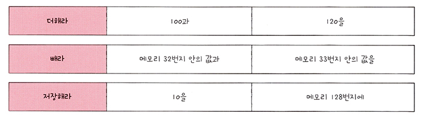

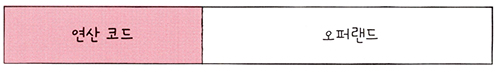

명령어는 연산 코드와 오퍼랜드(피연산자)로 이루어져 있다.

---

## 1) 연산 코드
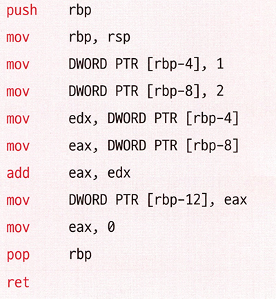

### 1.1 연산 코드(operation-code)
- 연산코드 : 명령어가 수행할 연산
- 연산코드 필드 : 연산코드가 담기는 영역을 연산 코드 필드라고 한다.

### 1.2 연산 코드의 종류
- 데이터 전송
- 산술/논리 연산
- 제어 흐름 변경
- 입출력 제어

### 1.3 데이터 전송 연산 코드
- MOVE : 데이터를 옮겨라
- STORE : 메모리에 저장하라
- LOAD(FETCH) : 메모리에서 CPU로 데이터를 가져와라
- PUSH : 스택에 데이터를 저장하라
- POP : 스택의 최상단 데이터를 가져와라

### 1.4 산술/논리 연산 코드
- ADD/ SUBTRACT / MULTIPLY / DIVIDE : 덧셈 / 뺄셈 / 곱셈 / 나눗셈을 수행하라
- INCREMENT / DECREMENT : 오퍼랜드에 1을 더하라 / 1을 빼라
- AND / OR / NOT : 논리곱 / 논리합 / 부정 연산을 수행하라
- COMPARE : 두 개의 숫자 또는  TRUE / FALSE 값을 비교하라

### 1.5 제어 흐름 변경 연산 코드
- JUMP : 특정 주소로 실행 순서를 옮겨라
- CONDITIONAL JUMP : 조건에 부합할 때 특정 주소로 실행 순서를 옮겨라
- HALT : 프로그램의 실행을 멈춰라
- CALL : 되돌아올 주소를 저장한 채 특정 주소로 실행 순서를 옮겨라
- RETURN : CALL을 호출할 때 저장했던 주소로 돌아가라

### 1.6 입출력 제어 연산 코드
- READ(INPUT) : 특정 입출력 장치로부터 데이터를 읽어라
- WRITE(OUTPUT) : 특정 입출력 장치로 데이터를 써라
- START IO : 입출력 장치를 시작하라
- TEST IO : 입출력 장치의 상태를 확인하라

---

## 2) 오퍼랜드

### 2.1 오퍼랜드(operand)
- 오퍼랜드 : '연산에 사용될 데이터' 또는 '연산에 사용할 데이터가 저장된 위치'
- 오퍼랜드 필드(주소 필드) : 오퍼랜드가 담기는 영역

### 2.2 오퍼랜드의 갯수에 따른 명령어 분류
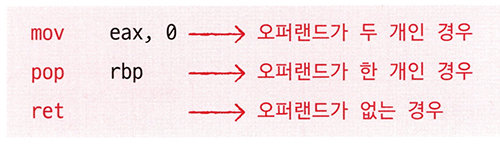

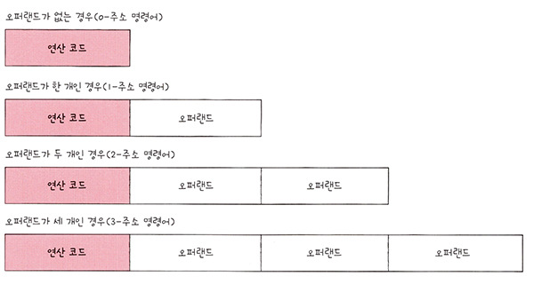

- 오퍼랜드 0개 : 0-주소 명령어
- 오퍼랜드 1개 : 1-주소 명령어
- 오퍼랜드 2개 : 2-주소 명령어
- 오퍼랜드 3개 : 3-주소 명령어
- ...

---

## 3) 주소 지정 방식

### 3.1 오퍼랜드 필드에 주소를 할당하는 이유
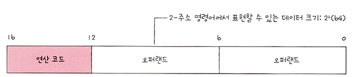

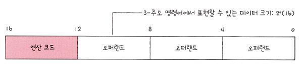

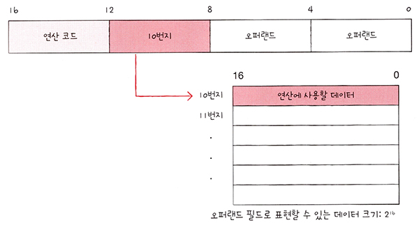

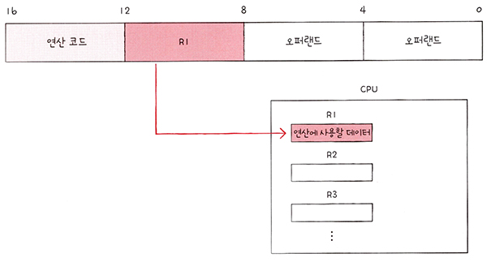

- 명령어의 비트 갯수는 제한적인데, 데이터를 직접 담으면 명령어가 제한 적인 정보만을 표현할 수 밖에 없다.
- 따라서 명령어의 비트 갯수를 효율적으로 사용할 수 있도록, 주로 데이터를 직접 담기보다 데이터의 주소(메모리 주소, 레지스터 이름)를 담는다.

### 3.2 유효주소
- 연산의 대상이 되는 데이터가 저장된 위치를 유효 주소라고 한다.
- 유효주소는 메모리에 위치하거나, CPU의 레지스터에 존재한다. 

### 3.3 주소 지정방식
오퍼랜드에 데이터가 저장된 위치를 명시할 때, 연산에 사용될 데이터 위치를 찾는 방법.  
즉, 유효 주소를 찾는 방법이다.

- 즉시 주소 지정 방식 : 연산에 사용될 데이터
- 직접 주소 지정 방식 : 유효 주소(메모리 주소)
- 간접 주소 지정 방식 : 유효 주소의 주소
- 레지스터 주소 지정 방식 : 유효 주소(레지스터 이름)
- 레지스터 간접 주소 지정 방식 : 유효 주소를 저장한 레지스터

### 3.4 즉시 주소 지정 방식(immediate addressing mode)
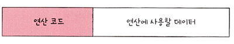

- 연산에 사용할 데이터를 오퍼랜드 필드에 직접 명시하는 방식
- 표현할 수 있는 데이터가 작아지는 단점이 있지만, 연산에 사용할 데이터를 메모리나 레지스터로부터 찾는 과정이 없기 때문에
아래에서 후술할 주소 지정 방식들보다 빠르다.

### 3.5 직접 주소 지정 방식(direct addressing mode)
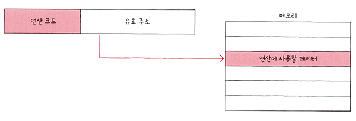

- 오퍼랜드 필드에 유효 주소(메모리 주소)를 직접적으로 명시하는 방식
- 표현할 수 있는 유효 주소의 범위에 제한이 있다.

### 3.6 간접 주소 지정 방식(indirect addressing mode)
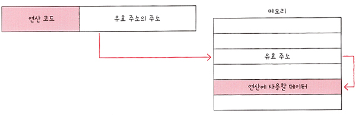

- 오퍼랜드 필드에 유효 주소의 주소를 명시하는 방식
- 두 번의 메모리 접근이 필요하기에, 앞에서 설명한 직접 주소 지정 방식보다는 느리다.
- 직접 주소 지정 방식과 비교했을 때 표현할 수 있은 유효 주소의 범위가 넓다.

### 3.7 레지스터 주소 지정 방식(register addressing mode)
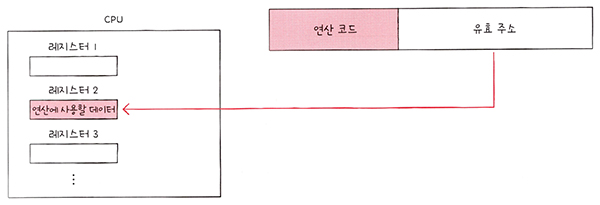

- 오퍼랜드 필드에 연산에 사용할 데이터를 저장한 레지스터를 직접 명시하는 방법
- CPU의 레지스터에 접근하므로, 직접 주소 지정 방식보다 빠르다.
- 직접 주소 지정 방식과 마찬가지로, 표현할 수 있는 레지스터 크기에 제한이 있다.

### 3.8 레지스터 간접 주소 지정 방식(register indirect addressing mode)
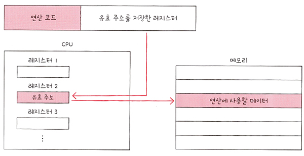

- 오퍼랜드 필드에 유효주소를 저장한 레지스터를 명시하는 방식
  - 연산에 사용할 데이터는 메모리에 보관한다.
- 유효 주소를 찾는 방법은 간접 주소 지정 방식과 비슷하지만, 메모리에 접근하는 횟수가 한 번으로 줄어들기에
간접 주소 지정 방식보다 빠르다.
- 레지스터 주소 지정 방식과 비교했을 때 표현할 수 있는 레지스터 크기의 제한에 더 자유롭다.

---

## 4) (참고) 스택, 큐

### 4.1 스택
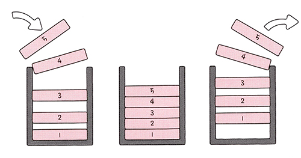

- LIFO(후입선출)의 자료 구조
- PUSH(삽입), POP(추출)

### 4.2 큐
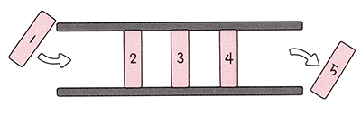

- FIFO(선입선출)의 자료 구조

---
