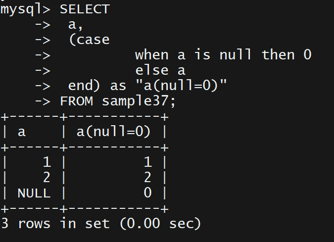
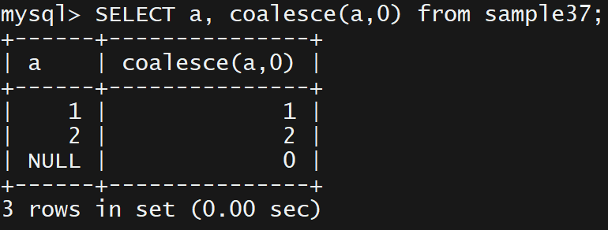

# <a href = "../README.md" target="_blank">SQL 첫걸음</a>
## Chapter 03. 정렬과 연산
### 15강. CASE문으로 데이터 변환하기
1) 기본 CASE문(조건식 상세 기술)
2) 또 다른 CASE문(단순 CASE문)
3) CASE를 사용할 경우 주의사항
4) COALESCE
5) NULLIF
6) 그 외 비표준 조건식
---

# 15강. CASE문으로 데이터 변환하기

---

## 1) 기본 CASE문(조건식 상세 기술)
```sql
CASE
    WHEN 조건식1 THEN 식1
    WHEN 조건식2 THEN 식2
    ELSE 식3
END
```

- 조건식을 순서대로 평가하여 먼저 조건을 만족한 경우 then절 식의 처리 결과를 case 문의 결과값으로 반환함
- 어떤 조건식도 만족하지 못 한 경우 else 절에 기술한 식이 채택됨
- ELSE는 생략 가능하며, 생략 시 ELSE NULL로 간주된다.

---

## 2) 또 다른 CASE문(단순 CASE문)
```sql
CASE 식1
        WHEN 식2 THEN 식3
        WHEN 식4 THEN 식5
        ELESE 식6
END
```

- case 문에 비교 대상을 적어서 사용하여, case문을 단순화함
- `식1`의 값이 when 절에서 지정한 값과 동일한지 순서대로 비교하여, 동일할 경우 then 절의 처리 결과를 case문의 결과값으로 반환함
- 어떤 식들도 만족하지 못 한 경우 else 절에 기술한 식이 채택됨
- ELSE는 생략 가능하며, 생략 시 ELSE NULL로 간주된다.
- 주의
  - WHEN절의 식이 NULL 일 경우 정상적으로 처리되지 않는다. (비교연산자 `=`는 null과 같은 지를 비교할 수 없기 때문이다)
  - NULL을 비교하기 위해서는 조건식을 상세 기술하는 CASE문의 `is Null`을 사용하는 것이 낫다.

---

## 3) CASE를 사용할 경우 주의사항

### 3.1 ELSE문 생략하지 않기
- else를 생략 시, `else null`이 된다.
- 상정한 것 외의 데이터가 들어왔을 때 의도치 않은 결과를 초래할 수 있음
- else를 생략하지 않는 것이 좋다.

### 3.2 단순 CASE문에서 WHEN에 null을 지정할 수 없다.
```sql
CASE a
    WHEN 1 THEN '남자'
    WHEN 2 THEN '여자'
    WHEN NULL THEN '데이터 없음'
    ELSE '미지정'
END
```
- 단순 case문은 case 뒤의 비교대상을 순서대로 when절의 식과 비교연산자 `=`로 비교한다.
  - 위의 경우 `a=1`, `a=2`, `a=null`을 실행한다.
- 비교연산자 `=`는 null과 같은지 아닌지를 비교할 수 없다. null인지 여부는 `is Null`로만 판단할 수 있다.
- null을 비교해야하는 경우에는 단순 CASE문을 쓰기보다, 기본 CASE문을 사용하는 것이 낫다.

---

## 4) COALESCE
> COALESCE(식1, 식2, ...)



- 지정 식을 순서대로 확인하여 null이 아닌 첫번째 값을 반환함

---

## 5) NULLIF
> NULLIF(식1, 식2)

- 식1, 식2를 비교하여 같으면 null, 다르면 `식1`을 반환

---

## 6) 그 외 비표준 조건식

### Oracle의 DECODE 함수
> DECODE(비교대상, 조건1, 결과1, 조건2, 결과2, ... , 기본값)

- Oracle에서는 비교대상을 순서대로 지정 값들과 비교하여 디코딩를 수행하는 DECODE 함수가 내장되어 있음
- 하지만 Oracle에서만 지원하므로 다른 데이터베이스에서 사용할 수 없다.


### Oracle의 NVL
> NVL(값, 지정값)

- null 값을 변환하는 Oracle 함수
- 값이 null이 아니면 그대로, 값이 null이면 지정값을 반환
- SQL Server에서는 isNull
- 이 함수들은 특정 데이터베이스에 국한된 함수이므로 null 변환시에는 가급적 coalesce 함수, case 문을 사용하자
