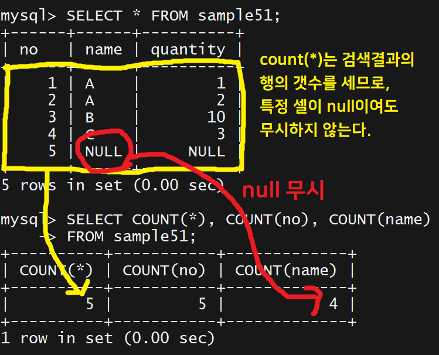

# <a href = "../README.md" target="_blank">SQL 첫걸음</a>

## Chapter 05. 집계와 서브쿼리

### 20강. 행 개수 구하기 - COUNT
1) 집계함수(Aggregate Function)
2) COUNT로 행의 개수 구하기
3) 집계 함수의 동작 순서
4) 집계함수와 NULL 값
5) DISTINCT로 중복 제거
6) 집계함수에서의 DISTINCT
---

# 20강. 행 개수 구하기 - COUNT

---

## 1) 집계함수(Aggregate Function)
- 복수의 행(또는 행의 값)에 대해 집계를 수행하는 함수.
- 인수로 특정 값이 아닌, 값의 모음(집합 또는 다중집합)을 가지며, 결과값으로 단일값을 반환함
- 기본적으로 null을 제외하고 집계
  - 단, `count(*)`는 행의 갯수를 세므로 특정 속성값이 null이더라도 집계된다.
- 종류 : count, sum, avg, max, min

---

## 2) COUNT로 행의 개수 구하기
```sql
SELECT count(값의 모음)
FROM 테이블 WHERE 조건식; 
```

- COUNT : 주어진 값의 모음(Collection)(집합 또는 다중 집합)의 요소의 갯수를 반환
- COUNT 집계 함수에서 모든 열(`*`)을 지정하면, 행의 갯수를 반환
  - 인수로 `*`를 지정할 수 있는 집계함수는 COUNT 뿐이다.

---

## 3) 집계 함수의 동작 순서

- WHERE 절을 기반으로 행을 검색
- 검색한 결과값 모음들이 집계함수로 전달됨

---

## 4) 집계함수와 NULL 값

- 집계함수는 null을 무시하고 집계한다.
- 단, `count(*)`는 검색된 모든 행의 갯수를 집계하기 때문에 특정 속성값이 null이더라도 무시하지 않는다.

---

## 5) DISTINCT로 중복 제거
```sql
SELECT [ALL|DISTINCT] 칼럼1, 칼럼2, 칼럼3, ...
FROM 테이블
WHERE 조건식;
```
- SELECT 절에서 칼럼(들) 앞에 ALL을 지정하면, where절에서 필터링된 결과에서 중복을 고려하지 않고 가져옴(디폴트)
- SELECT 절에서 칼럼(들) 앞에 DISTINCT를 지정하면, where절에서 필터링된 결과에서 중복을 배제하여 가져옴
- 중복 기준
  - 모든 열의 값들을 비교해서, 판단함
  - **하나의 열이라도 다르면 중복이 아닌 것으로 인식함**

---

## 6) 집계함수에서의 DISTINCT
```sql
SELECT count([ALL|DISTINCT] 값의_모음)
FROM 테이블;
```

- 집약함수의 인수 앞에 DISTINCT를 입력하면 중복을 제거한 뒤 집계한다.

---