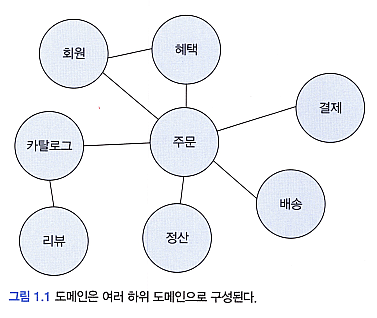
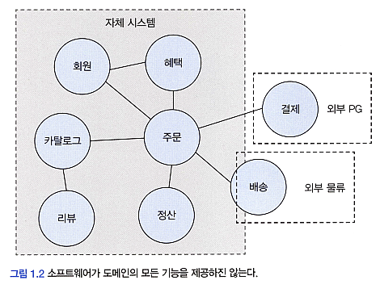

# <a href = "../README.md" target="_blank">도메인 주도 개발 시작하기</a>
## Chapter 01. 도메인 모델 시작하기
### 1.1 도메인이란
1) 도메인, 하위 도메인
2) 특정 도메인의 모든 기능을 소프트웨어에서 직접 구현할 필요는 없다.
3) 하위 도메인을 어떻게 구성할 지의 여부는 상황에 따라 다르다.

---

# 1.1 도메인이란

---

## 1) 도메인, 하위 도메인

### 1.1 정의
- 소프트웨어로 해결하고자 하는 문제 영역
- 하나의 도메인은 여러개의 하위 도메인으로 나뉘어져 있고 이들은 각각 서로 연동함으로서 완전한 기능을 제공한다.

### 1.2 예시
- 도메인: 온라인 서점
- 하위 도메인 : 주문, 정산, 배송, 결제, 혜택, 회원, 카탈로그, 리뷰, ...

---

## 2) 특정 도메인의 모든 기능을 소프트웨어에서 직접 구현할 필요는 없다.

- 온라인 쇼핑몰이 자체적으로 배송 시스템을 구축하기보다, 외부 배송 업체의 시스템(API)을 사용하고, 배송 추적 정보를 제공하는데 필요한 기능만
일부 연동하는 식으로 처리할 수 있다.
- 이미 잘 만들어진 바퀴를 다시 발명할 필요가 있는가?

---

## 3) 하위 도메인을 어떻게 구성할 지의 여부는 상황에 따라 다르다.
- 규모가 작은 업체에서는 특정 기능을 수작업으로 처리하는 경우도 있다.
- 특정 업체에서는 특정 하위 도메인 기능 제공이 필요하지 않을 수 있다.

---
