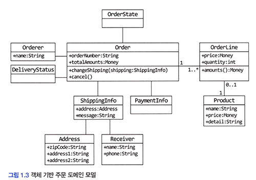
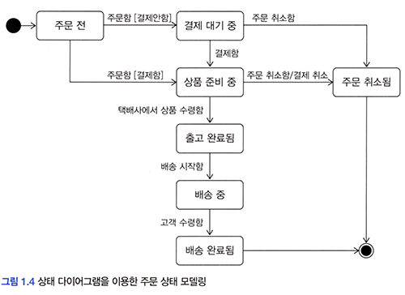

# <a href = "../README.md" target="_blank">도메인 주도 개발 시작하기</a>
## Chapter 01. 도메인 모델 시작하기
### 1.3 도메인 모델
1) 도메인 모델
2) 여러가지 도메인 모델 방식
3) 수단이 어찌됐든, 도메인을 이해하기 쉽게 표현하는 것이 중요
4) 구현 기술에 맞는 모델이 별도로 필요
5) 같은 용어를 가지더라도, 하위 도메인마다 별도로 모델을 만들어야한다.

---

# 1.3 도메인 모델

---

## 1) 도메인 모델
- 특정 도메인을 개념적으로 표현한 것
- "어떤 방식으로 도메인을 개념적으로 이해하기 쉽게 표현할까?"

---

## 2) 여러가지 도메인 모델 방식

- UML 표기법(Unified Modeling Language) : 클래스 다이어그램, 상태 다이어 그램, ...
- 그래프, 수학공식, ...

---

## 3) 수단이 어찌됐든, 도메인을 이해하기 쉽게 표현하는 것이 중요
- 어떤 표기법을 써야한다는 정답은 존재하지 않는다.
- 도메인 모델은 정의 그대로, 도메인을 개념적으로 "이해하게 쉽게 표현"하는 것이 중요하므로
어떤 수단을 사용하는 지는 중요하지 않다.

---

## 4) 구현 기술에 맞는 모델이 별도로 필요

### 4.1 개념 모델과 구현 기술 모델
- 도메인 모델은 개념 모델이므로, 이를 이용해 바로 코드를 작성할 수 있는 것이 아니다.
- 구현 기술에 맞는 구현 모델이 별도로 필요하다.

### 4.2 물론, 구현 모델이 개념 모델을 최대한 따르도록 할 수는 있다.
- 객체 기반 모델을 기반으로 도메인을 표현했다면, 객체 지향 언어를 이용해 개념 모델과 유사하게
구현할 수 있음
- 수학적인 모델을 사용했다면, 함수를 이용해서 개념 모델과 유사한 구현 모델을 만들 수 있음

---

## 5) 같은 용어를 가지더라도, 하위 도메인마다 별도로 모델을 만들어야한다.

### 5.1 하위 도메인마다 같은 용어의 의미가 달라질 수 있음
- 각각의 하위 도메인이 다루는 영역은 서로 다르기 때문에 같은 용어라도 하위 도메인마다 의미가 달라질 수 있다.
- 예를 들어 카탈로그 도메인의 상품은 상품 가격/상세 내용 등을 담은 정보를 의미하면, 배송 도메인의 상품은
고객에게 실제 배송되는 물리적인 상품을 의미한다. 이들은 의미가 서로 다르다.

### 5.2 각 하위 도메인마다 별도로 모델을 만들어야한다.
- 도메인에 따라 용어 의미가 결정되므로 여러 하위 도메인을 하나의 다이어그램에 모델링하면 안 된다.
- 같은 모델링에 표현하려고 하면, 각 하위 도메인 입장에서 용어의 의미를 제대로 이해하는데 방해가 된다.
- 모델의 각 구성 요소는 특정 도메인으로 한정할 때 비로소 의미가 완전해지기 때문에 각 하위 도메인마다 별도로
모델을 만들어야한다.

---
