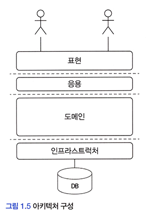

# <a href = "../README.md" target="_blank">도메인 주도 개발 시작하기</a>
## Chapter 01. 도메인 모델 시작하기
### 1.4 도메인 모델 패턴
1) 애플리케이션 아키텍처(계층형)
2) 도메인 모델 패턴
3) 개념모델, 구현 모델

---

# 1.4 도메인 모델 패턴

---

## 1) 애플리케이션 아키텍처(계층형)

### 1.1 사용자 인터페이스(UI), 표현 계층(Presentation Layer)
- 사용자의 요청을 처리하고, 사용자에게 정보를 보여줌
- 사용자는 소프트웨어를 사용하는 사람뿐만 아니라 외부 시스템일 수도 있다.

### 1.2 응용 계층(Application Layer)
- 사용자가 요청한 기능을 실행
- 업무 로직을 직접 구현하지 않으며 도메인 계층을 조합해서 기능을 실행

### 1.3 도메인 계층(Domain Layer)
- 시스템이 제공할 도메인 규칙을 구현

### 1.4 인프라스트럭쳐 계층 (Infrastructure)
- 데이터베이스나 메시징 시스템과 같은 외부 시스템과의 연동을 처리한다.

---

## 2) 도메인 모델 패턴

### 2.1 도메인 계층
- 도메인 계층은 핵심 규칙을 구현한다.

### 2.2 도메인 모델 패턴
- 도메인 규칙을 객체 지향 기법으로 구현하는 패턴
- 핵심 규칙을 구현한 코드는 도메인 모델에만 위치하기 때문에 규칙이 바뀌거나 규칙을 확장해야할 때
다른 코드에 영향을 덜 주고 변경 내역을 모델에 반영할 수 있게 된다.

### 용어 주의
- 앞에서 설명했던 도메인 모델 : '도메인' 자체를 표현하는 개념적인 모델
- 마틴 파울러의 도메인 모델 : 도메인 계층을 구현할 때 사용하는 객체 모델
  - 이 책에서 도메인 계층의 객체 모델을 표현할 때는 도메인 모델이라는 단어를 사용한다.

---

## 3) 개념모델, 구현 모델

### 3.1 개념 모델
- 순수하게 문제를 분석한 결과물
- 특정 구현 기술을 고려하지 않고 있기 때문에 실제 코드를 작성할 때 개념 모델을 있는 그대로 사용할 수 없다.

### 3.2 구현 모델 
- 개념 모델을 구현 가능한 형태로 전환하는 과정이 필요한데 이 과정의 결과물이 구현 모델이다.

### 3.3 도메인에 대한 이해도가 깊어지면, 개념 모델 자체가 변하는 경우가 생길 수 있음
- 소프트웨어를 개발하면서 개발자 및 관계자는 해당 도메인을 더 잘 이해하게 된다.
- 프로젝트 초기에 이해한 도메인 지식이 시간이 지나 새로운 통찰을 얻으면서 완전히 다른 의미로 해석되는 경우도 있음
- 프로젝트 초기에 완벽한 도메인 모델을 만들더라도, 결국 도메인에 대한 새로운 지식이 쌓이면서 모델을 보완하거나
변경하는 일이 발생

### 3.4 개념 모델은 전반적인 개요를 알 수 있는 수준으로 모델링해야함
- 결국 개념 모델은 변화할 가능성이 많음
- 프로젝트 초기에는 개요 수준으로 도메인에 대한 전체적인 윤곽을 이해하는 데 집중하고, 구현하는 과정에서 개념 모델을
논리 모델로 점진적 발전시켜 나가야 함

---
