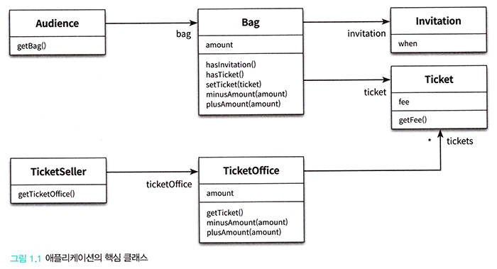

# <a href = "../README.md" target="_blank">오브젝트</a>
## Chapter 01. 객체, 설계
### 1.1 티켓 판매 애플리케이션 구현하기
1) 요구사항 분석
2) 구현 결과물

---

# 1.1 티켓 판매 애플리케이션 구현하기

---

## 1) 요구사항 분석
- 공연을 관람하기 원하는 모든 사람은 티켓을 소지하고 있어야만 한다.
- 극장에 입장하기 위해서는 초대장을 티켓으로 교환하거나, 구매해야한다.
  - 이벤트 당첨자는 티켓으로 교환할 초대장을 가지고 있으므로, 요금을 지불하지 않는다.
  - 이벤트에 당첨되지 않은 당첨자는 초대장을 가지고 있지 않고, 요금을 지불해야 한다.
- 관람객은 초대장, 현금, 티켓을 보유할 수 있고 소지품을 관리하기 위해 가방을 소지할 수 있다.
- 각 극장에는 티켓 판매원이 상주하고 있으며, 판매원은 매표소에서 초대장을 티켓으로 교환하거나
판매하는 역할을 수행한다.
- 티켓 매표소에는 관람객에게 판매할 티켓과 티켓의 판매금액이 보관되어 있어야 한다.

---

## 2) 구현 결과물


```java
public class Theater {

    private TicketSeller ticketSeller;

    public Theater(TicketSeller ticketSeller) {
        this.ticketSeller = ticketSeller;
    }

    public void enter(Audience audience) {
        if (audience.getBag().hasInvitation()) {
            Ticket ticket = ticketSeller.getTicketOffice().getTicket();
            audience.getBag().setTicket(ticket);
        } else {
            Ticket ticket = ticketSeller.getTicketOffice().getTicket();
            audience.getBag().minusAmount(ticket.getFee());
            ticketSeller.getTicketOffice().plusAmount(ticket.getFee());
            audience.getBag().setTicket(ticket);
        }
    }
}
```
- Theater가 audience의 bag, ticketSeller의 TicketOffice를 알고 있음
- 애플리케이션 로직이 Theater에 집중되어있음.
- 어찌되든 동작하지만 뭔가 읽기 힘든 코드가 됐다.

---
