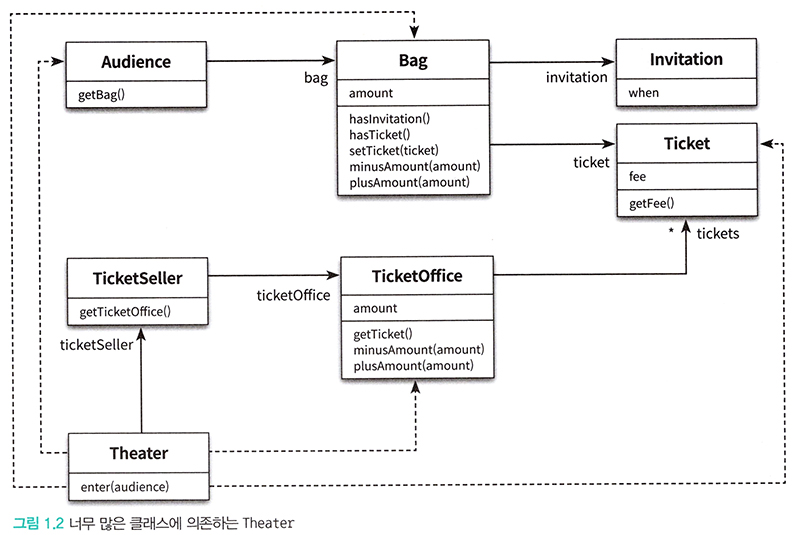

# <a href = "../README.md" target="_blank">오브젝트</a>
## Chapter 01. 객체, 설계
### 1.2 무엇이 문제인가
1) 수동적인 객체 → 읽기 어려운 코드, 예상을 벗어나는 코드
2) 불필요한 의존성 → 높은 결합도 → 변경에 취약한 코드
3) 불필요한 의존성을 최소하하여 결합도를 낮춰라.

---

# 1.2 무엇이 문제인가

> 모든 모듈은 제대로 실행돼야 하고, 변경이 용이해야 하며, 이해하기 쉬워야한다.

---

## 1) 수동적인 객체 → 읽기 어려운 코드, 예상을 벗어나는 코드
어떤 객체가 자기 자신의 일을 스스로 처리하지 못 하는 것은 우리의 직관을 벗어난다.   
의도를 정확하게 의사소통하지 못 하기 때문에 이해하기 어려운 코드가 됐다.  

### 1.1 읽기 어려운 코드, 예상을 벗어나는 코드
- 읽기 어려운 코드, 예상을 벗어나는 코드
- 제대로 실행은 되지만, 변경이 쉽지 않고, 이해하기 어렵다.

### 1.2 수동적인 객체
- Audience, TicketSeller가 Theater의 통제를 받는 수동적인 존재
- 코드의 맥락을 읽어보면 우리의 상식과 너무 다르게 동작하기 때문에 코드를 읽는 다른 사람과 제대로 의사소통하기 어렵다.

### 1.3 하나의 클래스, 메서드에서 너무 많은 세부사항을 다룸
- 하나의 클래스, 메서드에서 너무 많은 세부사항을 다루기 때문에 코드 작성자 뿐 아니라 코드를 이해해야하는 사람 모두에게 큰 부담을 줌
- getter로 다른 클래스의 세세한 부분까지 접근하여 간섭을 하고 있음. 너무 많은 것을 알고 있다.

---

## 2) 불필요한 의존성 → 높은 결합도 → 변경에 취약한 코드

불필요한 의존성이 발생하여 결합도가 높아지고, 변경의 파급효과가 커짐으로서 변경하기 어려운 코드가 됐다.

### 2.1 변경에 취약하다
- Theater는 TicketSeller가 근무하고 있는 TicketOffice도 알고 있고, Audience가 Bag을 갖고 있는 사실, Bag의 상태 등을
참조하고 있다.
- Theater의 코드에 참여하고 있는 Audience, Bag 클래스의 구현 코드가 변경하면 해당 클래스뿐만 아니라
Theater의 코드도 변경해야함.
- 클라이언트가 참조하고 있는 객체의 내부에 대해 더 많이 알면 알 수록 코드를 더 변경하기 어려워진다.

### 2.2 불필요한 의존성(Dependency)은 변경에 대한 영향을 암시한다.
- 의존성 : 어떤 객체가 다른 객체를 알고 있는 것.
- 내부에 대한 더 많은 노출, 그리고 이러한 내부 구현사항에 대한 지나친 의존은 변경하기 어려운 코드를 만든다.
- 의존성은 변경에 대한 영향을 암시한다. 암시 어떤 객체가 변경될 때 이를 의존하는 다른 객체도 함께 변경될 수 있다.

### 2.3 결합도(coupling)
- 객체 사이의 의존성에 대한 정도를 칭하는 말
- 의존성이 과하다 = 결합도가 높다.
- 객체들이 합리적으로 의존한다 = 결합도가 낮다.

---

## 3) 불필요한 의존성을 최소하하여 결합도를 낮춰라.
- 의존성을 완전히 없애는 것이 정답은 아니다. 결국 만들고자 하는 것은 협력하는 객체들의 공동체를 구축하는 것.
- 현실적인 목표로, 애플리케이션의 기능을 구현하는 데 필요한 최소한의 의존성만 유지하고 불필요한 의존성을 제거하는 것을 두자
- 객체 사이의 결합도를 낮춰 변경이 용이한 설계를 만드는 것을 목표로 두자.

---
