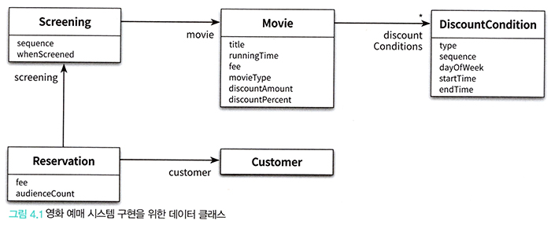

# <a href = "../README.md" target="_blank">오브젝트</a>
## Chapter 04. 설계 품질과 트레이드오프
### 4.1 데이터 중심의 영화 예매 시스템
1) 데이터 중심 설계
2) 책임 중심 설계
3) 데이터 중심 영화 예매 시스템 구현
---

# 4.1 데이터 중심의 영화 예매 시스템

---

## 1) 데이터 중심 설계

### 1.1 데이터 중심 설계
- 객체 내부에 저장되는 데이터를 기반으로 시스템을 분할하는 방법
- 객체 내부에 저장해야 하는 '데이터가 무엇인가'를 중점으로 하여 객체를 설계함
- 자신이 포함하고 있는 데이터를 조작하는 데 필요한 오퍼레이션을 정의함.
  - 주로 이는 getter, setter를 사용한다.
- 객체를 독립된 데이터 덩어리로 바라봄

### 1.2 데이터 중심 설계의 문제점
변경에 매우 취약한 코드를 만들 가능성이 높다.

- 객체의 상태는 '구현'에 속한다. 구현은 불안정하기 때문에 변하기 쉽다.
- 구현에 대한 세부사항이 객체의 인터페이스에 스며들게 되어 캡슐화의 원칙이 무너진다.
- 상태 변경은 인터페이스의 변경을 초래하며, 이 인터페이스에 의존하는 모든 객체에게 변경의 영향이 퍼지게 된다.

---

## 2) 책임 중심 설계

### 2.1 책임 중심 설계
- 책임을 찾고, 책임을 수행할 적절한 객체를 찾아 책임을 할당하는 방식으로 협력을 설계하는 방법
- 협력에 필요한 '책임은 무엇인가'를 중점으로 하여 객체를 설계함
- 다른 객체가 요청할 수 있는 오퍼레이션을 위해 필요한 상태를 보관함.
- 객체를 협력하는 공동체의 일원으로 바라봄.

### 2.2 책임 중심 설계의 장점
책임에 초점을 맞추면 상대적으로 변경에 안정적인 설계를 얻을 수 있다.

- 객체의 책임은 '인터페이스'에 속한다.
- 객체는 책임을 드러내는 안정적인 '인터페이스' 뒤로 책임을 수행하는 데 필요한 상태를 캡슐화함으로써 구현 변경에 대한 파장이
외부로 퍼져나가는 것을 방지한다.

---

## 3) 데이터 중심 영화 예매 시스템 구현


### 3.1 Money

<details>
<summary>접기/펼치기 버튼</summary>
<div markdown="1">

```java

public class Money {

    public static final Money ZERO = Money.wons(0);

    private final BigDecimal amount;

    public static Money wons(long amount) {
        return new Money(BigDecimal.valueOf(amount));
    }

    public static Money wons(double amount) {
        return new Money(BigDecimal.valueOf(amount));
    }

    private Money(BigDecimal amount) {
        this.amount = amount;
    }

    public Money plus(Money amount) {
        return new Money(this.amount.add(amount.amount));
    }

    public Money minus(Money amount) {
        return new Money(this.amount.subtract(amount.amount));
    }

    public Money times(double percent) {
        return new Money(this.amount.multiply(BigDecimal.valueOf(percent)));
    }

    public boolean isLessThan(Money other) {
        return amount.compareTo(other.amount) < 0;
    }

    public boolean isGreaterThanOrEqual(Money other) {
        return amount.compareTo(other.amount) >= 0;
    }

    @Override
    public boolean equals(Object o) {
        if (this == o) return true;
        if (!(o instanceof Money money)) return false;
        return Objects.equals(amount.doubleValue(), money.amount.doubleValue());
    }

    @Override
    public int hashCode() {
        return Objects.hash(amount);
    }

    @Override
    public String toString() {
        return amount.toString() + "원";
    }
}

```

</div>
</details>


### 3.2 Movie
<details>
<summary>접기/펼치기 버튼</summary>
<div markdown="1">


```java

public class Movie {

    private String title;
    private Duration runnintTime;
    private Money fee;
    private List<DiscountCondition> discountConditions;

    private MovieType movieType;
    private Money discountAmount;
    private double discountPercent;

    public Money getFee() {
        return fee;
    }

    public void setFee(Money fee) {
        this.fee = fee;
    }

    public List<DiscountCondition> getDiscountConditions() {
        return discountConditions;
    }

    public void setDiscountConditions(List<DiscountCondition> discountConditions) {
        this.discountConditions = discountConditions;
    }

    public MovieType getMovieType() {
        return movieType;
    }

    public void setMovieType(MovieType movieType) {
        this.movieType = movieType;
    }

    public Money getDiscountAmount() {
        return discountAmount;
    }

    public void setDiscountAmount(Money discountAmount) {
        this.discountAmount = discountAmount;
    }

    public double getDiscountPercent() {
        return discountPercent;
    }

    public void setDiscountPercent(double discountPercent) {
        this.discountPercent = discountPercent;
    }
}
```

</div>
</details>


### 3.3 MovieType
<details>
<summary>접기/펼치기 버튼</summary>
<div markdown="1">

```java
public enum MovieType {
    AMOUNT_DISCOUNT, // 금액 할인 정책
    PERCENT_DISCOUNT, // 비율 할인 정책
    NONE_DISCOUNT // 미적용
}
```

</div>
</details>


### 3.4 DiscountCondition
<details>
<summary>접기/펼치기 버튼</summary>
<div markdown="1">

```java

public class DiscountCondition {

    private DiscountConditionType type;

    private int sequence;

    private DayOfWeek dayOfWeek;
    private LocalTime startTime;
    private LocalTime endTime;

    public DiscountConditionType getType() {
        return type;
    }

    public void setType(DiscountConditionType type) {
        this.type = type;
    }

    public int getSequence() {
        return sequence;
    }

    public void setSequence(int sequence) {
        this.sequence = sequence;
    }

    public DayOfWeek getDayOfWeek() {
        return dayOfWeek;
    }

    public void setDayOfWeek(DayOfWeek dayOfWeek) {
        this.dayOfWeek = dayOfWeek;
    }

    public LocalTime getStartTime() {
        return startTime;
    }

    public void setStartTime(LocalTime startTime) {
        this.startTime = startTime;
    }

    public LocalTime getEndTime() {
        return endTime;
    }

    public void setEndTime(LocalTime endTime) {
        this.endTime = endTime;
    }
}
```


</div>
</details>


### 3.5 DiscountConditionType
<details>
<summary>접기/펼치기 버튼</summary>
<div markdown="1">

```java

public enum DiscountConditionType {
    SEQUENCE, // 순번 조건
    PERIOD // 기간 조건
}
```

</div>
</details>


### 3.6 Screening

<details>
<summary>접기/펼치기 버튼</summary>
<div markdown="1">

```java

public class Screening {

    private Movie movie;
    private int sequence;
    private LocalDateTime whenScreened;

    public Movie getMovie() {
        return movie;
    }

    public void setMovie(Movie movie) {
        this.movie = movie;
    }

    public int getSequence() {
        return sequence;
    }

    public void setSequence(int sequence) {
        this.sequence = sequence;
    }

    public LocalDateTime getWhenScreened() {
        return whenScreened;
    }

    public void setWhenScreened(LocalDateTime whenScreened) {
        this.whenScreened = whenScreened;
    }
}

```


</div>
</details>


### 3.7 Reservation
<details>
<summary>접기/펼치기 버튼</summary>
<div markdown="1">

```java

public class Reservation {

    private Customer customer;
    private Screening screening;
    private Money fee;
    private int audienceCount;

    public Reservation(Customer customer, Screening screening, Money fee, int audienceCount) {
        this.customer = customer;
        this.screening = screening;
        this.fee = fee;
        this.audienceCount = audienceCount;
    }

    public Customer getCustomer() {
        return customer;
    }

    public void setCustomer(Customer customer) {
        this.customer = customer;
    }

    public Screening getScreening() {
        return screening;
    }

    public void setScreening(Screening screening) {
        this.screening = screening;
    }

    public Money getFee() {
        return fee;
    }

    public void setFee(Money fee) {
        this.fee = fee;
    }

    public int getAudienceCount() {
        return audienceCount;
    }

    public void setAudienceCount(int audienceCount) {
        this.audienceCount = audienceCount;
    }
}
```


</div>
</details>


### 3.8 Customer
<details>
<summary>접기/펼치기 버튼</summary>
<div markdown="1">

```java
public class Customer {

    private String name;
    private String id;

    public Customer(String name, String id) {
        this.name = name;
        this.id = id;
    }
}
```


</div>
</details>


### 3.9 ReservationAgency
<details>
<summary>접기/펼치기 버튼</summary>
<div markdown="1">

```java

public class ReservationAgency {

    public Reservation reserve(Screening screening, Customer customer, int audienceCount) {
        Movie movie = screening.getMovie();

        boolean discountable = false;

        for (DiscountCondition condition : movie.getDiscountConditions()) {
            if (condition.getType() == DiscountConditionType.PERIOD) {
                discountable = screening.getWhenScreened().getDayOfWeek().equals(condition.getDayOfWeek()) &&
                        condition.getStartTime().compareTo(screening.getWhenScreened().toLocalTime()) <= 0 &&
                        condition.getEndTime().compareTo(screening.getWhenScreened().toLocalTime()) >= 0;
            } else {
                discountable = condition.getSequence() == screening.getSequence();
            }

            if (discountable) {
                break;
            }
        }

        Money fee;

        if (discountable) {
            Money discountAmount = switch (movie.getMovieType()) {
                case AMOUNT_DISCOUNT -> movie.getDiscountAmount();
                case PERCENT_DISCOUNT -> movie.getFee().times(movie.getDiscountPercent());
                case NONE_DISCOUNT -> Money.ZERO;
            };

            fee = movie.getFee().minus(discountAmount);

        } else {
            fee = movie.getFee();
        }

        return new Reservation(customer, screening, fee, audienceCount);
    }
}
```
- 참고 : 최신 switch문 문법
  - java 12부터 변수에 switch문을 할당할 수 있다.
  - 화살표 문법을 사용하여, case문을 간소화할 수 있다.
    - default 키워드를 안 써도 된다.
    - 한 줄의 표현식인 문을 사용하면 해당 값을 리턴한다.
    - 두 개 이상의 문은 블록으로 감싼다. 이 경우 리턴 값은 yield 키워드를 사용하여 반환한다.(java 13)
- 문제점 : 코드가 읽기 힘들고 변경하기 어렵다.

</div>
</details>

---
