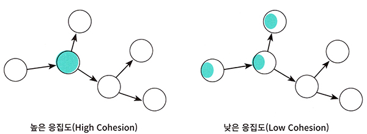

# <a href = "../README.md" target="_blank">오브젝트</a>
## Chapter 04. 설계 품질과 트레이드오프
### 4.2 설계 트레이드오프
1) 캡슐화
2) 응집도
3) 결합도
4) 설계 품질 관점에서의 캡슐화, 응집도, 결합도
---

# 4.2 설계 트레이드오프

좋은 설계의 특징을 판단할 수 있는 주요 기준으로, 캡슐화/응집도/결합도가 있다.

---

## 1) 캡슐화

### 1.1 캡슐화
- 연관된 상태와 행동을 하나의 모듈에 모음
- 접근제어 : 퍼블릭 인터페이스를 외부에 공개, 내부 구현을 은닉하여 외부에서는 퍼블릭 인터페이스를 통해서만 접근할 수 있게 함
  - 퍼블릭 인터페이스 : 외부에 공개하는 안정적인 부분.
  - 구현 : 변경 가능성이 높은 부분
- 변경 관점에서 놓고 보면, 캡슐화는 변경 가능성이 높은 부분을 객체 내부로 숨기는 추상화 기법이다.

### 1.2 설계 품질 관점에서의 캡슐화의 중요성
- 요구사항은 계속 변하기 마련이다.
- 캡슐화가 중요한 이유는 불안정한 부분과 안정적인 부분을 분리해서 변경의 영향을 통제할 수 있기 때문이다.
- 변경의 관점에서 놓고 보면 설계의 품질을 판단하기 위해 캡슐화를 기준으로 삼을 수 있다.

---

## 2) 응집도

### 2.1 응집도
- 모듈에 포함된 내부 요소들이 연관돼 있는 정도
- 객체 지향 관점 : 객체 또는 클래스에 얼마나 관련 높은 책임들을 할당했는가
- 변경 관점 : 변경이 발생할 때 모듈 내부에서 변경의 정도

### 2.2 응집도가 높다
- 모듈 내의 요소들이 하나의 목적을 위해 긴밀하게 협력함
- 응집도가 높으면 하나의 요구사항을 반영하기 위해 하나의 모듈만 수정하면 된다.
- 변경의 대상과 범위가 명확해지기 때문에 코드를 변경하기 쉬워진다.

### 2.3 응집도가 낮다
- 모듈 내의 요소들이 서로 다른 목적을 추구함.
- 관련 있는 요소들이 여러 모듈에 분산됨
- 응집도가 낮으면 하나의 원인에 의해 변경하는 부분이 다수의 모듈에 분산돼 있기 때문에 여러 모듈을 동시에 수정해야 한다.

---

## 3) 결합도

### 3.1 결합도
- 의존성의 정도. 다른 모듈에 대해 얼마나 많은 지식을 갖고 있는 지에 관한 척도
- 객체 지향 관점 : 객체 또는 클래스가 협력에 필요한 적절한 수준의 관계만을 유지하고 있는가
- 변경 관점 : 한 모듈이 변경되기 위해서 다른 모듈의 변경을 요구하는 정도

### 3.2 결합도가 낮다
- 어떤 모듈이 다른 모듈에 대해 꼭 필요한 지식만을 갖고 있음
- 하나의 모듈을 변경했을 때 적은 수의 모듈을 변경하면 된다.
- 퍼블릭 인터페이스를 수정했을 때에만 다른 모듈에 영향을 미침

### 3.3 결합도가 높다
- 어떤 모듈이 다른 모듈에 대해 너무 자세한 부분까지 알고 있음
- 하나의 모듈을 변경했을 때, 많은 수의 모듈을 변경해야 함
- 내부 구현을 변경했을 때 쉽게 다른 모듈에 영향을 끼침

### 3.4 결합도에 대해 고민하지 않아도 되는 경우
변경 가능성이 매우 적은 안정적인 모듈

- 표준 라이브러리에 포함된 모듈 : String, ArrayList, ...
- 성숙 단계에 접어든 프레임워크

---

## 4) 설계 품질 관점에서의 캡슐화, 응집도, 결합도

### 4.1 좋은 설계
- 오늘의 기능을 수행하면서 내일의 변경을 수용할 수 있는 설계(쉽게 변경할 수 있는 설계)
- 높은 응집도와 낮은 결합도를 가진 모듈로 구성된 설계

### 4.2 가장 중요한 것은 캡슐화
응집도와 결합도를 고려하기 전에 먼저 캡슐화를 향상시키기 위해 노력해야함

- 캡슐화의 정도가 응집도, 결합도에 영향을 미침
- 캡슐화를 지키면 모듈 안의 응집도는 높아지고, 모듈 사이의 결합도가 낮아짐.
- 캡슐화를 위반하면 모듈 안의 응집도는 낮아지고, 모듈 사이의 결합도는 높아짐

---
