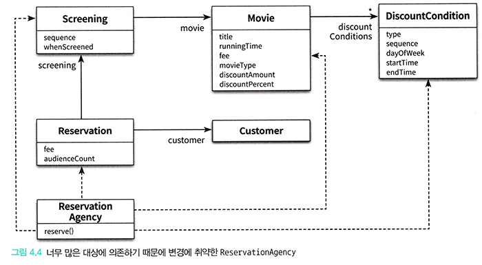

# <a href = "../README.md" target="_blank">오브젝트</a>
## Chapter 04. 설계 품질과 트레이드오프
### 4.3 데이터 중심의 영화 예매 시스템의 문제점
1) 캡슐화 위반
2) 높은 결합도
3) 낮은 응집도
4) 응집도와 단일 책임 원칙(SRP)

---

# 4.3 데이터 중심의 영화 예매 시스템의 문제점

---

## 1) 캡슐화 위반

### 1.1 접근자, 수정자
- 접근자(getter), 수정자(setter)가 외부에 열려 있어서, 객체 내부의 상태에 대한 어떤 정보도 캡슐화를 하지 못 하고 있다.
- 접근자와 수정자는 객체 내부에 특정한 상태가 있다는 사실을 노골적으로 드러냄.

### 1.2 책임을 중심으로 한 설계를 해야한다.
- 객체가 캡슐화를 위반하게 된 근본적인 원인은 객체가 수행할 책임이 아니라 내부에 저장할 데이터에 초점을 맞췄기 때문이다.
- 객체가 사용될 문맥(협력, 책임 등)을 고려하지 않으면 어떤 상황에서도 해당 객체가 사용될 수 있게 getter, setter를 무분별하게 열어놓게 됨
  - 추측에 의한 설계 전략 : 어디선가 객체가 다양한 상황에서 사용될 수 있으리라는 막연한 추측을 기반으로 getter, setter를 열어 둔 설계
- 설계를 할 때 '협력'에 관해 고민하지 않으면 캡슐화를 위반하는 과도한 접근자(getter)와 수정자(setter)를 갖게 된다.

---

## 2) 높은 결합도

### 2.1 접근자, 수정자로 인한 강한 결합
```java

public class ReservationAgency {

    public Reservation reserve(Screening screening, Customer customer, int audienceCount) {
        ...
        
        Money fee;
        
        if (discountable) {
            ...
            
            fee = movie.getFee().minus(discountAmount);

        } else {
            fee = movie.getFee();
        }
        ...
    }
}
```
- 객체의 상태는 내부 구현에 해당함.
- getter, setter는 결국 객체의 내부 구현을 public으로 열어둔 것과 동일한 결과를 가짐
- 클라이언트가 참조하는 객체의 내부 구현을 강하게 의존하여, 객체의 캡슐화를 약화시키고 강하게 결합됨.
- 내부 구현이 변경되면 이를 의존하는 모든 모듈의 코드를 변경해야한다.

### 2.2 여러 데이터 객체를 사용하는 제어 로직이 하나의 모듈에 집중되고, 이 객체가 다수의 객체에 강하게 결합됨


- 로직을 구현하기 위해 여러 객체들을 사용하는 제어로직이 하나의 모듈(ReservationAgency)에 집중됨
- 이 제어 객체가 참조하는 다수의 데이터 객체와 강하게 결합되어 있는 상태
- 참조하고 있는 데이터 객체를 변 경하면 제어 객체를 변경할 수 밖에 없음.
- 결국 제어 객체는 모든 의존성이 모이는 결합도의 집결지가 되어버려서, 시스템 안의 어떤 변경도 모두 제어 객체의 변경을 유발함
- 전체 시스템을 하나의 거대한 의존성 덩어리로 만들어 버리기 때문에, 어떤 변경이라도 일단 발생하고 나면 시스템 전체가 요동침

---

## 3) 낮은 응집도

### 3.1 어떤 하나의 변경이 일어나면, 변경과 아무 상관 없는 코드들이 영향을 받게 됨.
- '변경의 이유'가 서로 다른 코드를 하나의 모듈 안에 뭉쳤기 때문에 변경과 아무 상관이 없는 코드들이 영향을 받게 됨
- 예) ReservationAgency 안에서 할인 정책을 선택하는 코드, 할인 조건을 판단하는 코드가 함께 존재하기에 새로운 할인 정책을 추가하면
할인 조건 코드에도 영향을 끼칠 수 있음


### 3.2 하나의 요구사항을 변경하기 위해 동시에 여러 모듈을 수정해야한다.
- 응집도가 낮을 경우 다른 모듈에 위치해야 할 책임의 일부가 엉뚱한 곳에 위치하게 됨.
- 어떤 요구사항 변경을 수용하기 위해 하나 이상의 클래스를 수정해야 한다는 것은 설계의 응집도가 낮다는 증거다.

---

## 4) 응집도와 단일 책임 원칙(SRP)
- 클래스는 단 한 가지의 변경 이유만을 가져야한다.
- 이 원칙에서는 '책임'이라는 용어를 '변경의 이유'로 보고 있음. (이전에 다룬 '협력', '책임', '역할' 과 다른 개념)
- 모듈의 응집도는 변경과 연관이 있다는 사실을 강조하기 위한 원칙

---
