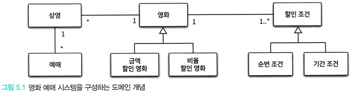
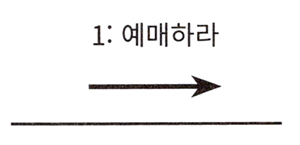
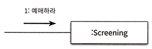
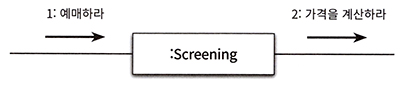
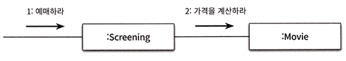
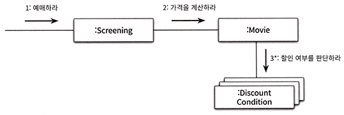
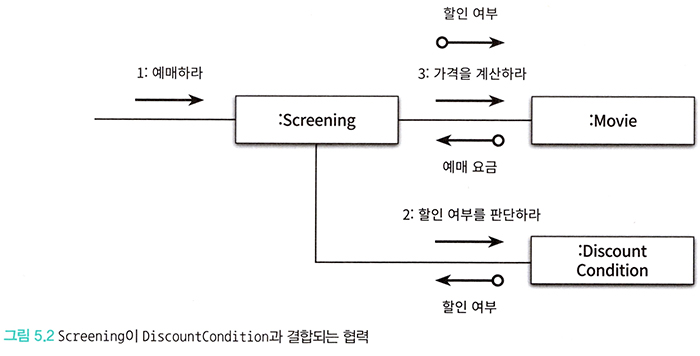
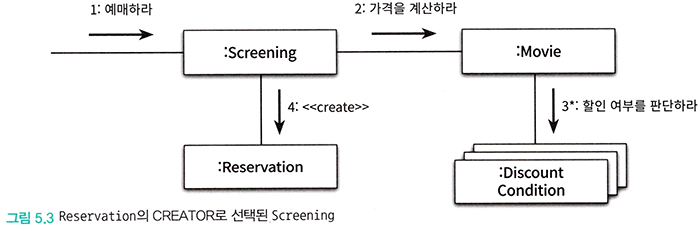

# <a href = "../README.md" target="_blank">오브젝트</a>
## Chapter 05. 책임 할당하기
### 5.2 책임 할당을 위한 GRASP 패턴
1) GRASP 패턴 : 객체에게 책임을 할당할 때 지침으로 삼을 수 있는 원칙들의 집합을 패턴화
2) 도메인 개념에서 출발하기
3) 정보 전문가 패턴 : 책임을 수행할 정보를 가장 잘 알고 있는 객체에게 책임을 할당하라
4) 높은 응집도와 낮은 결합도

---

# 5.2 책임 할당을 위한 GRASP 패턴

---

## 1) GRASP 패턴 : 객체에게 책임을 할당할 때 지침으로 삼을 수 있는 원칙들의 집합을 패턴화
- 책임 할당 기법의 일종
- General Responsibility Assignment Software Pattern(일반적인 책임 할당을 위한 소프트웨어 패턴)
- 객체에게 책임을 할당할 때 지침으로 삼을 수 있는 원칙들의 집합을 패턴으로 정리한 것

---

## 2) 도메인 개념에서 출발하기

### 2.1 도메인 모델
- 특정 도메인을 개념적으로 표현한 것
- 도메인 모델에 포함된 개념, 관계는 구현의 기반이 된다.

### 2.2 도메인 모델링
- 설계를 시작하기 전에 도메인에 대한 대략적인 모습을 그려보는 정도로 하면 된다.
- 시작 시점에서는 설계를 시작하기 위해 참고할 수 있는 개념들의 모음 정도로 간주한다.
- 할당 받을 객체들의 종류, 관계에 대한 유용한 정보를 제공하여, 올바른 구현을 이끌어내는데 도움이 된다면 충분하다.
- 도메인 개념을 완벽하게 정리하는 것이 아니다. 도메인 개념을 정리하는 데 많은 시간을 들이지 말고 빠르게 설계와 구현을 진행하라.

### 2.3 코드 구현 과정에서, 도메인을 바라보는 관점이 바뀌기도 함
- 코드의 구조가 도메인을 바라보는 관점을 바꾸기도 한다.
- 유연성이나 재사용성 등과 같이, 실제 코드를 구현하면서 얻게 되는 통찰이 역으로 도메인에 대한 개념을 바꿀 수 있음
- 예) 여기서 사용한 모델은 2장에서 사용한 도메인 모델과 다른데 이후 구현 과정에서 트레이드 오프를 통해, 2장의 형태로 변화할 것이다.

### 2.4 올바른 도메인 모델은 존재하지 않는다.
- 도메인을 개념적으로 이해할 수 있게 하고, '올바른 구현'을 이끌어 낼 수 있다면 어떤 것이든 상관 없다.
- 올바른 구현을 이끌어낼 수 있다면, 어떤 것이든 상관 없다.
- 실용적이면서도 유용한 모델이 답이다.

---

## 3) 정보 전문가 패턴 : 책임을 수행할 정보를 가장 잘 알고 있는 객체에게 책임을 할당하라

### 3.1 애플리케이션이 제공하는 '기능'을 애플리케이션의 책임으로 생각하기
- 전체 애플리케이션 맥락에서 놓고볼 때 제공해야할 기능은, 하나의 거대한 책임이다.
- 이 거대한 책임을, 애플리케이션에 대해 전송된 메시지로 간주하고 이 메시지를 책임질 첫번째 객체를 선택하는 것으로 설계를 시작한다.

### 3.2 메시지 결정하기

- 메시지는 메시지를 전송할 객체가 원하는 것이다.
- 수신할 객체가 아니라, 메시지를 전송할 객체의 의도를 반영해서 결정해야한다.
- 수신자가 누군지를 염두한 메시지를 작성하는 것이 아니다.

### 3.3 누가 메시지를 처리할 것인가?

- 객체는 상태와 행동을 통합한 캡슐화의 단위이며, 자신의 상태를 스스로 처리하는 자율적인 존재여야 한다.
- 객체의 책임과 책임을 수행하는 데 필요한 상태는 동일한 객체 안에 존재해여야한다.
- 객체에게 책임을 할당하는 첫 번째 원칙은, 책임을 수행할 정보를 알고 있는 객체에게 책임을 할당하는 것이다.
이를 정보 전문가(Information Expert) 패턴이라고 한다.

### 3.4 정보 전문가 패턴
- 책임을 수행할 정보를 알고 있는 객체에게 책임을 할당하는 것
- 책임을 할당할 때 가장 기본이 되는 책임 할당 원칙.
- 객체란, 상태와 행동을 가지는 단위라는 객체지향의 기본 원리를 책임 할당의 관점에서 표현한 패턴이다.
- 정보 전문가 패턴을 따르는 것만으로도 자율성 높은 객체들로 구성된 협력 공동체를 구축할 가능성이 높아진다.

### 3.4 정보 전문가가 데이터를 반드시 저장하고 있을 필요는 없다.
- 정보 전문가 패턴에서의 '정보'는 '데이터'와 다르다. 객체가 정보를 알고 있다고 해서 그 정보를 '저장'하고 있을 필요는 없다. 객체는
정보를 제공할 수 있는 다른 객체를 알고 있거나, 필요한 정보를 계산해서 제공할 수도 있다.
- 어떤 경우에든 정보 전문가가 데이터를 반드시 저장하고 있을 필요는 없다.

### 3.5 메시지를 처리할 객체를 정했다면, 객체 내부 관점으로 들어가서 생각한다.
- 예를 들어 영화를 예매하라는 메시지를 처리할 객체로 Screening을 선택했다면, Screening 내부 관점으로 들어가, 메시지를 처리하기 위해
필요한 절차와 구현을 고민해본다.
- 책임을 수행하는 데 필요한 작업을 구상해보고, 스스로 처리할 수 있는 것인지 스스로 처리할 수 없는 것인지 고민해본다.
  - 너무 디테일한 부분까지 생각할 필요는 없다.

### 3.6 스스로 처리할 수 없는 일은 외부의 도움을 요청해야한다.

- 정보 전문가 스스로 처리할 수 없는 부분은 정보 전문가가 다시 또 외부에 도움을 요청해야 한다.
- 이 요청이 외부로 전송해야하는 새로운 메시지가 되고, 이 메시지가 새로운 객체의 책임으로 할당된다.
- 이와 같은 연쇄적인 메시지 전송과 수신을 통해 협력 공동체가 형성된다.

---

## 4) 높은 응집도와 낮은 결합도

### 4.1 결국 설계는 트레이드오프
- 정보 전문가 패턴 외에도 다른 방식으로 책임을 할당하는 패턴이 있기 마련이다.
- 해석하기 나름에 따라, 동일하게 정보 전문가 패턴을 사용하더라도 여러 가지 방식의 설계가 나올 수 있다.

### 4.2 선택의 기준 : 높은 응집도, 낮은 결합도
- 책임을 할당할 수 있는 다양한 대안들이 존재한다면, 그 중에서 응집도와 결합도 측면에서 더 나은 대안을 선택하는 것이 좋다.
- 두 협력 패턴 중에서 높은 응집도(High Cohesion)와 낮은 결합도(Low Coupling)를 얻을 수 있다면 그 설계를 선택하는 것이 좋다.
- 책임을 할당하고 코드를 작성하는 매 순간마다 높은 응집도, 낮은 결합도 관점에서 전체적인 설계 품질을 검토하면 단순하면서도 재사용
가능하고 유연한 설계를 얻을 수 있다.

### 4.3 예시
- 위의 설계에서는 Screening이 DiscountCondition에게 할인여부 판단 로직을 위임하고 그 할인 여부를 Movie에게 전달하여
할인 가격을 계산하도록 하였다.
- 기존의 설계와 비교했을 때 이 설계는 두 가지 관점에서 부족함이 있다.
  - 더 낮은 응집도 : Screening의 주된 책임은 예매를 생성하는 것인데, 영화 요금을 계산하는 책임의 일부가 Screening에게 이전하게 됐다.
  Screening의 변경의 이유는 두 가지가 되므로, 더 응집도가 낮아진다.
  - 더 높은 결합도 : Screening과 DiscountCondition 사이에 새로운 의존 관계가 추가되어 결합도가 높아졌다.
- 따라서, 응집도/결합도 관점에서 Movie와 DiscountCondition이 협력하는 것이 더 나은 선택이다.

---

## 5) 창조자(Creator)에게 객체 생성 책임을 할당하라

### 5.1 협력의 목적이 무언가를 만드는 것이면, 이를 누군가 생성할 책임을 가진다.
- 이번 예제에서 영화 예매의 최종 결과물은 'Reservation' 인스턴스를 생성하는 것이다.
- 따라서 협력에 참여하는 어떤 객체는 Reservation 인스턴스를 생성할 책임을 가져야 한다.

### 5.2 창조자(Creator) 패턴 : 객체를 생성할 책임을 어떤 객체에게 할당할 지
- 객체 A를 창조해야할 때, 아래 조건을 최대한 많이 만족하는 B에게 객체 생성 책임을 할당해야 한다.
  - B가 A 객체를 포함하거나 참고한다.
  - B가 A 객체를 기록한다.
  - B가 A 객체를 긴밀하게 사용한다.
  - B가 A 객체를 초기화하는 데 필요한 데이터를 가지고 있다. (이 경우 B는 A에 대한 정보 전문가이다.)
- 요컨대 A를 가장 잘 알고 있거나, 긴밀하게 하거나, 초기화에 필요한 데이터를 가지고 있는 객체를 Creator로 하는 것이 적절한 경우가 많다.

### 5.3 창조자 패턴의 의도
- 어떤 방식으로든 생성되는 객체와 연결되거나 관련될 필요가 있는 객체에게 해당 객체를 생성할 책임을 맡기는 것
- 생성될 객체에 대해 잘 알고 있어야 하거나, 그 객체를 사용해야하는 객체는 어떤 방식으로든 생성될 객체와 연결될 것이다. 다시 말하면, 두
객체는 결국 결합된다.
- 이미 결합돼 있는 객체에게 생성 책임을 할당하는 것은 설계의 전체적인 결합도에 영향을 미치지 않는다.
- 결과적으로 Creator 패턴은 이미 존재하는 객체 사이의 관계를 이용하기 때문에 설계가 낮은 결합도를 유지할 수 있게 한다.

---
