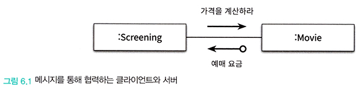
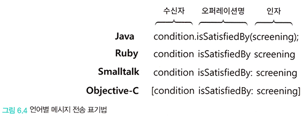
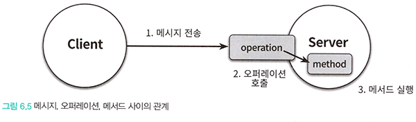

# <a href = "../README.md" target="_blank">오브젝트</a>
## Chapter 06 메시지와 인터페이스
### 6.1 협력과 메시지
1) 클라이언트-서버 모델
2) 메시지와 메시지 전송
3) 메시지와 메서드
4) 퍼블릭 인터페이스와 오퍼레이션
5) 시그니처
---

# 6.1 협력과 메시지

---

## 1) 클라이언트-서버 모델

### 1.1 협력의 필요성
- 객체가 독립적으로 수행할 수 있는 것보다 더 큰 책임을 수행하기 위해서는 다른 객체와 협력해야한다.

### 1.2 협력과 메시지

- 협력은 어떤 객체가 다른 객체에게 무언가를 요청할 때 시작된다.
- 메시지는 객체 사이의 협력을 가능하게 하는 매개체이다.
- 객체가 다른 객체에게 접근할 수 있는 유일한 방법은 메시지를 전송하는 것 뿐이다.
- 메시지를 매개로 하는 요청과 응답의 조합이 두 객체 사이의 협력을 구성한다.
- 클라이언트-서버 모델에 따르면, 클라이언트가 서버의 서비스를 요청하는 단방향 상호작용을 의미한다.

### 1.3 클라이언트

- 협력 안에서 메시지를 전송하는 객체(메시지 전송자)
- 자신의 희망을 메시지라는 형태로 전송한다.

### 1.4 서버
- 협력 안에서 메시지를 수신하는 객체(메시지 수신자)
- 요청을 자신의 방식대로 적절히 처리하고 응답한다.

### 1.5 하나의 객체는 클라이언트, 서버의 역할을 동시에 수행하는 경우가 많다.

- Movie의 예처럼, 객체는 협력에 참여하는 동안 클라이언트, 서버의 역할을 동시에 수행하는 것이 일반적이다.
- 협력의 관점에서 객체는 두 가지 종류의 메시지 집합으로 구성된다.
  - 객체가 수신하는 메시지의 집합
  - 외부의 객체에게 전송하는 메시지의 집합
- 협력에 적합한 객체를 설계하기 위해서는 외부에 전송하는 메시지의 집합도 함께 고려하는 것이 바람직하다.

---

## 2) 메시지와 메시지 전송

### 2.1 메시지
- 객체들이 협력하기 위해 사용할 수 있는 유일한 의사소통 수단
- 오퍼레이션명, 인자로 구성
- 예) `isSatisfiedBy(screening)`

### 2.2 메시지 전송
- 한 객체가 다른 객체에게 도움을 요청하는 것
- 메시지 수신자 + 메시지(오퍼레이션명 + 인자)
- 예) `condition.isSatisfiedBy(screening)`

---

## 3) 메시지와 메서드

### 3.1 메서드
- 메시지를 수신했을 때 실제로 실행되는 함수 또는 프로시저(코드 블록)
- 오퍼레이션의 구현
- 동일한 오퍼레이션이라 하더라도, 객체의 실제 타입에 따라 메서드는 다를 수 있다.

### 3.2 메시지와 메서드의 구분
메시지-메서드의 구분은 다형성의 개념과 연결된다.

- 메시지 전송자와 메시지 수신자가 느슨하게 결합될 수 있게 한다.
- 메시지 전송자는 자신이 어떤 메시지를 전송하는지만 알면 된다.
  - 코드 상에 메시지 전송을 표기하는 시점에, 어떤 코드가 실행될 지 정확하게 알 수 없고, 알 필요도 없다.
  - 그저 그 메시지에 응답할 수 있는 객체가 존재하고 그 객체가 적절한 메서드를 선택해서 응답할 것이라고 믿을 수밖에 없다.
- 메시지 수신자 역시 누가 메시지를 전송하는 지 알 필요가 없다.
  - 단지 메시지가 도착했다는 사실만을 알면 된다.
  - 메시지를 처리하기 위해 필요한 메서드를 스스로 결정할 수 있는 자율권(구현의 자유)를 가진다.
- 객체는 메시지와 메서드라는 서로 다른 개념을 실행 시점에 연결하기 때문에 컴파일 시점과 실행 시점의 의미가 달라질 수 있다.
- 실행 시점 메시지-메서드를 바인딩하는 메커니즘 덕분에 두 객체 사이의 결합도를 낮춤으로써 유연하고 확장 가능한 코드를 작성할 수 있게 만든다.

---

## 4) 퍼블릭 인터페이스와 오퍼레이션

### 4.1 퍼블릭 인터페이스
- 객체가 협력에 참여하기 위해서 외부에서 수신할 수 있는(외부에 공개한) 메시지의 묶음
- 어떤 클래스의 퍼블릭 메서드들의 집합이나 메시지의 집합을 가리키는데 사용
- 객체를 설계할 때 가장 중요한 것은 퍼블릭 인터페이스를 설계하는 것이다.

### 4.2 오퍼레이션

- 객체가 다른 객체에게 제공하는 추상적인 서비스
- 메시지가 전송자-수신자 사이의 협력 관계를 강조하는 데에 비해 오퍼레이션은 메시지를 수신하는 객체의 인터페이스를 강조한다.
- 메시지 전송자는 고려하지 않은 채 메시지 수신자의 관점만을 다룬다.
  - 메시지 수신 : 메시지에 대응되는 객체의 오퍼레이션을 호출하는 것

---

## 5) 시그니처

### 5.1 시그니처
- 오퍼레이션(또는 메서드)의 이름과 파라미터 목록을 합친 것

### 5.2 시그니처와 메서드, 다형성
- 메서드 : 시그니처 + 구현
- 일반적으로 하나의 메시지를 수신하면 오퍼레이션의 시그니처와 동일한 메서드가 실행된다.
- 오퍼레이션 관점에서 다형성은 동일한 오퍼레이션 호출에 대해 서로 다른 메서드들이 실행되는 것이다.

---

## 6) 결론 : 메시지가 객체의 품질을 결정한다
- 객체가 수신할 수 있는 메시지가 객체의 퍼블릭 인터페이스와 그 안에 포함될 오퍼레이션을 결정한다.
- 객체의 퍼블릭 인터페이스가 객체의 품질을 결정하기 때문에 결국 메시지가 객체의 품질을 결정한다.

---

