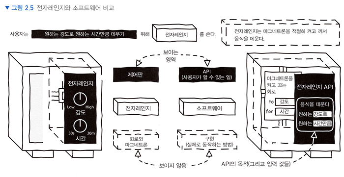
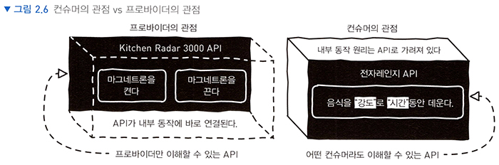

# <a href = "../README.md" target="_blank">웹 API 디자인</a>
## Chapter 02. 사용자를 위한 API 디자인하기
### 2.2 소프트웨어 인터페이스 디자인 방법
1) 인터페이스와 구현
2) '사용자가 할 수 있는 일'에 집중
3) 중요한 것은 컨슈머 입장에서 필요한 API의 목표가 무엇인지 명확하게 식별하는 것
---

# 2.2 소프트웨어 인터페이스 디자인 방법

---

## 1) 인터페이스와 구현

이 부분은 조영호 님의 '오브젝트'에서 설명하신 내용과 연관이 깊어보여 해당 내용을 일부 가져왔다.

### 1.1 퍼블릭 인터페이스
- 외부에서 접근 가능한 부분.
- 최소한의 필요한 정보만 노출(무슨 정보를 제공받아야하는 지, 이 인터페이스는 결국 무엇을 해주는 지)

### 1.2 구현
- 사용자에게 노출되지 않는 숨겨진 부분
- 외부에서 접근 불가능하고 오직 내부에서만 접근 가능한 부분. 변경 가능성이 높고, 복잡한 비즈니스 로직.
- 내부 동작 원리 등이 이곳에 은닉되어야 한다.

### 1.3 퍼블릭 인터페이스와 구현의 분리

- 사용자 친화적인 API는, 철저하게 인터페이스와 구현을 분리해야한다.
- 사용자에게는 최소한의 필요한 정보(퍼블릭 인터페이스)만 노출하고, 내부적인 복잡한 동작 원리 등은 은닉되어야 함

---

## 2) '사용자가 할 수 있는 일'에 집중

### 2.1 프로바이더 관점에서 디자인 된 API
- API 사용자의 목표와 거리가 먼, 불필요한 내부 동작 원리(구현)가 과다하게 노출됨.
- 사용하기 복잡하고, 사용자가 원하는 바를 쉽게 이루기 어렵다.
  - 예) Kitchen Radar 3000 API : 음식의 가열 세기, 시간을 조절하기 위해 마그네트론 버튼을 반복적으로 켜고 꺼야함.

### 2.2 컨슈머 관점에서 디자인 된 API
- 최소한의 인터페이스만 노출되고, 복잡한 구현이 은닉된 API
- 사용자는 API를 사용할 때 하나의 목표만을 갖고 있으며, 연관성 없는 내부 동작 원리를 알고 싶지 않음
- 사용자의 구체적인 목표를 '구현'에 전달할 수 있도록 명확하게 설계되어야함.
  - 예) 전자레인지 API : '~한 강도로 ~분동안 음식을 데우라'는 명확한 요청만 전달하면,
  내부적인 동작을 몰라도 사용자가 원하는 바를 '구현'이 수행해 줌.
- 컨슈머 친화적인 API는 내부 동작이 잘 은닉되어 있고, 이해하기 쉽고, 사용하기 쉽다. 자연스럽게 사용성이 좋아진다.

---

### 3) 중요한 것은 컨슈머 입장에서 필요한 API의 목표가 무엇인지 명확하게 식별하는 것
결국 컨슈머가 이해하기 쉽고 사용하기 쉬운 API를 만들려면,  
컨슈머가 API를 사용할 때 달성할 수 있는 목표가 무엇인지 명확하게 식별하는 것이 중요함  

---
