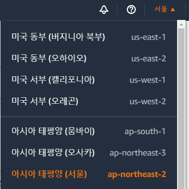

# <a href = "../README.md" target="_blank">따라하며 배우는 AWS 네트워크 입문</a>
## Chapter 01. AWS 인프라
### 1.3 실습 전 사전 준비 사항
1) AWS 회원 가입 및 프리 티어
2) AWS를 사용하는 방법
3) AWS 관리 콘솔 접근하기
4) SSH 소개
5) AWS SSH 키 페어 생성(서울 리전)
6) 그 외 준비 사항
---

# 1.3 실습 전 사전 준비 사항

---

## 1) AWS 회원 가입 및 프리 티어
- 회원가입 : https://aws.amazon.com/ko/free/
- 프리티어는 12개월 무료

---

## 2) AWS를 사용하는 방법

### 2.1 AWS 관리 콘솔(AWS Management Console)
- 웹 브라우저로 접근하여, 웹 상의 조작으로 서비스 사용

### 2.2 AWS 명령 줄 인터페이스(AWS CLI)
- 보통 Shell이라고 하는 터미널에서 AWS 전용 명령어를 통해서 서비스 사용

### 2.3 소프트웨어 개발 키트(AWS SDK)
- 프로그래밍 언어(코드)에서 쉽게 AWS 서비스를 사용할 수 있음

---

## 3) AWS 관리 콘솔 접근하기

- 접속 : https://aws.amazon.com/ko/ 접속
- root 계정 생성, admin, developer 권한 사용자 추가
  - root 계정은 반드시 MFA로
- 오른쪽 상단에서 리전을 '서울'로 변경 (주의)

---

## 4) SSH 소개

- 네트워크를 통해 원격 시스템에 접근할 수 있는 프로토콜 및 프로그램
- 접속 방식 : 유저-암호 입력방식, 키 페어 방식
  - 유저-암호방식은 무차별 대입 공격 방식에 의해 권한 탈취를 할 수 있는 우려가 있음
  - 키 파일은 사용자의 개인키가 노출되지 않기 때문에 안전. 키 파일로 로그인하기 때문에 추가적인 암호를 입력하지 않아도 되어 편리
- 기본적으로 SSH 키 페어를 통하여 AWS EC2 인스턴스에 접속

---

## 5) AWS SSH 키 페어 생성(서울 리전)
- 서비스 - EC2 - 네트워크 및 보안 - 키 페어 - 키 페어 생성
- 여기서 생성된 키는 절대 잃어버려선 안 됨
- 로컬 컴퓨터에 보관

---

## 6) 그 외 준비 사항
- 기본적으로 서울 리전 사용
- 실제 운영하는 인프라 환경과 충돌되지 않도록 AWS 프리 티어 신규 계정 생성

---

