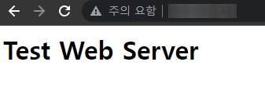

# <a href = "../README.md" target="_blank">따라하며 배우는 AWS 네트워크 입문</a>
## Chapter 01. AWS 인프라
### 1.4 [실습 1-1] EC2 배포 및 사용
1) AWS 관리 콘솔에서 EC2 인스턴스 배포
2) 사용자 PC에서 SSH로 EC2 인스턴스 접근
3) EC2 인스턴스에 웹 서비스 설치
4) EC2 인스턴스 삭제
---

# 1.4 [실습 1-1] EC2 배포 및 사용

---

## 1) AWS 관리 콘솔에서 EC2 인스턴스 배포
- 인스턴스명 : WebServer (자동으로 Name 태그 value로 WebServer)
- AMI : Amazon Linux 2 AMI
- 인스턴스 유형 : t2.micro
- 퍼블릭 IP : 퍼블릭 IP 자동 할당 반드시 활성화
- 스토리지 : 기본 설정 사용
- 보안그룹(인바운드)
  - ssh : 내 ip / 22번 포트
  - http : 위치 무관 / 80번 포트
- AWS SSH 키페어 : 이전에 생성한 키로 지정

---

## 2) 사용자 PC에서 SSH로 EC2 인스턴스 접근
책에서는 windows 기준 putty를 사용했는데, 나는 git bash 를 사용했다.

### 2.1 config 파일 생성
```
Host : 인스턴스명
    HostName 인스턴스_퍼블릭_ip_주소
    User ec2-user
    IdentityFile ~/.ssh/키이름.pem
```

### 2.2 git bash를 통해 ssh 접속
```shell
ssh WebServer(앞에서 지정한 호스트명)
```

---

## 3) EC2 인스턴스에 웹 서비스 설치
```shell
# root 계정으로 전환
sudo su -

# Web 서비스 설치
yum install httpd -y

# Web 서비스 실행
systemctl start httpd

# 웹 페이지 구성
echo "<h1>Test Web Server</h1>" > /var/www/html/index.html

# curl 명령어로 웹 접속 확인
curl localhost
```

```html
<h1>Test Web Server</h1>
```



- EC2 인스턴스에 웹 서비스를 실행하고, html 파일을 저장한다.
- 퍼블릭 ip로 접속하여 정상적으로 html이 렌더링되는 지 확인한다.

---

## 4) EC2 인스턴스 삭제
- 서비스 - EC2 - 인스턴스 - 인스턴스 선택 - 작업 - 인스턴스 상태 - 종료
- 보안그룹도 함께 삭제한다.

---
