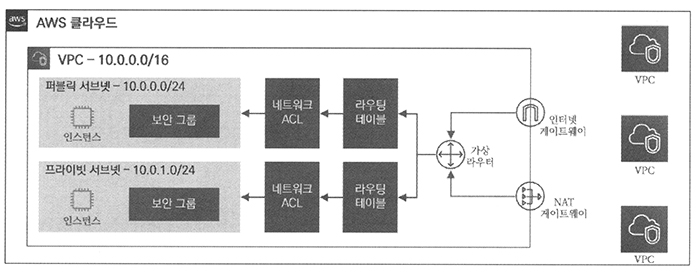

# <a href = "../README.md" target="_blank">따라하며 배우는 AWS 네트워크 입문</a>
## Chapter 02. VPC 기초
### 2.1 VPC(Virtual Private Cloud)
1) VPC : 가상 사설 클라우드 네트워크
2) VPC 특징
---

# 2.1 VPC(Virtual Private Cloud)

---

## 1) VPC : 가상 사설 클라우드 네트워크

### 1.1 VPC 정의

- Virtual Private Cloud : 독립된 가상 사설 클라우드 네트워크
- AWS 클라우드 내 논리적으로 독립된 섹션을 제공하여, 사용자가 정의한 가상 네트워크상에서 다양한 AWS 리소스를 실행할 수 있게 지원
- 사용자에 따라 네트워크 환경을 직접 설계할 수 있음
- 사용자는 VPC 내에 IP 대역, 인터페이스, 서브넷, 라우팅 테이블, 인터넷 게이트웨이, 보안 그룹, 네트워크 ACL 등을 생성하고 제어할 수 있음
- AWS 콘솔의 VPC 대시보드를 통해 VPC 리소스들을 확인할 수 있음.

### 1.2 VPC 종류
- 디폴트 VPC : 리전별로 1개씩 생성되어 있는 기본 VPC
  - AWS 리소스가 미리 정해져 있다.
  - 별도의 작업 없이 기본적인 클라우드 네트워크를 제공
- 사용자 VPC : 사용자 정의에 의해 수동으로 AWS 리소스를 생성하고 제어할 수 있음 

이후 실습에서는 사용자 VPC를 통해 환경에 맞는 구성을 할 것

---

## 2) VPC 특징

### 2.1 확장성
- 클라우드 기반에 손쉽게 VPC 자원을 생성하고 삭제가 가능하다.
- 설정 및 관리에 편의성을 제공한다.

### 2.2 보안
인스턴스 레벨과 서브넷 레벨에서 인바운드(Inbound) 및 아웃바운드(Outbound) 필터링을 수행할 수 있도록 보안 그룹과 네트워크 ACL을 제공하여
보안을 강화할 수 있다.

### 2.3 사용자 중심
VPC 내 리소스에 대해 사용자가 원하는 대로 손쉽게 제어할 수 있으며, 네트워크 지표 및 모니터링 툴을 활용하여 사용자에게 높은 가시성을
제공한다.

### 2.4 제약 사항
- 전통적인 네트워크 환경에서 사용가능 했던 기능이 제한되어 있거나 일부분만 사용 가능하여 기술적 제약이 따르게 된다.
  - 기술적 제약 : 브로드캐스트, 멀티캐스트, IP 기반 Failover 프로토콜(VRRP, HSRP) 등
- 물론, 위에서 나열한 제약사항들은 AWS에서 지속적인 기능 추가로 개선해 나가고 있다.

---
