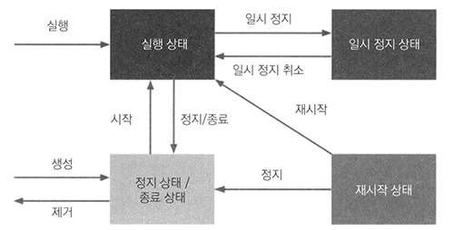

# <a href = "../README.md" target="_blank">배포 자동화와 지속적 인도</a>
## Chapter 02. 도커 소개
### 2.6 도커 컨테이너 상태
1) `docker run -d` : 백그라운드에서 컨테이너 실행
2) `docker ps` : 실행 중인 컨테이너 확인
3) `docker ps -a` : 모든 상태의 컨테이너 확인(실행 상태, 중지상태, ...)
4) 도커 컨테이너의 상태 및 상태 전환 명령어

---

# 2.6 도커 컨테이너 상태

---

## 1) `docker run -d` : 백그라운드에서 컨테이너 실행
```shell
docker run -d -t ubuntu:22.04
```
- 기본적으로 컨테이너를 실행하고, 빠져나가면 컨테이너가 종료됐다.
- 백그라운드에서 계속 실행되어야할 때가 있는데 이럴 경우 `-d` 옵션을 붙여주면 된다.

---

## 2) `docker ps` : 실행 중인 컨테이너 확인
```shell
docker ps
```
```text
CONTAINER ID   IMAGE          COMMAND   CREATED          STATUS          PORTS     NAMES
d3ec04c3e647   ubuntu:22.04   "bash"    14 seconds ago   Up 13 seconds             objective_archimedes
```
- 이전에 실행한 ubuntu가 백그라운드에서 계속 실행 중인 것을 확인할 수 있다.

---

## 3) `docker ps -a` : 모든 상태의 컨테이너 확인(실행 상태, 중지상태, ...)

### 3.1 컨테이너 정지
```shell
docker stop d3ec04c3e647
```
- 실행 중인 컨테이너를 정지시킨다.

### 3.2 `docker ps -a` : 모든 컨테이너 확인
```shell
docker ps -a
```
```text
CONTAINER ID   IMAGE          COMMAND   CREATED       STATUS                       PORTS     NAMES
d3ec04c3e647   ubuntu:22.04   "bash"    2 hours ago   Exited (137) 7 seconds ago             objective_archimedes
```
- 이 명령을 사용하면 모든 상태의 컨테이너를 확인할 수 있다.

---

## 4) 도커 컨테이너의 상태 및 상태 전환 명령어


### 4.1 도커 컨테이너의 상태

- Created : 생성된 상태(이미지에서는 생성(create) 명령 직후)
- Running : 실행 중인 상태
- Restarting : 재시작 상태(재시작 진행 중)
- Exited : 정지, 종료 상태
- Paused : 일시 정지 상태
- Dead : 컨테이너가 작동하지 않음. 다시 시작할 수 없고, 제거만 가능
- 참고 : [https://www.baeldung.com/ops/docker-container-states](https://www.baeldung.com/ops/docker-container-states)

### 4.2 상태 전환 명령어
- `docker run` : 이미지로부터 컨테이너를 실행함
- `docker rm` : 컨테이너를 제거함
- `docker create` : 이미지로부터 컨테이너를 실행하지 않고, 컨테이너 상태로만 만듬
- `docker start` : 시작 상태 또는 정지 상태의 컨테이너를 시작함
- `docker stop` : 컨테이너를 정지, 종료 시킴
- `docker pause` : 컨테이너를 일시정지 시킴
- `docker unpause` : 일시정지 상태의 컨테이너를 다시 실행함
- `docker restart`: 현재 컨테이너를 멈추고 재시작하는 임시적인 상태

---
