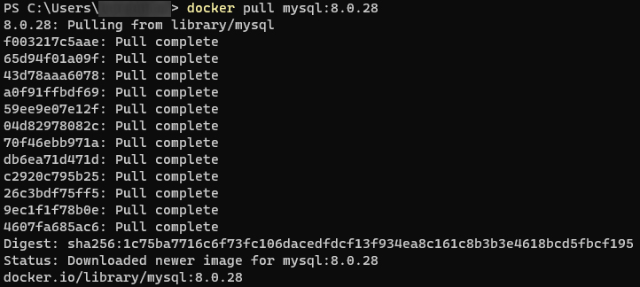
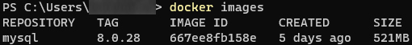

## Docker에 MySQL 환경 구축하기

## TODO

- [x] 가상환경에서 MySQL을 사용하기 위해 Docker를 설치
- [x] Docker에 MySQL 이미지 설치
- [ ] Docker 명령으로 MySQL 컨테이너 실행
- [ ] Docker 명령으로 MySQL 컨테이너에 Bash로 접속
- [ ] 셸의 환경변수와 Locale 설정, MySQL의 Config을 UTF-8로 변경

---

## 1. 가상환경에서 MySQL을 사용하기 위해 Docker 설치


- Windows / MacOS
  - https://www.docker.com/get-started/ 에서 도커 설치
  - Windows WSL2 기반 도커 실행시 vmmem 메모리 소모량 이슈가 있다. 이 부분은 아래 링크를 참조하도록 하자.
    - https://meaownworld.tistory.com/160
- 설치 확인
  ```shell
  PS C:\Users\ttasjwi> docker --version
  Docker version 20.10.13, build a224086
  ```

---

## 2. Docker에 MySQL 이미지 설치

- MySQL 이미지 pull 해오기
    ```shell
    docker pull mysql:8.0.28
    ```
    - 왜 8.0.28을 다운받았는가? : 작성 시점에서 8.0.xx 기준 안정버전


- Docker 이미지 확인
    ```shell
    PS C:\Users\ttasjwi> docker images
    ```

<details>
<summary>이미지로 보기</summary>
<div markdown="1">




- MySQL 이미지가 잘 설치된 것을 확인할 수 있다.

</div>
</details>

---
