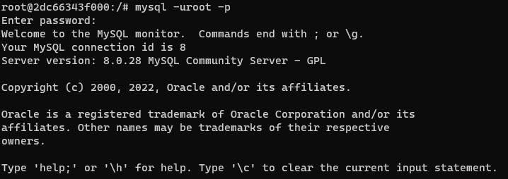
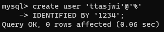
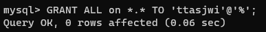
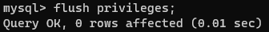

# Docker에 MySQL 환경 구축하기

---

## 1. 가상환경에서 MySQL을 사용하기 위해 Docker 설치


- Windows / MacOS
  - 도커 설치 : [Get Started with Docker](https://www.docker.com/get-started/)
  - Windows WSL2 기반 도커 실행시 vmmem 메모리 소모량 이슈가 있다. 이 부분은 아래 링크를 참조하도록 하자.
    - 참조링크 : [WSL2 기반 docker 사용시 vmmem 프로세스 메모리 소모량 줄이기](https://meaownworld.tistory.com/160)
    - `Settings > General > Start Docker Desktop when you log in` 을 끄자.
- 설치 확인
  ```shell
  PS C:\Users\ttasjwi> docker --version
  Docker version 20.10.13, build a224086
  ```

---

## 2. Docker로 ko_KR.UTF-8 로케일을 적용한 MySQL 이미지 만들기
- pull 명령어로 MySQL 이미지를 땡겨올 경우, locale 설정이 POSIX로 되어있다.
- 여기서 명령어를 적당히 입력하면 `ko_KR.UTF-8` 로케일을 적용할 수 있지만, 다시 동일 이미지로 컨테이너를 생성해보면 설정이 날아간다.
- `ko_KR.UTF-8`이 기본 설정으로 적용된 이미지를 빌드하는 것이 재사용에 있어 현명하다.
- 참고자료 : [도커(Docker) 컨테이너 로케일 설정 데비안(Debian), 우분투(Ubuntu) 이미지에서 한글 입력 문제](https://www.44bits.io/ko/post/setup_linux_locale_on_ubuntu_and_debian_container#%EB%93%A4%EC%96%B4%EA%B0%80%EB%A9%B0-%EC%BB%A8%ED%85%8C%EC%9D%B4%EB%84%88%EC%99%80-%EB%A6%AC%EB%88%85%EC%8A%A4-%EB%A1%9C%EC%BC%80%EC%9D%BC-%EC%84%A4%EC%A0%95)

### Dockerfile을 실행할 폴더 생성/이동
```shell
mkdir dockerbuild
cd dockerbuild
```

### Dockerfile 생성
```dockerfile
FROM mysql:latest
RUN apt-get update && apt-get install -y locales
RUN localedef -f UTF-8 -i ko_KR ko_KR.UTF-8
ENV LC_ALL ko_KR.UTF-8
```
- 적당한 폴더를 만들어서 그 안에서 Dockerfile 생성
- `mysql:latest`를 기반으로 몇 가지 설정을 덧붙여 이미지를 정의한 DockerFile을 작성한 뒤 이미지를 새로 빌드한다.

### Dockerfile로 Docker 이미지 빌드
```shell
# 현재 경로의 Dockerfile 기반으로 
docker build -t mysql:적당한태그명 .
```

### 실행 결과

<details>
<summary>접기/펼치기</summary>
<div markdown="1">

```shell
docker run -it mysql:ttasjwi bash
root@410ca2fa6632:/# locale
```


- 실제로 해당 이미지로 도커 컨테이너를 실행했을 때 locale 설정이 ko_KR.UTF-8로 된 MySQL 이미지가 빌드된 것을 확인할 수 있다.
- 해당 이미지를 기반으로 컨테이너를 실행했을 때 터미널에서 한글을 입력할 수 있다.

</div>
</details>

---

## 3. Docker 명령으로 MySQL 컨테이너 실행
- 앞에서 만든 이미지를 바탕으로 여러가지 환경변수 설정, 기본설정 등을 덧붙여 docker 컨테이너를 실행해야한다.
- 기본적으로 컨테이너를 실행하는 명령어는 run인데 컨테이너 하나 띄우기 위해 많은 옵션값을 덧붙여야한다.
- 이를 간편하게 하기 위해 `docker-compose.yml` 파일을 만들어서 실행 컨테이너를 정의한다.
- 참고링크 : [Docker Compose로 MySQL/MariaDB 세팅하기](https://int-i.github.io/sql/2020-12-31/mysql-docker-compose)

### docker-compose.yml
```yml
# 파일 규격 버전
version: "3"

# 이 항목 밑에 실행하려는 컨테이너를 정의
services:
  db: # 서비스 명
    image: mysql:ttasjwi # 사용할 이미지
    container_name: mysql # 컨테이너 이름 설정
    ports: # 접근 포트 설정 (여러개 설정 가능, 컨테이너 외부:컨테이너 내부)
      - 3306:3306
    env_file: .env # .env 파일을 읽고 설정으로 사용함
    command:
      - --character-set-server=utf8mb4
      - --collation-server=utf8mb4_unicode_ci
    volumes: # 볼륨 (디렉토리 마운트 설정 호스트:컨테이너)
      - ./mysql/data:/var/lib/mysql # data
      - ./mysql/conf:/etc/mysql/conf.d # conf
      - ./mysql/initdb:/docker-entrypoint-initdb.d

```
- 본래 conf.d 하위에 정의한 cnf 파일을 읽어다 mysql에서 부가적으로 사용하는데 여기서 한 10시간 넘게 삽질했다. 이 부분은 내가 실행했을 때 제대로 먹지 않았다.
- ports는 여러개 지정할 수 있다.
  - MySQL의 기본 포트는 3306이다.
  - MySQL 서버로 사용하려면 컨테이너 내부 포트는 3306을 지정하고 이것을 호스트의 포트(컨테이너 외부포트)로 연결하면 된다.
- command에서 위의 utf8mb4 characterSet과 utf8mb4_unicode_ci 콜레이션을 적용했다.
  - MySQL 8.0 이후부터는 기본 characterSet이 utf8mb4다.
  - 기본 collation은 `utf8mb4_0900_ai_ci`인데 이 collation은 동아시아권 문자열(한글 포함)에 대한 정렬에서 일부 문자들이 동일한 글자로 인식되는 등 문제가 많다. `utf8mb4_unicode_ci`를 사용하는 것을 권장한다.
  - 참조링크 : [MySQL 8.0.1 utf8mb4_0900_ai_ci의 한글 사용에 대한 문제점](https://rastalion.me/mysql-8-0-1-%EB%B2%84%EC%A0%84%EB%B6%80%ED%84%B0-%EC%B1%84%ED%83%9D%EB%90%9C-utf8mb4_0900_ai_ci%EC%9D%98-%ED%95%9C%EA%B8%80-%EC%82%AC%EC%9A%A9%EC%97%90-%EB%8C%80%ED%95%9C-%EB%AC%B8%EC%A0%9C%EC%A0%90/)
- volumes를 지정해야, 이후 컨테이너를 내리고 다시 만들어도 db 파일, conf 등을 공유한다.

### .env(환경변수)
```env
TZ=Asia/Seeoul
MYSQL_HOST=localhost
MYSQL_PORT=3306
MYSQL_ROOT_PASSWORD=패스워드
```
- `environment` 옵션으로 사용해도 되는데, 별도로 외부 파일을 읽고 설정으로 사용하도록 할 수 있다.

### docker 컨테이너 실행
```shell
# docker-compose.yml 파일에 있는 디렉토리에서
docker-compose up -d
```
- `-d` : 백그라운드 실행

---

## 4. Docker 명령으로 MySQL 컨테이너에 Bash로 접속

### 컨테이너의 bash명령어 실행
```shell
docker exec -it [컨테이너명] bash
```
- 앞에서 생성한 컨테이너를 대화형 명령으로 bash로 접속함.

---

## 5. MySQL 사용자 생성 및 권한 부여

### 루트 접속
```shell
mysql -u root -p
## 비밀번호 입력
```

### 사용자 생성
```mysql
CREATE user '이름'@'호스트'
IDENTIFIED BY '패스워드';
```
- 사용자 생성 시에는 여러가지 옵션을 사용해야하는데 이 부분을 서술하기엔 현재 학습 수준에서 범위를 벗어나므로 생략
- 주의점
  - MySQL은 사용자의 계정 뿐 아니라 접속 지점(호스트명 또는 도메인 또는 ip 주소)도 계정의 일부로 취급한다.
  - 사용자에 특정 호스트만 등록되어 있으면 다른 컴퓨터에서는 접속 불가능
  - 호스트에 `%`가 지정되어 있으면 모든 접속 지점(호스트명 또는 도메인 또는 ip 주소)에서 접속 가능
  - 서로 동일한 id에 대해 다른 호스트로 여러개가 등록되어 있을 경우 좁은 범위를 우선시하여 선택 후 식별
    - 다른 패스워드가 부여될 경우 좁은 범위를 우선시하여 인증을 적용함.


### 권한 부여
```mysql
GRANT ALL ON *.* TO '사용자이름'@'호스트';
FLUSH PRIVILEGES;
```
- 글로벌 수준에서 가능한 모든 권한 및 모든 DB에 대한 객체 권한을 부여

### 실행결과
<details>
<summary>접기/펼치기</summary>
<div markdown="1">





- 실제 서비스에서는 비밀번호를 저렇게 짓지도 않을테고, 권한도 저렇게 다 주지는 않을 것이다.
- MySQL에 익숙하지 않은 상태에서 좀 더 친숙해지기 위해 대충 지었다.

</div>
</details>

---
