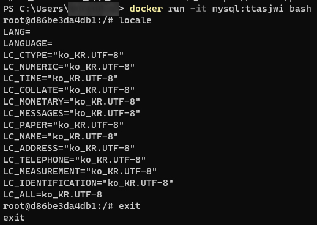

## Docker에 MySQL 환경 구축하기

## TODO

- [x] 가상환경에서 MySQL을 사용하기 위해 Docker를 설치
- [x] Docker로 ko_KR.UTF-8 로케일을 적용한 MySQL 이미지 만들기
- [x] Docker 명령으로 MySQL 컨테이너 실행
- [ ] Docker 명령으로 MySQL 컨테이너에 Bash로 접속

---

## 1. 가상환경에서 MySQL을 사용하기 위해 Docker 설치


- Windows / MacOS
  - https://www.docker.com/get-started/ 에서 도커 설치
  - Windows WSL2 기반 도커 실행시 vmmem 메모리 소모량 이슈가 있다. 이 부분은 아래 링크를 참조하도록 하자.
    - https://meaownworld.tistory.com/160
    - Settings > General > Start Docker Desktop when you log in 을 끄자.
- 설치 확인
  ```shell
  PS C:\Users\ttasjwi> docker --version
  Docker version 20.10.13, build a224086
  ```

---

## 2. Docker로 ko_KR.UTF-8 로케일을 적용한 MySQL 이미지 만들기

```shell
mkdir dockerbuild
cd dockerbuild
```
```dockerfile
# 적당한 폴더를 만들어서 그 안에서 Dockerfile 생성
FROM mysql:latest
RUN apt-get update && apt-get install -y locales
RUN localedef -f UTF-8 -i ko_KR ko_KR.UTF-8
ENV LC_ALL ko_KR.UTF-8
```
```shell
# 현재 경로의 Dockerfile 기반으로 
docker build -t mysql:적당한태그명 .
```
- pull 명령어로 MySQL 이미지를 땡겨올 경우, locale 설정이 POSIX로 되어있다.
- 여기서 명령어를 적당히 입력하면 `ko_KR.UTF-8` 로케일을 적용할 수 있지만, 다시 동일 이미지로 컨테이너를 생성해보면 설정이 날아간다.
- `ko_KR.UTF-8`이 기본 설정으로 적용된 이미지를 빌드하는 것이 재사용에 있어 현명하다.
- `mysql:latest`를 기반으로 몇 가지 설정을 덧붙여 이미지를 정의한 DockerFile을 작성한 뒤 이미지를 새로 빌드한다.
- 해당 이미지를 기반으로 실행 시 터미널에서 한글을 입력할 수 있다.
- 참고자료 : [도커(Docker) 컨테이너 로케일 설정 데비안(Debian), 우분투(Ubuntu) 이미지에서 한글 입력 문제](https://www.44bits.io/ko/post/setup_linux_locale_on_ubuntu_and_debian_container#%EB%93%A4%EC%96%B4%EA%B0%80%EB%A9%B0-%EC%BB%A8%ED%85%8C%EC%9D%B4%EB%84%88%EC%99%80-%EB%A6%AC%EB%88%85%EC%8A%A4-%EB%A1%9C%EC%BC%80%EC%9D%BC-%EC%84%A4%EC%A0%95)


<details>
<summary>실험 결과</summary>
<div markdown="1">

```shell
docker run -it mysql:ttasjwi bash
root@410ca2fa6632:/# locale
```


- 실제로 해당 이미지로 도커 컨테이너를 실행했을 때 locale 설정이 ko_KR.UTF-8로 된 MySQL 이미지가 빌드된 것을 확인할 수 있다.

</div>
</details>

---

## 3. Docker 명령으로 MySQL 컨테이너 실행
- 앞에서 만든 이미지를 바탕으로 여러가지 환경변수 설정, 기본설정 등을 덧붙여 docker 컨테이너를 실행해야한다.
- 기본적으로 docker를 실행하는 명령어는 run인데 도커 하나 띄우기 위해 많은 옵션값을 덧붙여야한다.
- 이를 간편하게 하기 위해 `docker-compose.yml` 파일을 만들어서 실행 컨테이너를 정의한다.

### docker-compose.yml
```yml
# 파일 규격 버전
version: "3"

# 이 항목 밑에 실행하려는 컨테이너를 정의
services:
  db: # 서비스 명
    image: mysql:ttasjwi # 사용할 이미지
    container_name: mysql # 컨테이너 이름 설정
    ports: # 접근 포트 설정 (여러개 설정 가능, 컨테이너 외부:컨테이너 내부)
      - 3306:3306
    env_file: .env
    command:
      - --character-set-server=utf8mb4
      - --collation-server=utf8mb4_unicode_ci
    volumes: # 볼륨 (디렉토리 마운트 설정 호스트:컨테이너)
      - ./mysql/data:/var/lib/mysql # data
      - ./mysql/conf:/etc/mysql/conf.d # conf
      - ./mysql/initdb:/docker-entrypoint-initdb.d

```
- 참고링크 : [Docker Compose로 MySQL/MariaDB 세팅하기](https://int-i.github.io/sql/2020-12-31/mysql-docker-compose)
- 본래 conf.d 하위에 정의한 cnf 파일을 읽어다 mysql에서 부가적으로 사용하는데 여기서 한 10시간 넘게 삽질했다. 이 부분은 내가 실행했을 때 제대로 먹지 않았다.
- ports는 컨테이너 내부에서는 mySQL이 기본적으로 3306 포트를 열어놓으니 3306을 지정하고 외부는 자유롭게 지정해도 된다. Spring 등에서 DB 접속시 사용하는 포트는 바깥쪽 포트를 사용하면 된다.
- command에서 위의 utf8mb4 characterSet과 utf8mb4_unicode_ci 콜레이션을 적용했다.
  - MySQL 8.0 이후부터는 기본 characterSet이 utf8mb4다.
  - 기본 collation은 `utf8mb4_0900_ai_ci`인데 이 collation은 동아시아권 문자열(한글 포함)에 대한 정렬에서 일부 문자들이 동일한 글자로 인식되는 등 문제가 많다. `utf8mb4_unicode_ci`를 사용하는 것을 권장한다.
  - 참조링크 : [MySQL 8.0.1 utf8mb4_0900_ai_ci의 한글 사용에 대한 문제점](https://rastalion.me/mysql-8-0-1-%EB%B2%84%EC%A0%84%EB%B6%80%ED%84%B0-%EC%B1%84%ED%83%9D%EB%90%9C-utf8mb4_0900_ai_ci%EC%9D%98-%ED%95%9C%EA%B8%80-%EC%82%AC%EC%9A%A9%EC%97%90-%EB%8C%80%ED%95%9C-%EB%AC%B8%EC%A0%9C%EC%A0%90/)
- volumes를 지정해야, 이후 컨테이너를 내리고 다시 만들어도 db 파일, conf 등을 공유한다.


### docker 컨테이너 실행
```shell
# docker-compose.yml 파일에 있는 디렉토리에서
docker-compose up -d
```
- `-d` : 백그라운드 실행

---

