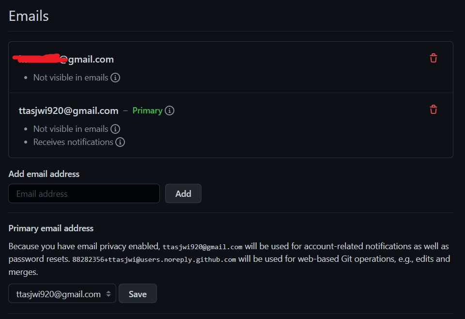

# <a href = "../../README.md" target="_blank">Git</a>
## <a href = "README.md" target="_blank">Chapter 6. GitHub</a>
### 6.1 계정 만들고 설정하기
1) 계정 생성
2) SSH 사용하기
3) 아바타
4) 사용자 이메일 주소
5) 투팩터 인증 (Two Factor Authentication)

---

# 6.1 계정 만들고 설정하기

## 1) 계정 생성

- 링크 : <a href="https://github.com" target="_blank"> https://github.com </a>
- SignUp에 들어가서 다음 정보를 기입하고 회원가입
  - email
  - password
  - username
- 회원 가입 후 이메일 인증 과정을 거치기

---

## 2) SSH 사용하기

- push할 때 SSH 프로토콜을 사용하지 않고, `https://` 프로토콜을 통하여 id, pw 방식의 인증을 사용해도 됨.
- SSH 공개키를 등록 (Setting > SSH and GPG keys > SSH keys > New SSH Key)

- 여러 기기를 등록할 경우 서로 식별하기 쉽게 Title을 지정하는 것이 좋음

---

## 3) 아바타

---

## 4) 사용자 이메일 주소

- 이메일을 등록하면, GitHub 저장소에 push를 했을 때 어떤 사용자인지 식별할 수 있게 됨.
- 여러개의 이메일을 등록해두면 등록한 메일들 모두에 대하여 대응되는 사용자를 식별할 수 있게 됨

---

## 5) 투팩터 인증 (Two Factor Authentication)
- Setting > Account security > Two-factor authentication
- GitHub에 id/pw 외에 추가 인증수단을 통해 접속
- TOTP, SMS 인증을 추가적으로 하여 로그인

---
