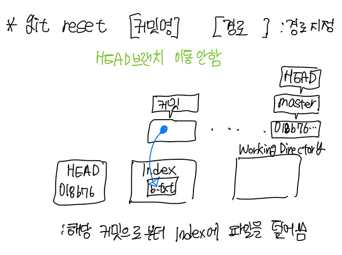

# <a href = "../../README.md" target="_blank">Git</a>
## <a href = "README.md" target="_blank">Chapter 7. Git 도구</a>
### 7.07 Reset 명확히 알고 가기
1) 기본 용어
2) 경로가 지정되지 않은 reset
3) 경로가 지정된 reset

---

# 7.07 Reset 명확히 알고 가기

## 1) 기본 용어

1. HEAD : 마지막 커밋 스냅샷, 다음 커밋의 부모 커밋
    - 현재 브랜치를 가리키는 포인터
    - 브랜치에 담긴 커밋 중 마지막 커밋
    - 지금 HEAD가 가리키는 커밋은 다음 커밋의 부모
    - 마지막 커밋의 스냅샷

2. Index : 다음 커밋할 것들
   - Staging Area
   - 다음에 커밋할 스냅샷
   - `git commit` 명령을 수행시 Git이 처리할 내용들

3. Working Directory : 샌드박스. 실제 작업 공간
   - 실제 파일로 존재하는 것들

---

## 2) 경로가 지정되지 않은 reset

1. `git reset --soft [커밋]`
    - 현재 HEAD가 가리키는 브랜치를 커밋으로 이동시키기만 함. 
2. `git reset --mixed [커밋]` 또는 `git reset [커밋]`
    - 현재 HEAD가 가리키는 브랜치를 커밋으로 이동시킴
    - HEAD를 Index(다음에 커밋할 스냅샷)에 옮김.
    - Working 디렉토리는 그대로. 작업물은 여전히 남아있다.
3. `git reset --hard [커밋]`
    - 현재 HEAD가 가리키는 브랜치를 커밋으로 이동시킴
    - HEAD를 Index에 이동
    - Working directory까지 덮어 씌움

---

## 3) 경로가 지정된 reset

> git reset [커밋명] [경로]
- HEAD 브랜치 이동 없음
- 지정 커밋으로부터 파일을 가져와서 Index에 덮어씀

---