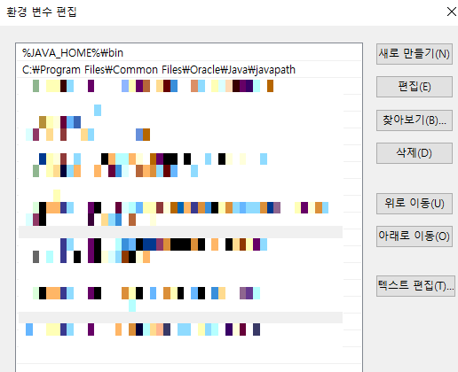

# <a href = "../README.md" target="_blank">백기선 자바 스터디</a>
## <a href="README.md" target="_blank">Week 01. JVM과 자바 코드의 실행 원리</a>
### 1.1 자바 개발환경 구축
1) JDK 설치
2) JDK의 bin 경로를 환경변수로 등록
3) IntelliJ 설치

---

## 1.1 자바 개발환경 구축

---

## 1) JDK 설치

### 1.1 JDK?
- Java Development Kit, 자바 개발 도구
- 자바 어플리케이션을 개발하는데 필요한 도구들.
- 자세한 것은 뒷 부분에서 다루도록 함. 이걸 설치해야 자바 개발을 할 수 있다.

### 1.2 설치
- Oracle에서 java 다운, 설치 : [링크](https://www.oracle.com/java/technologies/downloads/)
- 2022.07.18 기준 나는 jdk 11을 사용하고 있다.
- 실행 프로그램에서는 모두 yes를 눌러서 설치하면 됨

### 1.3 설치 확인

- 터미널에서 `java --version`을 입력해서 제대로 뜨는 지 확인

### 1.4 제거

- 제어판 > 프로그램 및 기능 > 프로그램 제거 또는 변경
- jdk 제거

---

## 2) JDK의 bin 경로를 환경변수로 등록

접기/펼치기

### 2.1 JDK의 bin 경로

- jdk 내부의 bin 디렉토리는 javac을 비롯해 여러가지 자바 개발, 실행에 필요한 명령어 파일들이 포함되어 있다.
- 예를 들면 컴파일을 할 때 이 폴더의 `javac.exe`를 통해 컴파일을 해야함. 그런데 javac 명령어를 사용하기 위해서는 매번 이 경로에 들어와야한다.

### 2.2 환경변수
- 프로세스가 컴퓨터에서 동작하는 방식에 영향을 미치는, 동적인 값들의 모임
- 운영체제의 환경변수 :OS 상에서 동작하는 응용 소프트웨어 참조하기 위한 설정이 기록
  - 예) 시스템의 실행 파일이 놓여 있는 디렉터리의 지정
- 디렉토리 깊숙한 곳에 있는 응용 프로그램들(여기서는 jdk에 포함된 각종 실행 파일)을 쉽게 꺼내쓰기 위해서 미리 환경변수로 등록하자.

### 2.3 환경 변수 등록(Windows 10 기준)
  
`시작 > 시스템 환경 변수 편집`을 입력한다.

`고급 > 환경변수`에 들어간다.
   

JAVA_HOME 환경변수를 생성한다.
- 새로 만들기
- 변수 이름 : JAVA_HOME
- 변수 값 : 현재 jdk 설치 경로 (예: `C:\Program Files\Java\jdk-11.0.13`)

Path에 JAVA_HOME\bin을 등록하기 위해 Path를 건들여야한다.
- Path 선택 > 편집 클릭

`JAVA_HOME\bin`을 Path에 등록한다.
- 새로만들기 - `%JAVA_HOME%\bin` 등록 후 최 상단에 올리기(위로 이동)

### 2.4 확인

- 터미널에서 `javac`을 입력해서 명령어 모음이 뜨면 환경변수가 정상 등록된 것

---

## 3) IntelliJ 설치

- 코드 작성 시 날코딩(메모장,...), 코드 편집기(VS Code) 등을 통해 할 수 있긴 한데, 실행/컴파일/코드 작성 편의 기능 제공등을 도와주는 IDE를 사용하는 것이 생산성 향상에 있어 매우 도움이 됨.
- 주로 Java IDE로는 이클립스, IntelliJ가 사용되는데 IntelliJ를 사용하는 것이 좋다. **이클립스 쓰다가 IntelliJ 써보면 못 빠져나온다.**

### 3.1 방법 1 : IntelliJ 직접 설치

- 다운로드 : [링크](https://www.jetbrains.com/ko-kr/idea/download)
- Ultimate ? Community?
  - Ultimate : 여러가지 부가 기능 제공, 유료
    - 예) HTML, DataBase 등 웹 어플리케이션 개발에 필요한 여러가지 편의 기능 제공
  - Community : 기본 기능 제공, 무료

### 3.2 방법 2 : ToolBox를 통해 설치 (추천)

  

- 다운로드 : [링크](https://www.jetbrains.com/ko-kr/toolbox-app/)
- JetBrain에서 제공하는 여러가지 IDE들을 통합적으로 간편하게 관리할 수 있음.

---
