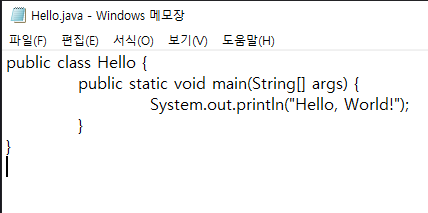
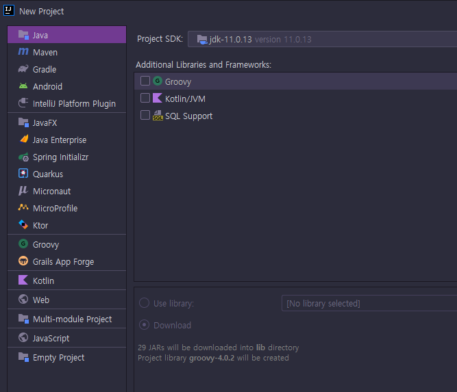
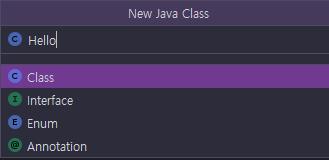
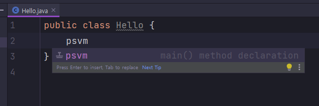
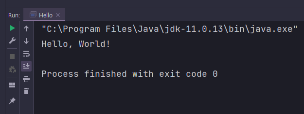

# <a href = "../README.md" target="_blank">백기선 자바 스터디</a>
## <a href="README.md" target="_blank">Week 01. JVM과 자바 코드의 실행 원리</a>
### 1.2 자바 코드 작성
1) 날코딩
2) IntelliJ의 도움으로 코드 작성

---

# 1.2 자바 코드 작성

---

## 1) 날코딩




```java
public class Hello {
    public static void main(String[] args) {
        System.out.println("Hello, World!");
    }
}
```
- 메모장을 켜서 위 코드를 작성하고 Hello.java로 저장한 뒤 저장한다.
- 직접 자잘자잘한 코드를 작성해야하고 문법 체크 등이 잘 안 되서 불편하다.
- 저장 시 `Hello.java`로 저장한다.
  - 주의 : 파일명과 코드에서 public class 뒤의 이름이 같아야 함.

---

## 2) IntelliJ의 도움으로 코드 작성

### 2.1 프로젝트 생성


- File -> New -> Project


- 프로젝트명, 경로 지정

### 2.2 `Hello.java` 파일 생성


- intellij는 `src`를 프로젝트 소스 경로로 관리함
- 해당 경로를 선택한 채로 windows 기준 `alt + insert`, mac 기준`Cmd + n`를 입력하여 새로운 파일 생성




- 클래스 명을 지정하는데 여기서는 Hello 클래스를 생성하므로 Hello를 입력
- `Hello.java` 파일이 생성됨

### 2.3 코드 작성 및 저장

- Hello 클래스가 생성됐다. 클래스 코드 블럭을 IDE가 기본적으로 편하게 만들어줬다.


- IntelliJ 기준, psvm을 입력 후 Enter를 누르면 메인 메서드가 생성된다.


- IntelliJ 기준, sout을 입력 후 Enter를 누르면 출력문(`System.out.println`)이 생성된다.


- println 메서드 안에 `"Hello, World!"`를 기입한다.
- 별 달리 설정을 건들이지 않아도 저장을 자동으로 저장된다.

### 2.4 컴파일 및 실행

- Windows 기준 `Ctrl + Shift + F10`, Mac 기준 `Cmd + Shift + r`
- 컴파일 및 실행을 전부 수행해 줌

---
