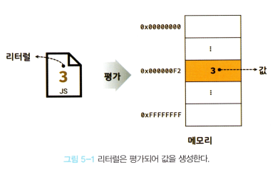
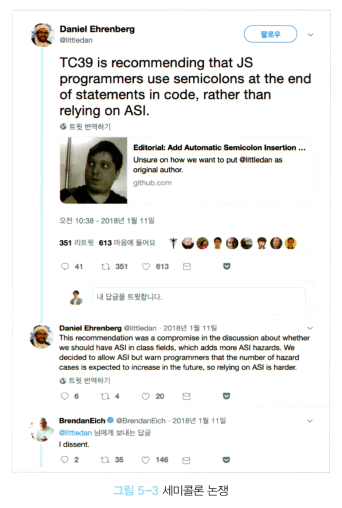
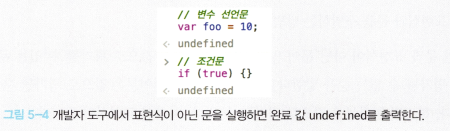

## <a href = "README.md" target="_blank">모던 자바스크립트 Deep Dive</a>

### 05장. 표현식과 문

1) 값(value)
2) 리터럴(literal)
3) 표현식(statement)
4) 문(statement)
5) 세미콜론과 세미콜론 자동 삽입 기능
6) 표현식인 문, 표현식이 아닌 문

---

# 05장. 표현식과 문

---

## 1) 값(value)

- 식(표현식, expression)이 평가(evaluate)되어 생성된 결과
    - 평가(evaluate) : 식을 해석해서 값을 생성하거나 참조하는 것
- 변수에 할당되는 것은 식이 평가된 결과에 해당하는 '값'이다.

<details>
<summary>접기/펼치기</summary>
<div markdown="1">

### 1.1 값(value)

```javascript
10 + 20; // 평가되어 숫자 30 생성
```

- 식(표현식, expression)이 평가(evaluate)되어 생성된 결과

### 1.2 평가(evaluate)

- 식을 해석해서 값을 생성하거나 참조하는 것
    - 예) 참조 : 변수 참조식

### 1.3 변수에 할당되는 것은 값이다

```javascript
var sum = 10 + 20;
```

- 식이 평가된 결과에 해당하는 '값'이 변수에 할당된다.

</div>
</details>

---

## 2) 리터럴(literal)

- 사람이 이해할 수 있는 문자 또는 약속된 기호를 이용해 값을 생성하는 표기법
- 코드 실행 시점인 런타임(runtime)에 리터럴을 평가(evaluate)해 값을 생성한다.
- 리터럴을 사용하여 다양한 종류의 값을 생성할 수 있다.

<details>
<summary>접기/펼치기</summary>
<div markdown="1">

### 2.1 리터럴(literal)

```javascript
var score = 100;
```

- 사람이 이해할 수 있는 문자 또는 약속된 기호를 이용해 값을 생성하는 표기법

### 2.2 리터럴의 평가 -> 값



- 코드 실행 시점인 런타임(runtime)에 리터럴을 평가(evaluate)해 값을 생성한다.

### 2.3 리터럴의 종류


- 리터럴을 사용하여 다양한 종류의 값을 생성할 수 있다.
    - 예) 100(정수 리터럴), 부동소수 리터럴(10.5), 문자열 리터럴('hello'), 불리언 리터럴(true, false), null 리터럴(null), undefined 리터럴(undefined),
      ...

</div>
</details>

---

## 3) 표현식(expression)

- 값으로 평가될 수 있는 문(statement)
- 표현식이 평가되면 새로운 값을 생성하거나 기존 값을 참조한다.
- 종류 : 리터럴 표현식, 식별자 표현식, 연산자 표현식, 함수/메서드 호출 표현식
  - 여러 표현식들의 조합으로 표현식을 형성할 수 있다.

<details>
<summary>접기/펼치기</summary>
<div markdown="1">

### 3.1 표현식

- 값으로 평가될 수 있는 문(statement)
- 표현식이 평가되면 새로운 값을 생성하거나 기존 값을 참조한다.

### 3.2 표현식의 종류
1. 리터럴 표현식
   ```javascript
   var score = 100;
   10;
   'hello';
   ```
    - 리터럴은 자바스크립트 엔진에 의해 평가되어 값을 생성하므로 표현식의 일종이다.

2. 식별자 표현식
   ```javascript
   sum;
   person.name;
   arr[1];
   ```
    - 식별자를 참조하면 변수 값(변수에 저장된 값)으로 평가된다.
    - 식별자 참조는 값을 생성하지 않지만 값으로 평가되므로 '표현식'이다.

3. 연산자 표현식
   ```javascript
   var score = 50 + 50; // 산술 연산자
   10 + 20; // 산술 연산자
   sum = 10; // 할당 연산자
   sum !== 10; // 논리 연산자
   ```
    - 평가되어 연산 결과 값을 생성하므로 표현식이다.
    - cf) 할당문도 할당된 값으로 평가되므로 표현식인 '문'이다. (7장)
4. 함수/메서드 호출 표현식
   ```javascript
   square();
   person.getName();
   ```
    - 함수, 또는 메서드 호출 역시 값으로 평가될 수 있으므로 표현식인 문이다.

### 3.3 여러 표현식들의 조합으로 표현식을 형성할 수 있다.

```javascript
var x = 1 + 2; // 연산, 할당 (표현식)

// 식별자 표현식 x는 3으로 평가된다.
// 연산자 +의 오른쪽에 숫자값이 위치하고 있으므로 왼쪽에는 숫자값으로 평가될 수 있는 식이 위치해야한다
x + 3; 
```

- 표현식은 다른 표현식의 일부가 되어 새로운 값을 만들어낼 수 있다.

</div>
</details>

---

## 4) 문(statement)

- 프로그램을 구성하는 기본 단위, 최소 실행 단위
- 문은 여러 토큰으로 구성되어 있다.
  - 토큰 : 문법적인 의미를 가지며 문법적으로 더 이상 나눌 수 없는 기본 요소
    - 예) 키워드, 식별자, 연산자, 리터럴, 세미콜론(;), 마침표 등...
- 문은 명령문이라고도 부른다. 즉 문은 컴퓨터에 내리는 명령이다.
  - 문이 실행되면 명령이 실행되어, 무슨 일인가 일어난다.

<details>
<summary>접기/펼치기</summary>
<div markdown="1">

### 4.1 문(statement)

- 프로그램을 구성하는 기본 단위, 최소 실행 단위
- 여러 개의 토큰으로 구성되어 있다.

### 4.2 토큰
- 문법적인 의미를 가지며 문법적으로 더 이상 나눌 수 없는 기본 요소
- 예) 키워드, 식별자, 연산자, 리터럴, 세미콜론(;), 마침표 등...

### 4.3 문 = 명령
```javascript
// 변수 선언문 : 실행 후 변수가 선언된다.
var x;

// 할당문 : 실행 후 값이 할당된다.
x = 5;

// 함수 선언문 : 선언 후 함수가 선언된다.
function foo() {
}

// 조건문 : 실행 후 지정 조건에 따라 코드 블록이 결정되어 실행된다.
if (x > 1) {
    console.log(x);
}

// 반복문 : 실행 후 특정 코드 블록이 반복적으로 실행된다.
for (var i = 0; i < 2; i++) {
    console.log(i);
}
```

- 문은 명령문이라고도 부른다. 즉 문은 컴퓨터에 내리는 명령이다.
- 문이 실행되면 명령이 실행되어, 무슨 일인가 일어난다.

</div>
</details>

---

## 5) 세미콜론과 세미콜론 자동 삽입 기능
- 자바스크립트 엔진은 세미콜론(`;`)으로 문이 종료된 위치를 파악하고 순차적으로 하나씩 문을 실행
- 0개 이상의 문을 중괄호로 묶은 코드블록(`{...}`) 뒤에는 세미콜론을 붙이지 않는다. 이들 코드 블록은 자체 종결성을 갖는다.
  - 예) if문, for문, 함수 등 ...
- 세미콜론 자동 삽입 기능(ASI, automatic semicolon insertion) : 자바스크립트 엔진이 소스코드를 해석할 때 문의 끝이라고 예측되는 지점에 세미콜론을 자동으로 붙여주는 기능
- 세미콜론 자동 삽입 기능의 동작과, 개발자의 예측이 일치하지 않는 경우가 발생할 수 있으므로 세미콜론을 명시적으로 잘 사용해야함.

<details>
<summary>접기/펼치기</summary>
<div markdown="1">

### 5.1 세미콜론(semicolon, `;`)
- 문의 종료를 나타내는 토큰
- 자바스크립트 엔진은 세미콜론으로 문이 종료된 위치를 파악하고 순차적으로 하나씩 문을 실행
- 문을 종료할 때는 세미콜론을 붙여야한다.
- 0개 이상의 문을 중괄호로 묶은 코드블록(`{...}`) 뒤에는 세미콜론을 붙이지 않는다. 이들 코드 블록은 자체 종결성을 갖는다.
  - 예) if문, for문, 함수 등 ...

### 5.2 세미콜론 자동 삽입 기능(ASI, automatic semicolon insertion)
- 자바스크립트 엔진이 소스코드를 해석할 때 문의 끝이라고 예측되는 지점에 세미콜론을 자동으로 붙여주는 기능

### 5.3 세미콜론을 명시적으로 붙이는게 낫다.
```javascript
function foo() {

    return
    {};
    // ASI(automatic semicolon insertion)의 동작 결과 => return; {};
    // 개발자의 예측 : return {};

}

console.log(foo()); // undefined();

/**
 ASI의 동작 결과 => var bar = function() {} (function {})();
 개발자의 예측 => var bar = function() {}; (function() {})();
 TypeError : (intermediate value(...) is not a function
 */
var bar = function () {}
(function() {})();
```

- 세미콜론 자동 삽입 기능의 동작과, 개발자의 예측이 일치하지 않는 경우가 발생할 수 있음
- 개발자가 세미콜론 자동 삽입 기능의 동작을 제대로 예측하지 못 해 제대로 활용하지 못 하는 경우가 발생할 수 있음
- ESLint 등의 정적 분석 도구에서도 세미콜론 사용을 기본으로 설정하고 있고, TC39(ECMaScript 기술 위원회)도 세미콜론 사용을 권장

</div>
</details>

---

## 6) 표현식인 문, 표현식이 아닌 문
- 문은 표현식인 문, 표현식이 아닌 문으로 나뉜다.
  - 표현식인 문 : 값으로 평가될 수 있는 문
    - 예) 할당문
  - 표현식이 아닌 문 : 값으로 평가될 수 없는 문
    - 예) 변수 선언문
- 구별 방법 : 변수에 할당해보기

<details>
<summary>접기/펼치기</summary>
<div markdown="1">

### 6.1 문의 종류
```javascript
// 변수 선언문은 값으로 평가될 수 없으므로 표현식이 아니다.
var x;

// 1, 2, 1+2, x = 1+2 는 모두 값으로 평가될 수 있으므로 표현식이다
// x = 1+2 는 표현식이면서 완전한 문(실행단위)이기도 하다.
x = 1+2;
```
- 표현식인 문 : 값으로 평가될 수 있는 문
  - 예) 할당문
- 표현식이 아닌 문 : 값으로 평가될 수 없는 문
  - 예) 변수 선언문

### 6.2 구별 방법 : 변수에 할당해보기 
```javascript
// 표현식이 아닌 문은 값처럼 사용할 수 없다.
var foo = var x; // SyntaxError : Unexpected token var

// 할당문은 그 자체가 표현식이지만 완전한 문이기도 하다.
// 할당문 => 표현식인 문
x = 100;

// x=100은  변수 x 에 할당한 값 100으로 평가된다.
// foo 변수에는 100이 할당된다.
// 표현식인 문은 값처럼 사용할 수 있다.
var foo = x = 100; // x=100은 값처럼 사용할 수 있다. (표현식인 문)
console.log(foo); // 100
```
- 값처럼 사용될 수 있으면 표현식인 문이다.
- 표현식이 아닌 문은 변수에 할당하면 에러가 발생한다.
- 어떤 문이 표현식인 문인지 표현식이 아닌 문인지 판단할 때, 변수에 할당하면 쉽게 구별할 수 있다.

### 6.3 완료 값(completion value)
  

- 크롬 개발자 도구에서 표현식이 아닌 문을 실행하면 언제나 undefined를 출력한다. 이를 완료 값이라고 한다.
- 완료값은 평가 결과가 아니며, 다른 값과 같이 변수에 할당할 수 없고, 참조할 수도 없다.
- 표현식인 문을 실행하면 언제나 평가된 값을 반환한다.

</div>
</details>

---
