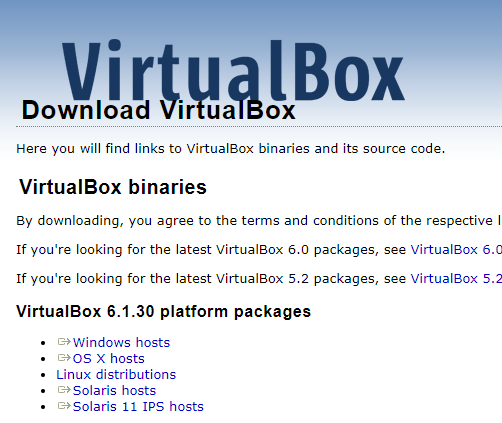
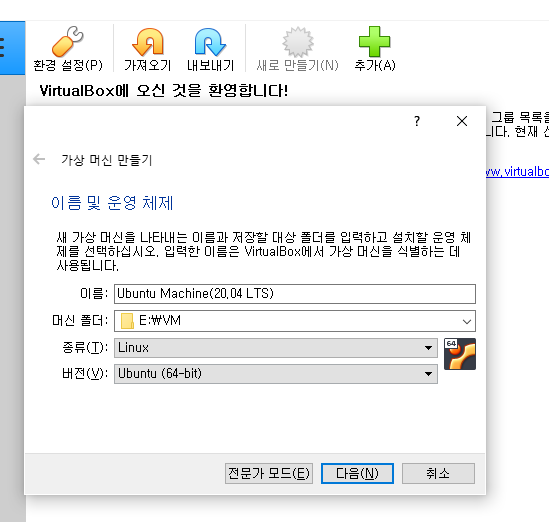
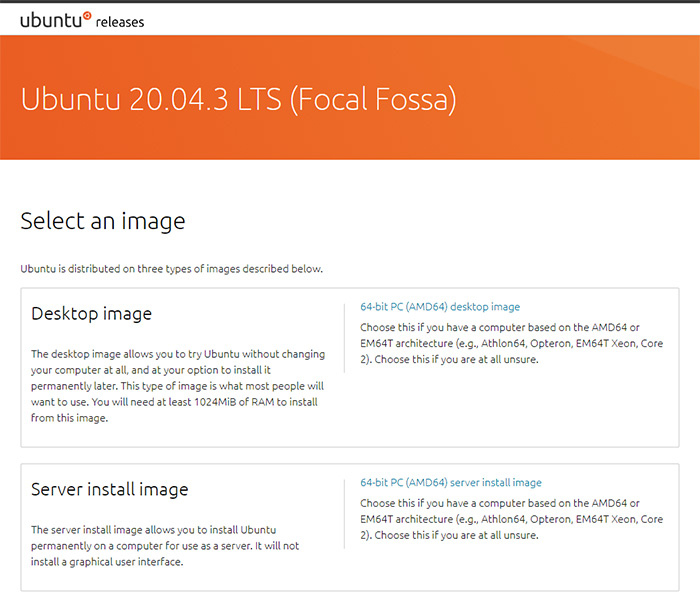
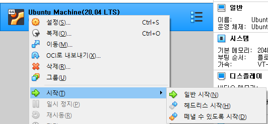
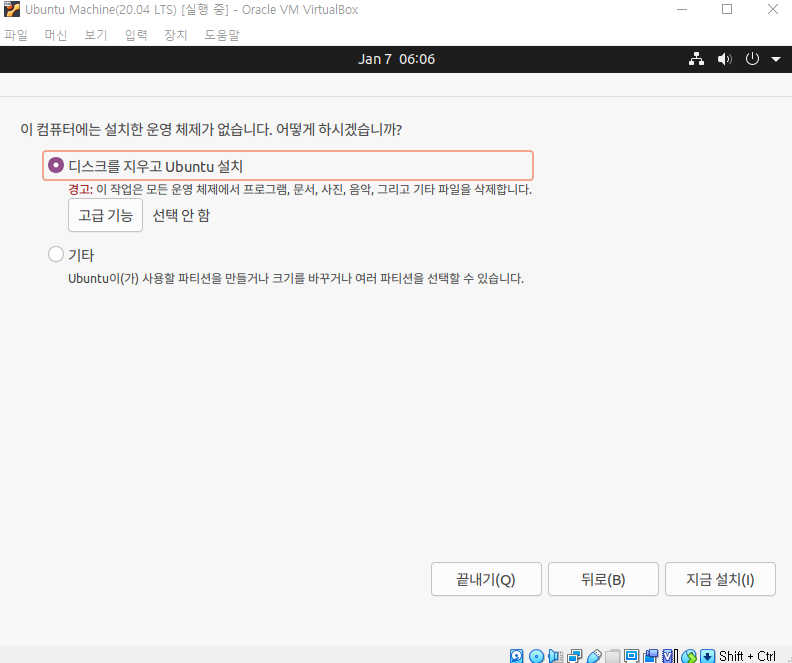
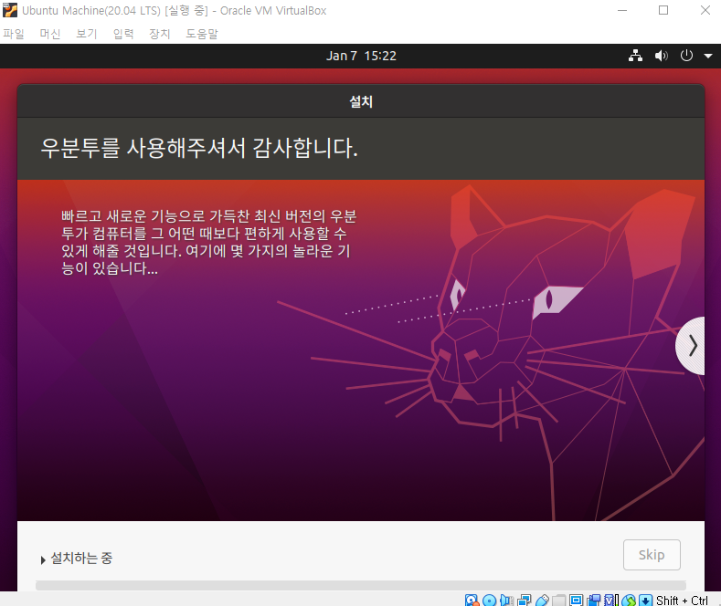
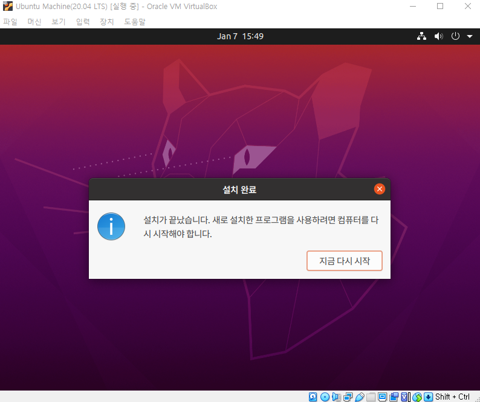

# <a href = "../README.md" target="_blank">Linux</a>
## <a href = "README.md" target="_blank">리눅스 입문 - 개념으로 탄탄히!!!</a>
### 1. 리눅스란 무엇인가

### 1.1 리눅스
1) 리눅스
2) Ubuntu 설치

---

# 1.1 리눅스

## 1) 리눅스

- 1991년 리누스 토르발스(Linus Benedict Torvalds)에 의해 창시된 OS(운영체제,Operating System)
- 다양한 배포판이 존재
  - 공통점 : 리눅스 커널, GNU 소프트웨어
  - 차이점 : 데스크탑 관리자, 패키지 매니저, 기본 파일 시스템 등, ...
  - 예시> Ubuntu, Fedora, ...

---

## 2) Ubuntu 설치

### 1. VirtualBox 설치
   - Oracle VM VirtualBox : <a href="https://www.virtualbox.org/wiki/Downloads" target="_blank">https://www.virtualbox.org/wiki/Downloads </a>

### 2. VirtualBox에, 가상머신 생성
   - VirtualBox는 가상화 레이어를 생성해주는 역할. 이 위에 가상머신을 추가하고 그 위에서 OS를 올릴 수 있다.
   - 테스트 용도로는, 메모리 용량은 2GB(2048Mb), 하드디스크 최소 용량으로는 40GB 정도면 충분하고, 동적으로 하드디스크 용량을 증가시키도록 함.
   - 용량이 넉넉한 HDD에 설치하는 것이 좋을 듯.

### 3. 가상머신에 Ubuntu 디스크 이미지 삽입
   - 작성일 기준 <a href="https://releases.ubuntu.com/20.04/" target="_blank">Ubuntu 20.04 LTS</a>를 사용

### 4. 가상머신 실행
   - 최초에는 가상머신에 OS가 설치되어있지 않으므로, OS 디스크 이미지를 삽입해야한다.

### 5. OS 설치 설정
- 언어 선택, 키보드 레이아웃 선택
- 세부 설치 설정
  - 최초 설치이므로, 파티션을 덮어씌워도 별 상관 없으니 그냥 모두 Yes 눌러도 된다.
- 지역 선택

### 6. 사용자 계정 설정
- 리눅스는 주로 서버측에 설치되어있는데, 보안상의 문제상, 적절한 패스워드를 지정하는 것이 필요

### 7. 오래 기다리고...
- 거의 20~30분 소요됨.
- 다시 시작을 누르면, 디스크를 제거하고 다시 시작하라고 명령이 뜨는데, 이미지 마운트를 해제하고 다시 가상머신을 켜면 된다.
  - VirtualBox에서 자동으로 디스크 이미지의 마운트를 해제해줘서 그냥 바로 엔터 입력하고 시작해도 됨.

### 8. 부가적인 설정
1. 장치 > 게스트 확장 CD 이미지 삽입 > VBOX Guest Addition Installization
   - Ubuntu 창크기가 고정되어있던 것이, VirtualBox 창을 늘리고 줄임에 따라 동적으로 확장, 축소 가능해진다.

2. 머신 설정 > 일반 > 고급 > 클립보드 공유
   - 로컬/리눅스 사이에 클립보드 공유를 하고 싶을 때 편리
   
---
