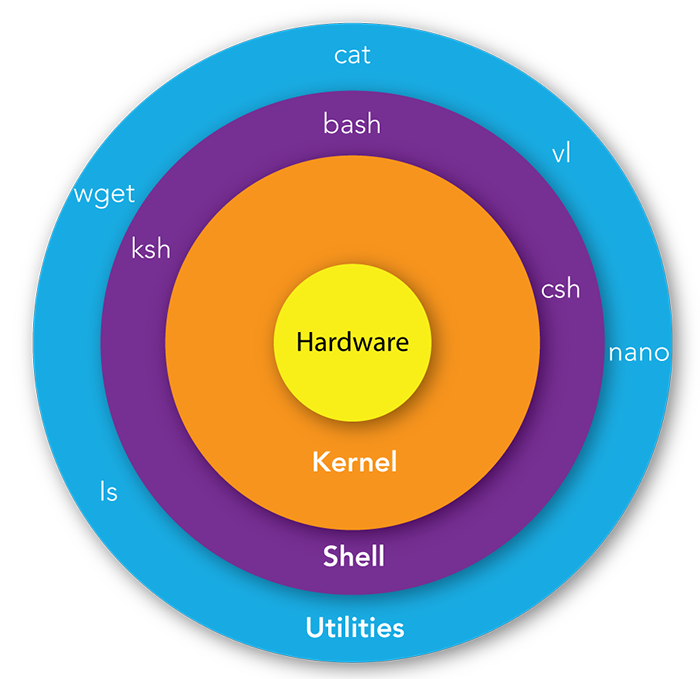

# <a href = "../README.md" target="_blank">Linux</a>
## <a href = "README.md" target="_blank">리눅스 입문 - 개념으로 탄탄히!!!</a>
### 2.1 리눅스 쉘, 리눅스 커널
1) 터미널 프로그램
2) 리눅스 쉘
3) 리눅스 커널

---

# 2.1 리눅스 쉘과 커널

## 1) 터미널 프로그램
- 입력 : 사용자의 명령을 쉘에 전달
- 출력 : 쉘에서 명령 결과를 반환 받아와 사용자에게 전달

---

## 2) 리눅스 쉘
- 터미널에서 전달된 사용자의 스크립트 명령을, 해석하여 커널에 전달.
- 커널로부터 전달된 결과를 해석하여, 터미널에 다시 전달
- 예> Bash, zsh, csh, ...

---

## 3) 리눅스 커널
- OS에서 가장 핵심적인 역할을 수행

---