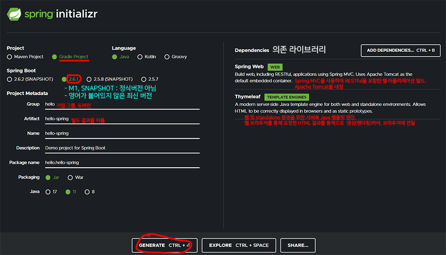
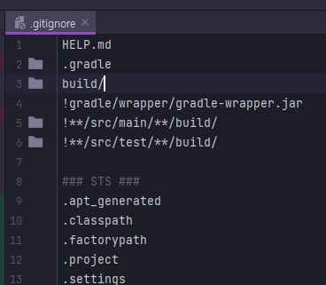
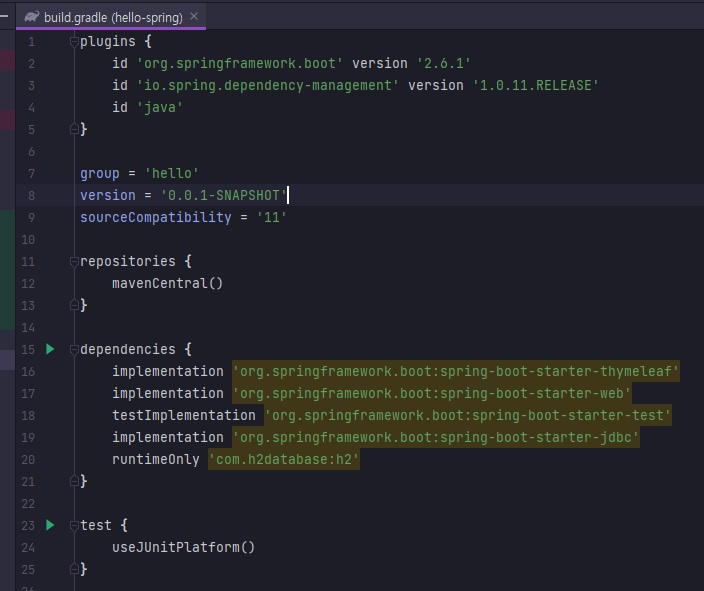

---

# <a href = "../../README.md" target="_blank">Spring</a>
## <a href = "README.md" target="_blank">스프링 입문 - 코드로 배우는 스프링 부트, 웹 MVC, DB 접근 기술</a>
### 1. Spring Boot로 Spring 시작하기
1) 개발환경
2) Spring Boot 프로젝트 시작하기
3) Spring Boot 프로젝트 폴더

---

# 1. Spring Boot로 Spring 시작하기

## 1) 개발환경
- JDK 11 이상
- IDE : IntelliJ

---

## 2) Spring Boot 프로젝트 생성하기

1. start spring
   - <a href="https://start.spring.io" target="_blank">start.spring.io</a>에서 Spring 프로젝트 생성

2. 프로젝트 설정
   - Project : Gradle Project
   - Language : Java
   - Spring Boot : SNAPSHOT, M1(미정식 버전)과 같은 문자가 안 붙은 버전들 중 최신 버전
   - Project Metadata
     - `Group` : 주로 기업 그룹, 도메인
     - `artifact`, `name` : 빌드 결과물의 이름
       - Packaging : Jar
       - Java : 11
   - Dependencies (의존 라이브러리)
     - Spring Web
     - Thymeleaf : Java Template Engine

3. 생성
   - GENERATE 버튼을 눌러 zip 파일 받기

4. 가져오기
   - 받은 zip 파일을 풀기
   - IntelliJ에서, File - Open에서 `build.gradle`을 선택하여 프로젝트 Open

---

## 3) Spring Boot 프로젝트 폴더

1. `.gradle` : gradle 관련 파일들

2. `.gitignore` : git의 tracking에서 열외 시킬 것들. 올리지 말아야할 파일들  
   
    - .gitignore에 대한 문법은 Git 학습부에서 정리해두었다.
    
3. `build.gradle` : gradle의 빌드 설정. 앞서 start.spring.io에서 설정한 내역들이 여기에 잡혀있음. 버전 설정 및 가져올 라이브러리.  
    
    - Gradle은 `dependencies`에서 지정한 라이브러리들이 의존하는 라이브러리들(의존 라이브러리의 의존라이브러리들까지)을 모두 자동으로 가져옴.
      - 이후 추가로 `dependencies`에 의존 라이브러리를 추가할 때 reload를 해줘야함.

4. src
    - main : 실행 코드
        - java : 자바 파일
        - resources : 자바 파일이 아닌 것들. (XML, properties 등 설정파일, html, ...)
            - static : 정적 html 파일
            - templates : 동적 html 파일
    - test : 테스트 코드

---