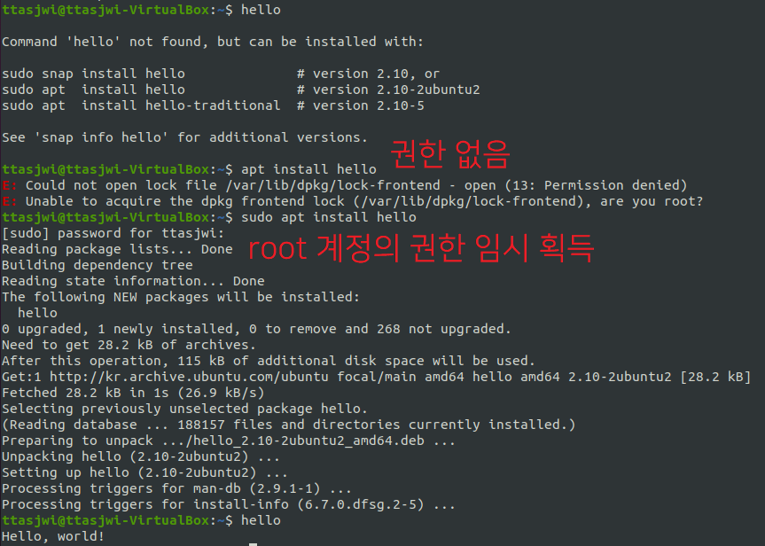

# <a href = "../README.md" target="_blank">Linux</a>
## <a href = "README.md" target="_blank">리눅스 입문 - 개념으로 탄탄히!!!</a>
### 2.9 관리자 권한 실행
1) 관리자, 사용자
2) sudo 명령어

---

# 2.9 관리자 권한 실행

## 2.9.1 관리자, 사용자
1. 관리자 계정
   - 시스템의 모든 설정 변경 가능
   - 시스템의 주요 기능을 변경, 사용하려면 root 계정의 권한이 필요함
     - 예) 프로그램 설치, 사용자 생성, 그룹 생성, 사용자 삭제, ...

2. 사용자 계정
   - 리눅스를 사용하는 사용자

---
## 2.9.2 sudo 명령어

- sudo : 일반 사용자가 root 권한을 임시로 획득하여 특정 명령을 가능하게 하는 명령어

---
