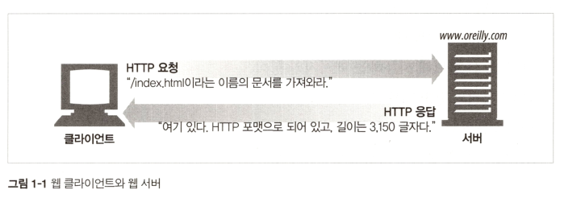

### <a href = "../README.md" target="_blank">HTTP 완벽 가이드</a>
#### 1.2 웹 클라이언트와 서버
1) HTTP
2) 프로토콜

---

## 1.2 웹 클라이언트와 서버

- 웹 클라이언트 : 웹 콘텐츠(데이터, 서비스)를 요청하는 측
    - 예) 웹 브라우저, 모바일 웹 어플리케이션, ...
- 웹 서버 : 데이터를 저장하고, HTTP 클라이언트가 요청한 데이터를 제공

---
