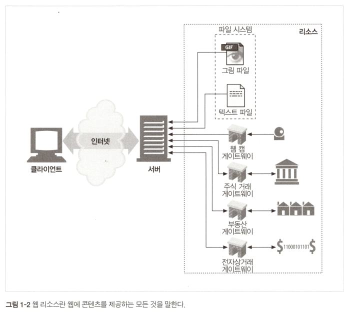
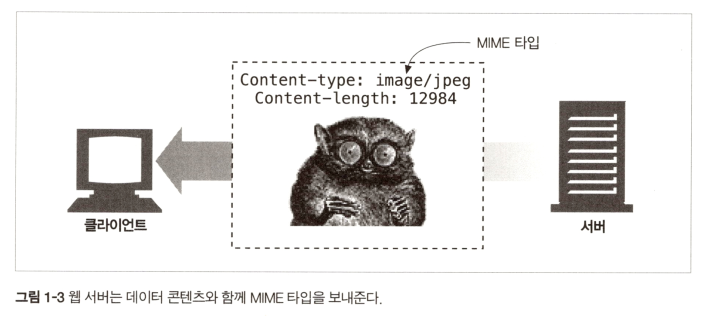

### <a href = "../README.md" target="_blank">HTTP 완벽 가이드</a>
#### 1.3 리소스 (→ 미디어 타입, URI, URL, URN) 
1) 리소스란?
2) 미디어 타입
3) URI
4) URL
5) URN

---

# 1.3 리소스

## 1.3.1 리소스란?

접기/펼치기

1. 리소스 : 웹에 컨텐츠를 제공하는 모든 것.
2. 리소스의 종류 : 어떤 종류의 컨텐츠 소스도 리소스가 될 수 있다.
   - 정적 콘텐츠 리소스 : 정적 파일
       - 텍스트 파일, HTML 파일, pdf 파일, 이미지 파일, 동영상 파일, ...
   - 동적 콘텐츠 리소스 : 요청에 따라 데이터를 동적으로 생산해내어 제공되는 프로그램의 반환 데이터
       - 사용자가 누구이고, 어떤 정보를 요청했는지, 언제 요청 했는 지에 따라 다른 데이터 제공

---

## 1.3.2 미디어 타입

접기/펼치기

1. MIME 타입(Multipurpose Internet Mail Extensions)
   - HTTP를 통해 전송되는 데이터 타입을 구분하기 위해 사용
   - 원래 서로 다른 전자메일을 시스템 사이에서 메시지가 오갈 때 생기는 문제점을 해결하기 위해 설계됨
   - 표기법 : 주타입/부타입
     - 예) text/html, text/plain, image/jpeg
2. 웹 브라우저와의 호환
   - 브라우저는 웹 서버로부터 객체를 돌려받을 때, 다룰 수 있는 객체인지 MIME 타입을 통해 확인
   - 대부분 잘 알려진 객체타입 대다수를 다룰 수 있음. (이미지 보여주기, HTML 파일 분석 및 포맷팅, 오디오 파일 재생, ...)

---

## 1.3.3 URI

접기/펼치기

1. URI(Uniform Resource Identifier) : 통합 자원 식별자
    - 웹 컨텐츠 자원을 식별하는 방법, 식별자
    - 정보 리소스를 고유하게 식별하고 위치를 지정

2. 종류 : URL, URN
    - 오늘 날 대부분의 웹 컨텐츠는 URL을 통해 식별된다.

---

## 1.3.4 URL

접기/펼치기

1. URL(Uniform Resource Locator) : 통합 자원 지시자
    - 통합 자원 지시자
    - 특정 서버의 한 리소스에 대한 구체적인 위치를 서술
    - 리소스가 정확히 어디에 있고, 어떻게 접근할 수 있는 지 알려줌

2. 표준 포맷
   > http://www.ttasjwi.com/images/logo.gif (주의 : 안 들어가짐. 없음)
    - Scheme : 리소스에 접근하기 위해 사용되는 프로토콜. 보통 HTTP 프로토콜
    - 호스트명 : ip 또는 dns 표기법에 의한 서버 주소
    - 리소스 주소 : 해당 웹 서버에서의 리소스 주소

---

## 1.3.5 URN

접기/펼치기

1. URN(Uniform Resource Name) : 통합 자원 이름
   - 리소스의 위치에 영향 받지 않는 유일무이한 이름
   - 리소스를 다른 위치로 이동하더라도 동일하게 동작

2. 예시
   > urn:ieft:rfc:2141

3. 실사용?
   - 널리 채택되지 않음
   - 효율적인 동작을 위해 리소스 위치를 분석하기 위한 인프라 자원이 필요하지만, 인프라가 없으므로 채택이 늦어지고 있음
   - URN은 거의 안 쓰이므로, 통상적으로 URL과 URI는 같은 의미로 사용됨.

---

