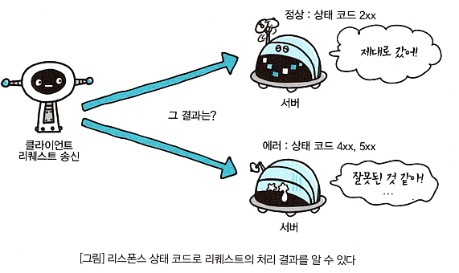

# <a href = "../README.md" target="_blank">그림으로 배우는 HTTP & Network Basic</a>
## Chapter 04. 결과를 전달하는 HTTP 상태 코드
### 4.1 상태 코드는 서버로부터 리퀘스트 결과를 전달한다
1) 상태 코드(Status Code)
2) 상태 코드 클래스

---

# 4.1 상태 코드는 서버로부터 리퀘스트 결과를 전달한다

---

## 1) 상태 코드(Status Code)

- 서버에서 클라이언트에게, 요청의 결과가 어떻게 되었는 지 알려주는 역할
- 앞의 자리는 클래스를 의미하고, 나머지 2자리는 분류가 없다.
- 많은 상태 코드가 있긴 하나 실제 자주 사용되는 것은 몇 없긴 하다.

---

## 2) 상태 코드 클래스

### 2.1 1xx (Informational)
- 리퀘스트를 받아들여 처리 중

### 2.2 2xx (Success)
- 리퀘스트를 정상적으로 처리했음

### 2.3 3xx (Redirection)
- 리퀘스트를 완료하기 위해서 추가 동작이 필요

### 2.4 4xx (Client Error)
- 클라이언트 측 오류
- 서버는 리퀘스트를 이해 불가능

### 2.5 5xx (Server Error)
- 서버 측 오류
- 서버에서 리퀘스트 처리 실패

---
