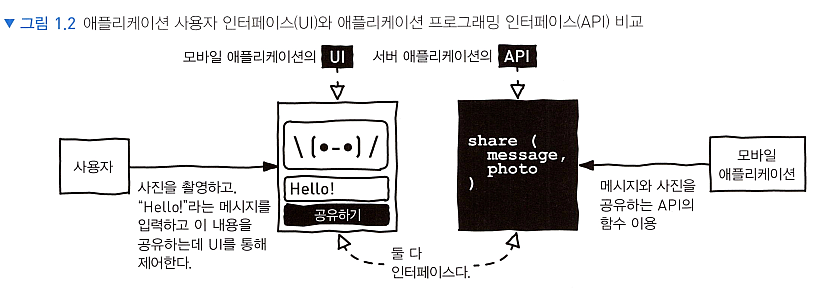

# <a href = "../README.md" target="_blank">웹 API 디자인</a>
## Chapter 01. API 디자인이란 무엇인가
### 1.1 API란 무엇인가
1) API : 소프트웨어를 위한 웹 인터페이스
2) Web API : HTTP 프로토콜 기반 애플리케이션 인터페이스
3) 프로바이더(provider), 컨슈머(consumer)
4) 소프트웨어의 기능들을 재사용 가능한 블록화
5) 퍼블릿 API, 프라이빗 API

---

# 1.1 API란 무엇인가

---

## 1) API : 소프트웨어를 위한 웹 인터페이스

API : Application Programming Interface

### 1.1 인터페이스
- 인터페이스 : 두개의 시스템, 대상, 조직 또는 그 밖의 대상들이 만나고 상호작용하는 지점
- 사용자 인터페이스(UI), 애플리케이션 프로그래밍 인터페이스(API)

### 1.2 애플리케이션 프로그래밍 인터페이스

- 애플리케이션과 다른 애플리케이션이 통신하기 위해서는 프로그래밍 인터페이스를 통해야함.
- 소프트웨어 내부에서 벌어지는 구체적인 구현을 의미하는 것이 아닌, 표면적으로 추상화된 개념
  - 하지만, 때때로는 내부적인 구현까지 포함하여, 프로그램 전체를 의미하기도 한다.

---

## 2) Web API : HTTP 프로토콜 기반 애플리케이션 인터페이스

### 2.1 HTTP
- 프로토콜 : 컴퓨터 간에 정보를 주고받을 때의 통신하는 방법에 위한 규칙이나 표준
- HTTP 프로토콜 : 전 세계의 여러 종류(거의 모든 형태)의 파일, 데이터를 끊임없이 빠르고 간편하고 정확하게 전달해줌
- 멀리 떨어진 애플리케이션(클라이언트 - 서버) 간 통신도 HTTP 프로토콜을 기반으로 동작

### 2.2 Web API
- HTTP 프로토콜을 기반으로 한 애플리케이션 인터페이스

---

## 3) 프로바이더(provider), 컨슈머(consumer)

### 3.1 프로바이더(provider)
- API를 제공하는 애플리케이션
- 컨슈머에게 API를 노출 또는 제공

### 3.2 컨슈머(consumer)
- API를 사용하는 애플리케이션
- 프로바이더의 API를 소비하거나 사용

### 3.3 예시 
- 백엔드 서버의 API를 모바일 애플리케이션이 사용하면 백엔드 서버가 프로바이더, 모바일 애플리케이션이 컨슈머
- 어떤 웹 API를 백엔드 서버에서 호출해서 사용한다면 웹 API 제공처가 프로바이더, 백엔드 서버가 컨슈머

---

## 4) 소프트웨어의 기능들을 재사용 가능한 블록화

### 4.1 조립 가능한 블록
- 웹 API는 소프트웨어를 레고 블록처럼 쉽게 조립할 수 있게 만든다.
- 소프트웨어 시스템을 블록처럼 쉽게 분해, 조립, 교체할 수 있음.
- 각 API는 간단한 함수 몇 개만 제공하고 있고 이를 의존하기만 하면 되기에 시스템 구성을 단순하게 할 수 있음.

### 4.2 한 번 만들면 여러 곳에서 재사용 가능
- 한번 만들어두면 여러 곳에서 사용할 수 있다.
- 때문에, 다른 곳에서 잘 만든 API 제품을 굳이 다시 새로 만들 필요가 없음. (바퀴의 재발명 x)
- 각각의 서비스에서는 다른 서비스의 API 제품을 사용하고, 자신들의 전문 분야에 집중할 수 있음.
- 웹 API의 등장 덕분에, 그동안 속박되어 있던 창의성과 혁신성을 펼칠 수 있음.

### 4.3 서비스의 성능, 확장성 관리를 유리하게 할 수 있음.
- 인터넷에 연결되어 있다면 API로 접근이 가능하며, 어디서든 실행할 수 있다.
- 하나의 시스템에서 모든 기능을 내장하고 있다면 성능상의 이슈가 있었겠지만, 이러한 수고를 다른 시스템에 위임하여
우리의 서비스 애플리케이션의 성능, 확장성 관리를 유리하게 함.

---

## 5) 퍼블릿 API, 프라이빗 API

### 5.1 퍼블릭 API
- 외부에 공개적으로 노출된 서비스, 제품의 형태로 제공

### 5.2 프라이빗 API
- 우리가 만든 애플리케이션을 위해, 또는 부서/회사를 위해서만 쓰이는 API

### 5.3 (참고) 파트너 API?
- 고객들이나 특정 파트너들에게만 노출하는 경우도 있는데, 이러한 경우는 퍼블릭이라 볼 수 있지만
종종 이를 파트너 API로 부르기도 함.

---
