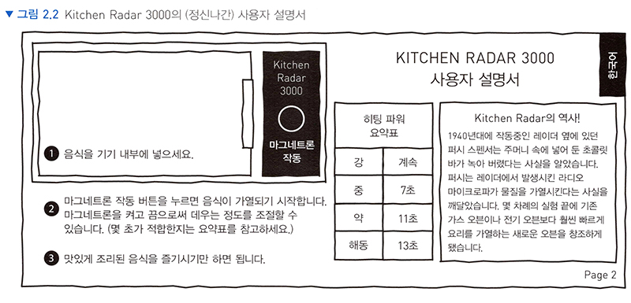
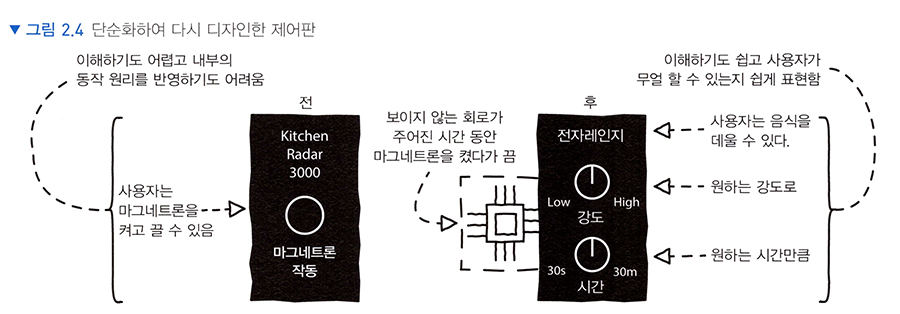

# <a href = "../README.md" target="_blank">웹 API 디자인</a>
## Chapter 02. 사용자를 위한 API 디자인하기
### 2.1 일상 속 사용자 인터페이스를 디자인하는 올바른 관점
1) 내부 동작에 집중하면 인터페이스가 복잡해진다.
2) 사용자가 할 수 있는 일에 집중하면 인터페이스는 단순해진다.

---

# 2.1 일상 속 사용자 인터페이스를 디자인하는 올바른 관점

> 장막 너머에서 벌어지는 일에 집중하는 순간 총체적 난국이 펼쳐집니다.
사용자가 얻을 결과에만 집중해야 일이 순탄하게 흘러갑니다.

---

## 1) 내부 동작에 집중하면 인터페이스가 복잡해진다.

### 1.1 'Kitchen Radar 3000'의 사례

- 이름부터가 무슨 역할을 하는지 목적을 제대로 설명하지 않음
- 인터페이스를 보았을 때 각 요소들이 무엇을 의미하는지, 무슨 역할을 하는지 직관적이지 않음
- 설명서(메뉴얼, 문서)를 확인해보면 사용자 입장에서 필요 없고 인터페이스와 연관 없는 미사여구를 늘어 놓아서
뭔 소리인지 이해하기 힘듬.
- 마그네트론 작동 버튼을 누른 시간에 맞춰서 강도를 조절하는데, 강한 화력으로 조작하려면 사용자는 불편하게 계속 버튼을 눌러야함.
익숙하지 않으면 제대로 화력 조절도 힘들다. 
- 사용자 입장에서는 인터페이스의 목적, 사용방법을 습득하기 어렵고 불편하며, 사용에 숙달되지 않으면 제대로 사용하기 힘듬

### 1.2 내부 동작(구현)에 집중했을 때의 문제점
- API 디자이너가 장치의 내부 동작 원리에 지나치게 몰입할 경우 사용자들은 API를
이해하기 힘들어짐.
- 사용자는 API를 접했을 때 그 API의 사용 목적을 알아내기 어려움.
- 사용자가 입장에서 복잡한 사용방식, 동작 원리를 학습해야함.
- 해당 인터페이스에 대한 이해도가 부족하고, 숙련되지 않았을 경우 사용하기 힘듬.

---

## 2) 사용자가 할 수 있는 일에 집중하면 인터페이스는 단순해진다.

- 사용자들이 원하는 것은 그들 입장에서 이해하기 쉽고 사용하기 쉬운 인터페이스이다.
- 이 인터페이스가 무엇인지, 사용자에게 무엇을 해주는 지 확실히 표현할 수 있어야 한다.
- 내부적으로 벌어지는 복잡한 원리에 대한 설명, 노출은 필요하지 않다.

---
