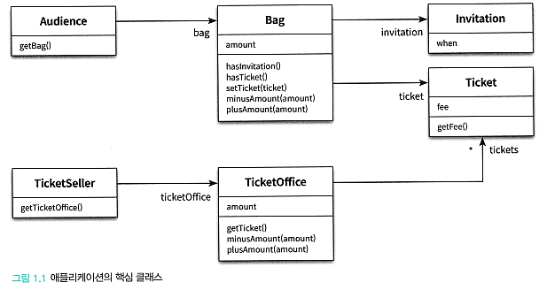

# <a href = "../README.md" target="_blank">오브젝트</a>
## <a href = "README.md" target="_blank">Chapter 01. 객체, 설계</a>
### 1.1 티켓 판매 애플리케이션 구현하기
1) 요구사항 분석 : 초대장 유무에 따라 입장
2) 관람객 및 관람객의 소지품 구현
3) 극장 및 내부 요소 구현
4) 티켓 판매 시스템의 객체 관계도

---

# 1.1 티켓 판매 애플리케이션 구현하기

---


## 1) 요구사항 분석 : 초대장 유무에 따라 입장
- 공연을 관람하기 원하는 모든 사람들은 티켓을 소지하고 있어야만 한다.
- 추첨을 통해 선정된 관람객에게 공연을 무료로 관람할 수 있는 초대장 발송
- 기본적으로 관람객은 관람객은 가방을 가지고 있고, 가방은 초대장, 티켓, 현금을 가질 수 있다.
- 초대장 유무에 따라 입장 방식을 다르게 해야함
  - 초대장 있다 : 초대장을 티켓으로 교환하여 입장
  - 초대장 없다 : 티켓을 판매한 후 입장

- 매표소는 일정 수량의 티켓을 보유하고 있고 티켓을 판매할 수 있다.
- 매표소 직원은 관람객의 티켓 보유여부에 따라 티켓을 판매하거나, 초대장을 교환해서 입장시킴

---

## 2) 관람객 및 관람객의 소지품 구현
### 2.1 초대장(Invitation)
```java
public class Invitation {

    private LocalDateTime when;

    public Invitation(LocalDateTime when) {
        this.when = when;
    }
}
```
- 공연을 관람할 수 있는 초대일자(when)를 인스턴스 변수로 포함하는 간단한 클래스

### 2.2 티켓(Ticket)
```java
public class Ticket {

    private Long fee;

    public Ticket(long fee) {
        this.fee = fee;
    }

    public Long getFee() {
        return fee;
    }
}
```
- 공연을 관람하기 원하는 모든 사람들은 티켓을 소지하고 있어야만 한다.

### 2.3 가방(Bag)
```java
public class Bag {

    private Long amount; // 현금 보유량
    private Invitation invitation; // 초대장
    private Ticket ticket; // 티켓

    public Bag(Invitation invitation, long amount) { // 초대장을 가진 관람객
        this.invitation = invitation;
        this.amount = amount;
    }

    public Bag(long amount) { // 초대장이 없는 관람객
        this(null, amount);
    }

    // 초대장 보유 여부
    public boolean hasInvitation() { 
        return invitation != null;
    }
    
    // 티켓 보유 여부
    public boolean hasTicket()  {
        return ticket != null;
    }
    
    // 티켓 추가
    public void setTicket(Ticket ticket) {
        this.ticket = ticket;
    }
    
    // 보유금 감소
    public void minusAmount(Long amount) {
        this.amount -= amount;
    }
    
    // 보유금 증가
    public void plusAmount(Long amount) {
        this.amount += amount;
    }
    
    // 보유금 반환
    public Long getAmount() {
        return amount;
    }
}
```
- 관람객은 소지품을 보관할 용도로 가방을 들고 올 수 있다.
- 관람객이 가지고 올 수 있는 소지품은 초대장, 현금, 티켓 세 가지뿐
  - 이벤트 당첨자는 티켓으로 교환할 초대장을 보유
  - 이벤트에 당첨되지 않은 관람객은 티켓을 구매할 수 있는 현금을 보유
- Bag 클래스는 초대장(invitation), 티켓 (ticket), 현금(amount)을 인스턴스 변수로 포함
- 유틸 메서드
  - 초대장의 보유 여부 : `haslnvitation`
  - 티켓의 소유 여부 : `hasTicket`
  - 현금을 증가/감소 : `plusAmount`, `minusAmount`
  - 초대장을 티켓으로 교환 : `setTicket`

### 2.4 관람객(Audience)
```java
public class Audience {

    private Bag bag;

    public Audience(Bag bag) {
        this.bag = bag;
    }

    public Bag getBag() {
        return bag;
    }
}
```
- 관람객은 소지품을 보관하기 위해 가방을 소지할 수 있다.
- `getBag` 메서드를 통해 가진 Bag을 외부에 넘길 수 있다...

---

## 3) 극장 및 내부 요소 구현

### 3.1 티켓 매표소(TicketOffice)
```java
public class TicketOffice {

    private Long amount; // 판매 금액
    private List<Ticket> tickets = new ArrayList<>(); // 판매할 티켓들
  
    public TicketOffice(Long amount, List<Ticket> tickets) {
        this.amount = amount;
        this.tickets = tickets;
    }
    public TicketOffice(Long amount, Ticket ... tickets) {
        this.amount = amount; // amount가 null이면 어쩌려고?
        this.tickets.addAll(Arrays.asList(tickets));
    }

    /**
     * 리스트의 맨 앞에 있는 티켓부터 꺼내서 제거하고 반환
     */
    public Ticket getTicket() {
        return tickets.remove(0);
    }

    /**
     * 판매 금액 차감
     */
    public void minusAmount(long amount) {
        this.amount -= amount;
    }

    /**
     * 판매 금액 증가
     */
    public void plusAmount(Long amount) {
        this.amount += amount;
    }
}
```
- 관람객이 소극장에 입장하기 위해서는 매표소에서 초대장을 티켓으로 교환하거나 구매해야함
- 매표소에는 관람객에게 판매할 티켓과 티켓의 판매 금액이 보관돼 있어야 한다.
- TicketOffice는 판매하거나 교환해 줄 티켓의 목록 (tickets)과 판매 금액(amount)을 인스턴스 변수로 포함
- 유틸 메서드
  - 티켓 판매 : `getTicket` (리스트에 보유한 0번째 티켓을 꺼내 반환)
  - 판매 금액 증감/차감 : `plusAmount`와 `minusAmount`

### 3.2 티켓 판매원(TicketSeller)
```java
public class TicketSeller {

    private TicketOffice ticketOffice;

    public TicketSeller(TicketOffice ticketOffice) {
        this.ticketOffice = ticketOffice;
    }

    public TicketOffice getTicketOffice() {
        return ticketOffice;
    }
}
```
- 매표소에서 초대장을 티켓으로 교환해 주거나 티켓을 판매하는 역할을 수행
- `TicketSeller` 클래스는 자신이 일하는 매표소(`Ticketoffice`)를 알고 있어야 한다.
- getter
  - `getTicketOffice` : 자신이 일하는 티켓 매표소를 반환

### 3.3 극장(Theater)
```java
public class Theater {

    private TicketSeller ticketSeller;

    public Theater(TicketSeller ticketSeller) {
        this.ticketSeller = ticketSeller;
    }

    public void enter(Audience audience) {
        if (audience.getBag().hasInvitation()) {
            // 초대장을 확인하여 티켓을 건내준다.
            Ticket ticket = ticketSeller.getTicketOffice().getTicket(); // 티케 셀러에게 티켓을 얻어야하는데 티켓셀러가 알고있는 티켓 오피스까지 알아야하는 이상한 상황
            audience.getBag().setTicket(ticket);
        } else {
            Ticket ticket = ticketSeller.getTicketOffice().getTicket();
            audience.getBag().minusAmount(ticket.getFee());
            ticketSeller.getTicketOffice().plusAmount(ticket.getFee());
            audience.getBag().setTicket(ticket);
        }
    }
}
```
- 근무하는 티켓 판매원을 알고 있다.
- 관람객 입장 로직 : `enter`
  1. 소극장은 관람객의 가방 안에 초대장이 들어 있는지 확인한다.
  2. 초대장이 있다면 당첨된 관람객이므로 판매원에게서 받은 티켓을 관람객의 가방 안에 넣어준다.
  3. 초대장이 없다면 티켓을 판매해야한다.
     - 소극장은 관람객의 가방에서 티켓 금액만큼을 차감한 후 매 표소에 금액을 증가시킨다.
     - 마지막으로 관람객의 가방 안에 티켓을 넣어줌

---

## 4) 티켓 판매 시스템의 객체 관계도



### 4.1 관람객 측
- 관람객은 가방을 하나 가지고 있음(알고 있음)
- 가방은 초대장 또는 티켓, 현금을 가진다.

### 4.2 극장 측
- 극장에는 근무하는 티켓 판매원이 하나 있음(알고 있음)
- 티켓 판매원은 자신이 근무하는 티켓 매표소를 알고 있음
- 티켓 매표소는 판매할 티켓들을 목록으로 알고 있고, 내부적으로 판매액을 상태로 갖고 있음

---
