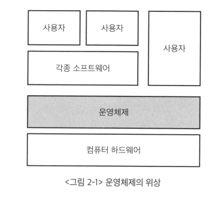

# <a href = "../README.md" target="_blank">운영체제와 정보기술의 원리</a>
## Chapter 02. 운영체제 개요
### 2.1 운영체제의 정의
1) 운영체제(Operating System)
2) 운영체제의 필요성
3) 운영체제와 메모리
4) 운영체제의 구성요소

---

# 2.1 운영체제의 정의

---

## 1) 운영체제(Operating System)

- 하드웨어 바로 윗단에 설치되는 소프트웨어
- 사용자 및 다른 모든 소프트웨어와 하드웨어를 연결하는 소프트웨어 계층

---

## 2) 운영체제의 필요성
- 운영체제가 없다면 하드웨어는 단순한 고철 덩어리
- 사용자는 하드웨어를 직접 다루는 것이 매우 쉽지 않음.
- 하드웨어 위에 기본적으로 운영체제를 탑재해, 전원이 들어왔을 때 손쉽게 사용할 수 있는 상태가 되도록 해야함.
- 결국 소프트웨어들도 하드웨어를 손쉽게 사용할 수 있는 기반이 갖춰져야 작동됨.

---

## 3) 운영체제와 메모리
- 프로그램이 실행되려면 메모리 위에 올라가야한다.
- 운영체제도 하나의 소프트웨어이기 때문에 메모리에 올라가야한다.
- 운영체제의 모든 것이 메모리에 올라가면 메모리 낭비가 심하므로 필요한 것만 올라가야한다.

---

## 4) 운영체제의 구성요소

### 커널(kernel)
- 좁은 의미의 운영체제
- 운영체제의 핵심
- 메모리 상에 상주하는 부분

### 시스템을 위한 유틸리티
- 넓은 의미로는 커널과 시스템을 위한 유틸리티들을 합쳐서 운영체제로 칭함.
- 메모리에 항상 올라가지 않으며, 필요할 때마다 메모리에 올려서 사용
- 예) 파일을 복사하는 프로그램.

### 운영체제의 정의
- 좁은 의미  : 커널
- 넓은 의미 : 커널 + 시스템을 위한 유틸리티

---
