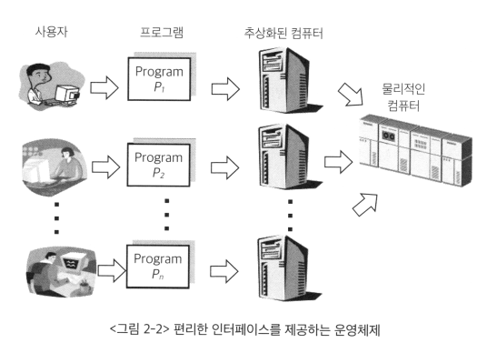
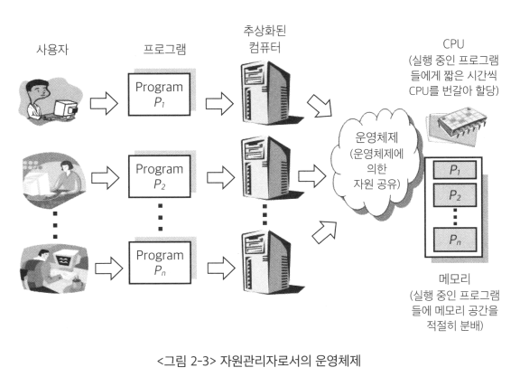

# <a href = "../README.md" target="_blank">운영체제와 정보기술의 원리</a>
## Chapter 02. 운영체제 개요
### 2.2 운영체제의 기능
1) 사용자 친화적 환경 제공
2) 자원의 효율적 관리
3) 보안 및 보호 기능

---

# 2.2 운영체제의 기능

---

## 1) 사용자 친화적 환경 제공

- 편리한 인터페이스 제공
- 컴퓨터 시스템을 편리하게 사용할 수 있는 환경 제공
- 여러 사용자 및 프로그램들에게 컴퓨터에서 실행되는 것 같은 "환상"을 제공
  - 짧은 시간동안 각 프로그램마다 번갈아가면서 할당
  - 여럿이 동시에 쓰더라도 사용자 자신의 프로그램만 돌아가는 줄... 하지만 실제적으로 내부적으로 동시에 실행되도록 할 수 있음.
- 하드웨어를 직접 다루는 복잡한 부분을 운영체제가 대행

---

## 2) 자원의 효율적 관리

- 사용자가 다루기 힘든 각종 하드웨어를 운영체제가 관리
- 컴퓨터 시스템 내의 자원(resource)을 효율적으로 관리
  - 효율성 : 주어진 자원을 효율적으로 관리하여, 가장 좋은 성능을 내도록 함
  - 형평성 : 사용자 및 프로그램 간에 자원이 형평성 있게 분배해야함

### 자원
- 하드웨어 자원 : CPU, 메모리, 하드디스크, ...
- 소프트웨어 자원 : 프로세스, 파일, 메시지, ...

---

## 3) 보안 및 보호 기능
- 운영체제는 사용자와 운영체제 자신을 보호하는 역할을 수행해야한다.
- 여러 사용자의 프로그램이, 하나의 프로그램에서 실행되는 것은 보안 상 위험하다.
  - 악의성 프로그램을 사용하여 다른 사용자 프로그램이 올라가 있는 메모리 영역을 참조하는 경우
  - 다른 사용자의 사적인 파일에의 접근하는 경우
- 운영체제가 올라가 있는 메모리 영역(커널)을 변경할 경우 컴퓨터의 정상적 작동에 악영향을 끼칠 수 있음

---
